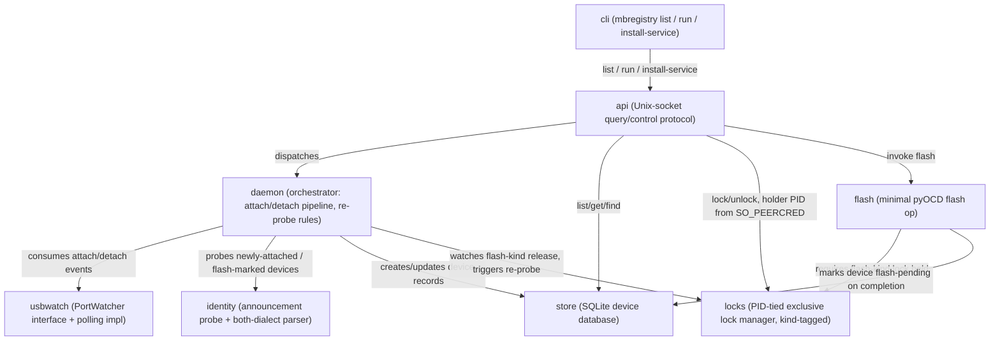
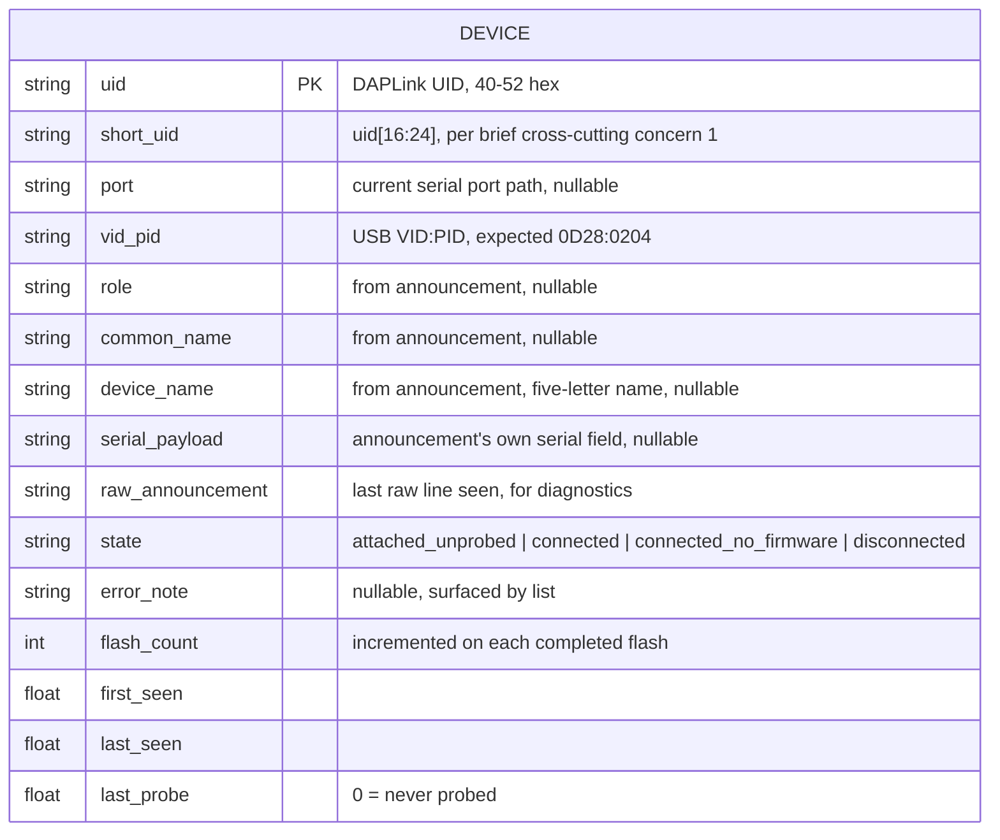

<!-- CLASI: Before changing code or making plans, review the SE process in CLAUDE.md -->

# Sprint 001: mbregistry core: local device registry daemon

## Goals

Stand up the `mbtools` package/repo and build `mbregistry` — the single
device-registry daemon — as a **Linux-only, local-only** first cut. No
peering, no other client tools yet. This sprint establishes the "one
daemon owns enumeration, identity, and locks" principle the whole project
rests on (brief §1-3).

## Problem

Today, `mbdeploy` and `mbrelay` each independently enumerate, probe, and
reset every micro:bit on a host, fighting over serial ports and locks the
other doesn't honor. The architectural fix is a single daemon that owns
enumeration, identification, and exclusive access; everything else
becomes a client of it. This sprint builds that daemon's core, local to
one Linux host.

## Solution

- Scaffold the `mbtools` repo/package layout (no dedicated issue covers
  this — it's infrastructure for everything that follows).
- Build `mbregistry` per `mbregistry-device-registry-daemon.md`:
  USB watch on Linux (polling `comports()` is an acceptable first cut,
  behind an interface that allows a real udev/netlink event source
  later); least-intrusive identification (classify by VID:PID before
  opening, then one brief open-with-reset to capture the announcement);
  re-probe rules (never reopen a device that hasn't been reattached or
  flashed; re-probe exactly once after a flash); a SQL database; a local
  query API over a Unix socket; PID-tied exclusive locks carrying a kind
  (`serial`/`relay`/`flash`/`debug`); `mbregistry list` with
  STATE/short-uid/firmware/error-notes/`--json`/stable exit codes; a
  systemd unit with restart on failure.
- The registry's minimal flash op (brief §3.6) is built here since it's
  part of the daemon issue, even though no client calls it yet — `mbdeploy`
  starts using it (or not — see the open decision) in sprint 002.

**ASSUMPTIONS for stakeholder confirmation at plan review** (brief §9,
spec's Open Decisions — none of these is a settled decision, only the
spec's own recommendation, adopted here as a working assumption for
sprint 001's build):
- **SQLite**, not MySQL, for the database (a MySQL server would be a
  second daemon on every node, including Pi Zeros).
- File layout: `/run/mbregistry/` for live state and the socket,
  `/var/lib/mbregistry/` for identity worth keeping across reboots.
- Lock mechanism: a Unix socket recording the peer PID via
  `SO_PEERCRED`; the lock releases when the PID dies or the connection
  closes.

These are flagged, not resolved, by this roadmap entry — detail planning
for this sprint should either get explicit stakeholder confirmation or
carry them forward as documented assumptions. See the Architecture
section below for how they're carried forward.

## Success Criteria

- `mbregistry` runs as a systemd service on Linux, restarts on crash, and
  rebuilds its live state from currently-attached devices on restart.
- Attach/detach events are detected and identified per the
  least-intrusive protocol, with both announcement dialects parsed.
- A device already probed is never reopened unless reattached or
  flashed.
- `mbregistry list` (table and `--json`) shows STATE, short uid,
  firmware/version, and error notes, with stable exit codes.
- Locks are exclusive, carry a kind, and release automatically when the
  holding PID dies or its connection closes.

## Scope

### In Scope

- `mbtools` repo/package scaffold.
- `mbregistry-device-registry-daemon.md` — full scope, Linux-first (see
  that issue's body: USB watch, identification, re-probe rules,
  database, query service, locks, minimal flash op, systemd install,
  listing CLI).

### Out of Scope

- Windows USB watch, named pipe query service, and Windows service
  install — split to `mbregistry-windows-platform-support.md` (sprint
  004).
- Peering (mDNS, ZeroMQ, remote access) — `mbregistry-peering-mdns-and-zeromq.md`
  (sprint 003).
- All client tools (`mbdeploy`, `mbserial`, `mbrelay`) — sprints 002 and
  004. This sprint builds only the daemon they will depend on, plus stub
  console-script entry points for them (see Architecture, Design
  Rationale "Package layout").

## Test Strategy

Hardware-free throughout: no ticket in this sprint requires a physical
micro:bit, a real pyOCD-visible probe, or a real systemd install to pass
its tests.

- **Fakes, shipped as reusable test support.** `mbtools.testing.fakes`
  provides `FakeUSBSource` (scripts a sequence of `comports()`-shaped
  attach/detach snapshots the `PortWatcher` interface consumes) and
  `FakeSerial` (a pyserial-`Serial`-shaped fake that scripts announcement
  lines, silence/timeout, and "port busy" `OSError`s for the identity
  probe to consume). Both are built in ticket 001 and reused by every
  later ticket's tests, and by sprint 002+'s client-tool tests — building
  them as an importable module rather than sprint-002+test-local
  fixtures avoids every future sprint reinventing them.
- **Unit tests per module**: identity parsing is table-driven against
  both announcement dialects plus malformed/short lines (ported fixtures
  from `mbdeploy`'s `devices.py` and `mbrelay`'s `inventory.py` test
  suites where they exist); store CRUD runs against a real SQLite file
  in `tmp_path`; locks are tested with an injectable `is_pid_alive`
  callable so PID-death tests don't need to actually fork and kill a
  process — one integration-style test does spawn and kill a real short-
  lived subprocess to prove the real liveness check works end to end.
- **Flash**: the pyOCD invocation is behind an injectable callable (same
  pattern `mbdeploy`'s `flash.py` already uses via its `log` callback —
  extended here to also inject the subprocess runner), so flash tests
  never shell out to a real `pyocd`.
- **API**: protocol/dispatch tests run against a real Unix socket in a
  `tmp_path` (this is a local IPC test, not a hardware test, so it runs
  in CI). The `SO_PEERCRED`-specific assertion is Linux-only and is
  skipped (not xfailed) on macOS, where the rest of the protocol test
  still runs against the injectable `is_pid_alive`/close-triggers-release
  paths.
- **CLI**: exercised against a daemon started in-process against a
  `tmp_path` store and a Unix socket in `tmp_path`, with `FakeUSBSource`
  standing in for real USB. Output is asserted both as a table and as
  `--json`.
- **Systemd unit**: golden-file test on the rendered unit contents
  (`Restart=on-failure`, correct `ExecStart`, correct paths); installing
  it into a real systemd is out of scope for automated tests — the
  ticket's acceptance criteria call out manual verification on real
  hardware (per this project's own `CLAUDE.md`: pick a spare board,
  never disturb a robot in use) as a follow-up, not a CI gate.
- Full suite runs once, at `close_sprint`, per `.claude/rules/source-
  code.md`; each ticket's own test run is scoped to the module(s) it
  touches.

## Architecture

**Substantial** — this sprint stands up `mbregistry` as an entirely new
daemon subsystem: USB watch, identity probing, a SQLite-backed device
store, a PID-tied lock manager, a minimal flash operation, a Unix-socket
query/control API, and a CLI. That's eight new modules, several new
cross-module dependencies, and a new persistent data model (the device
table) — all three "substantial" signals are present, so this section
uses the full 7-step methodology with diagrams. There is no existing
`docs/architecture/` to reconcile against: this is the first architecture
mbtools has.

### ASSUMPTIONS carried into this design (stakeholder confirmation requested)

These three are *not* decided — they are the spec's own recommendations,
adopted here as working assumptions so a concrete design could be
written at all. A stakeholder "no" on any one of them changes a module
below, not the module boundaries themselves:

1. **SQLite**, not MySQL, for the `store` module (brief §9.1). A MySQL
   server on every Pi Zero contradicts the one-daemon principle; SQLite
   needs no server process.
2. **File layout** (brief §9.2): `/run/mbregistry/` for the Unix socket
   and any purely-live state; `/var/lib/mbregistry/` for the SQLite file
   and anything that must survive a reboot. Test runs override both
   roots to a `tmp_path`.
3. **Lock-holder identity** (brief §9.3): a Unix socket connection,
   holder PID read via `SO_PEERCRED`, lock released when that PID dies
   *or* the connection closes (the two are treated as separate triggers
   — a process can leak a duplicated fd across a fork without closing
   the original connection, so both are checked). Windows has no
   `SO_PEERCRED` equivalent; sprint 004 must resolve that gap for its
   own lock-holder mechanism, not this sprint.

### 1-2. Problem and Responsibilities

Eight distinct responsibilities, each changing for its own reasons:
watching USB for attach/detach; turning a raw serial announcement into
parsed identity (two dialects); persisting device records across
restarts; granting/releasing exclusive per-device locks tied to a
holder's liveness; running the one pyOCD flash operation the registry
needs; exposing all of the above to local clients over a socket;
presenting that to a human as a CLI; and installing/running as a managed
service. USB watch and identity are kept separate because the interface
that will later gain a real udev/netlink source has nothing to do with
announcement parsing, and mbdeploy's own `devices.py` already shows these
evolving independently (the "robot dialect" gap was a parsing bug that
had nothing to do with how ports were enumerated). Locks are kept
separate from the store because a lock is ephemeral, process-lifetime
state while the store is durable identity — conflating them would mean
every lock grant is a disk write, and every daemon restart would need to
decide whether a persisted lock is real or stale.

### 3. Subsystems and Modules

- **`mbtools.registry.usbwatch`** — Purpose: detect USB attach/detach for
  devices matching the DAPLink VID:PID. Boundary: defines a `PortWatcher`
  interface (`scan() -> {uid: PortInfo}`, diffed by the caller) and ships
  exactly one implementation, `PollingPortWatcher`, wrapping pyserial's
  `comports()` filtered to `0x0D28:0x0204` (ported from `mbdeploy`'s
  `port_serial_map`). Knows nothing about announcements, locks, or
  storage. Serves SUC-001, SUC-002.
- **`mbtools.registry.identity`** — Purpose: turn a device's brief,
  reset-carrying serial probe into parsed identity. Boundary: the one
  place that opens a port to read an announcement (`probe()`, ported from
  `probe_type` — DTR/RTS held low, `HELLO` if silent, 1.6s read window),
  and the one place both announcement dialects are parsed (ported from
  `devices.py`'s `DEVICE:`/`device ` handling) and `is_relay`/`short_uid`
  live. No client tool re-parses announcements independently (spec,
  cross-cutting §2) — this module is why that's true. Serves SUC-001,
  SUC-003.
- **`mbtools.registry.store`** — Purpose: persist one record per device
  across restarts. Boundary: owns the SQLite schema and file, and the
  re-probe-eligibility fields (`last_probe`, `state`, `flash_count`) that
  the daemon core reads to enforce "never reopen unless reattached or
  flashed." Does not probe, does not know about locks. Serves SUC-001,
  SUC-002, SUC-003, SUC-004.
- **`mbtools.registry.locks`** — Purpose: grant and release exclusive,
  kind-tagged, holder-tied device locks. Boundary: an in-memory table
  (device uid → holder, kind, PID) plus a liveness sweep; the `SO_PEERCRED`
  extraction itself lives in the API module (locks takes a PID, not a
  socket) so this module is testable without any real socket. Serves
  SUC-005, SUC-006.
- **`mbtools.registry.flash`** — Purpose: flash one board's firmware over
  SWD by UID. Boundary: wraps a pyOCD invocation (ported from
  `mbdeploy`'s `flash.py`, minus the diagnostics/retry logic that stays
  in `mbdeploy`), requires a `flash`-kind lock already held, streams log
  lines to its caller, and on completion marks the device flash-pending
  in the store. Serves SUC-003 (it's the trigger), UC-008/UC-009 from
  the project use-case set (consumed by sprint 002, not exercised by a
  client here).
- **`mbtools.registry.daemon`** — Purpose: wire the above into the running
  service. Boundary: owns the attach/detach → probe → store pipeline,
  the "never reopen" rule, and the flash-triggered re-probe (watches for
  a `flash`-kind lock release and re-probes that device exactly once).
  Holds no persistent state of its own — everything it touches lives in
  `store` or `locks`. Serves SUC-001, SUC-002, SUC-003.
- **`mbtools.registry.api`** — Purpose: expose daemon state and
  operations to local clients. Boundary: a Unix-socket protocol server
  (list/get/find devices, lock/unlock, invoke flash) that dispatches to
  `store`, `locks`, `daemon`, and `flash`, plus the `SO_PEERCRED` read
  that turns a connection into a PID for `locks`. No business logic of
  its own beyond serialization and dispatch. Serves SUC-004, SUC-005,
  SUC-006.
- **`mbtools.registry.cli`** — Purpose: give a human `mbregistry list`,
  `mbregistry run`, and `mbregistry install-service`. Boundary: a client
  of the API socket for `list` (per spec §3.5, "other programs consult it
  through a service" — the CLI is not special-cased to read the store
  directly), the process that constructs and runs the daemon for `run`,
  and a systemd-unit-file writer for `install-service`. Serves SUC-004,
  SUC-007.

### 4. Diagrams

**Component diagram.** 8 nodes, all new. Every edge shown is also the
dependency direction (see the note below the diagram) — no separate
dependency graph is included because it would be a strict duplicate of
this one; that is the one-sentence reason for omitting it, per the
skill's stated exception, rather than a silent skip.

No cycles: `usbwatch`, `identity`, `store`, `locks` never depend back on
`daemon`, `api`, or `cli`; `flash` depends only on `locks` and `store`.
Fan-out is highest for `api` (4) and `daemon` (4) — both within the 4-5
guideline, and both are the two modules whose entire purpose is to
compose the others, so a high fan-out there is the cohesion test working
as intended, not a violation of it.

**Entity-relationship diagram.** The data model is new (this sprint's
first persistent schema), so one is included even though it's a single
entity:

Only one entity: locks are deliberately not a table (see Design
Rationale, "Locks are in-memory, not persisted").

### 5. What Changed / Why / Impact / Migration Concerns

**What changed**: everything — this is the first code in the repo. Eight
new modules under `mbtools.registry`, plus `mbtools.testing.fakes` and
console-script entry points for all four programs (`mbregistry`
functional, the other three stubbed — see Design Rationale, "Package
layout").

**Why**: brief §1-3's one-daemon principle requires exactly this shape —
one process owning enumeration/identity/locks, everything else a client.
Sprint 001 builds that one process's local-only core so sprints 002-004
have something to be clients of.

**Impact on existing components**: none — greenfield.

**Migration concerns**: none for this sprint's own code. Two forward
notes for later sprints, not actions this sprint takes: (1) the fleet's
Pi Zero nodes already run an old `mbdeploy` package and `mbrelay.service`
— this sprint's systemd unit is named `mbregistry.service`, distinct from
both, so installing it on a dev/test board doesn't collide with or
retire the old services; actually retiring them is sprint 004's job
(brief §9.8) and out of scope here. (2) Per this project's own
`CLAUDE.md`, any manual verification of the systemd unit or the flash op
against real hardware must target a spare board with no announcing
firmware (`togov` has served that role), never a robot in active use.

### 6. Design Rationale

**Decision: SQLite for the store (ASSUMPTION).**
*Context*: brief says "a MySQL database"; spec's Open Decisions §1
recommends SQLite instead, unconfirmed. *Alternatives*: MySQL/Postgres
(a second daemon per node — directly against brief §1's guiding
principle); a JSON file like both predecessor tools use today (not SQL,
and the brief is explicit that it wants SQL). *Why*: SQLite is SQL,
embedded, needs no server, and the brief itself notes device counts are
small enough that "simple iteration...is acceptable." *Consequences*: no
design here for multi-writer contention beyond SQLite's own file locking
(WAL mode) — acceptable because the daemon is the only writer; clients
only read via the API, never open the database file directly.

**Decision: file layout under `/run` and `/var/lib` (ASSUMPTION).**
*Context*: brief §9.2. *Alternatives*: everything under `/var/lib` (loses
the "cleared at boot" property for the socket, so a stale socket from a
crashed daemon could linger); everything under `/run` (loses identity
across reboots). *Why*: matches the semantics each directory already
promises on Linux. *Consequences*: `install-service`'s systemd unit must
create both directories (or rely on `RuntimeDirectory=`/`StateDirectory=`
systemd directives) — a ticket 009 acceptance criterion, not an
architectural one.

**Decision: lock-holder identity via Unix-socket `SO_PEERCRED` + PID
liveness sweep (ASSUMPTION).**
*Context*: brief §9.3, the stakeholder's own sketch. *Alternatives*: a
lock token the client must explicitly renew (adds a heartbeat protocol
for no benefit when the OS already tells us if a PID is alive); trusting
a client-supplied PID (spoofable — `SO_PEERCRED` is kernel-verified and
free). *Why*: SO_PEERCRED is the standard, zero-protocol way to bind a
Unix-socket peer to a real PID on Linux. *Consequences*: this doesn't
port to Windows (sprint 004 must pick something else for named pipes —
flagged, not solved, here) and doesn't port to a remote client (sprint
003's problem, already flagged in spec as "tied to the network session
instead").

**Decision: package layout — one `src/mbtools/` package, not four.**
*Context*: the issue's scaffold note leaves this open; the four programs
share identity/wire-protocol code that sprint 002+'s client tools will
need. *Alternatives*: four separately-installable packages
(`mbregistry`, `mbdeploy`, `mbserial`, `mbrelay`), each its own
`pyproject.toml` — rejected because (a) the brief wants one repo and
deploys as one thing via Ansible, not four independently-versioned
artifacts; (b) the shared identity/wire-protocol types would need a
fifth "common" package purely to avoid a dependency cycle between the
four, which is packaging overhead disproportionate to a four-program,
one-team tool. *Why*: `src/mbtools/registry/`, `mbtools/common/`
(shared DTOs — announcement/identity types now, the registry wire
protocol types once sprint 002 needs to speak it), and stub
`mbtools/deploy/`, `mbtools/serial/`, `mbtools/relay/` packages, one
`pyproject.toml`, `uv` for env/dependency management, `pytest` for tests,
console scripts `mbregistry = mbtools.registry.cli:main` (functional) and
`mbdeploy`/`mbserial`/`mbrelay` pointed at stub `main()`s that print
"not yet implemented — see mbtools sprint 002/004" and exit non-zero.
*Consequences*: a `mbtools.common` change always ships alongside a new
release of every program, even ones it didn't touch — acceptable at this
project's size; revisit only if release cadence becomes a real problem.

**Decision: `usbwatch` ships only a polling implementation in sprint
001, behind an interface.**
*Context*: issue explicitly allows this ("Polling `comports()` is an
acceptable first cut, provided the interface allows swapping in a real
event source later"). *Alternatives*: build a real udev/netlink source
now — rejected as scope creep for a sprint whose job is the daemon's
shape, not its most efficient USB backend; the interface is what
protects that choice from becoming permanent. *Why*: `PollingPortWatcher`
is trivially portable to macOS too (same `comports()` call), which is
what lets `mbregistry run` work as a macOS dev convenience without any
macOS-specific code in this sprint. *Consequences*: attach/detach
latency is bounded by the poll interval, not instant — acceptable for
sprint 001's success criteria, which don't specify a latency bound.

**Decision: locks are in-memory only, never persisted to the SQLite
store.**
*Context*: a lock is meaningless without a live holder to check liveness
against. *Alternatives*: a `locks` table, for observability into "what
was locked when the daemon last died" — rejected: UC-015's own
postcondition is that a crash-restarted daemon shows a clean slate (any
lock whose holder connection died with the daemon is definitionally
gone), so a persisted lock row would need the exact same PID-liveness
check on load as a fresh in-memory table needs on grant, for no added
correctness and one more thing that can drift from reality. *Why*: this
keeps `locks` a pure, fast, in-memory module with no I/O, which is also
what makes it trivially unit-testable via an injectable `is_pid_alive`.
*Consequences*: `mbregistry list` cannot show "who held this before the
last restart" — not asked for by any use case or success criterion.

**Decision: a `flash`-kind lock's release is the re-probe trigger.**
*Context*: brief's open decision §4 (does `mbdeploy` flash directly or
always through the registry's minimal flash op) is explicitly
unresolved, but sprint 001 must still provide the registry-side
mechanism for "the registry must know a flash happened" (brief §3.3,
UC-003). *Alternatives*: an explicit `notify_flashed(uid)` RPC alongside
the lock kind that already exists per spec §3.6 — rejected as a second,
redundant signal a caller could forget to send, when the lock kind
already carries the same information and releasing it is unavoidable
(a lock is always released, one way or another — see UC-007). *Why*:
`daemon` watches `locks` for a `flash`-kind release and re-probes that
device exactly once, regardless of whether the flash happened through
`mbtools.registry.flash` (this sprint) or, later, through `mbdeploy`
running pyOCD itself after taking a `flash`-kind lock via the API
(sprint 002, if that's the path chosen). *Consequences*: this makes
"take a `flash`-kind lock" a hard contract for *any* future flash path,
not just the registry's own — worth confirming with the stakeholder
alongside the other ASSUMPTIONS, since it's a real constraint on
sprint 002's design even though it isn't one of the three items brief §9
already lists as open.

### 7. Open Questions

1. **Wire protocol shape for the API socket** (framing, JSON-lines vs.
   something more compact) is left to ticket 008 as an implementation
   choice, not an architectural one — but once chosen it becomes a de
   facto contract sprint 002's client tools must speak, so it should be
   written down (in the ticket, or a short protocol note) rather than
   left only in code.
2. **Retention policy for `disconnected` device records** — sprint 001
   follows both predecessor tools' convention (entries are never
   deleted). No pruning policy exists if a machine sees heavy USB churn
   over months. Not a sprint-001 problem given the brief's own "not a
   lot of devices" scale note, but worth flagging before it becomes one.
3. **How much macOS support is "enough"** — this design gives macOS
   `mbregistry run` in the foreground via `PollingPortWatcher`, with no
   systemd unit and no service install (brief §9.7 leaves supported-vs-
   dev-convenience undecided). Sprint 001 treats "runs in the foreground
   for local dev" as sufficient; if the stakeholder wants more (e.g. a
   launchd plist), that's new scope, not implied by this design.
4. **All three ASSUMPTIONS at the top of this section** remain open by
   definition — flagging again because sprint 002 will build `mbdeploy`
   as a client of the API this sprint defines, and a stakeholder-driven
   change to the lock-holder mechanism after sprint 002 starts would
   ripple into a client that already depends on it.

## Use Cases

Sprint-level use cases, scoped to this sprint's Linux-only, local-only,
no-peering boundary. Each restates and narrows the corresponding project
use case from `docs/design/usecases.md`; differences from the full
project use case are called out explicitly.

---

**SUC-001 — Board attach identification (local, Linux)**
Restates UC-001, scoped to `PollingPortWatcher` (no udev/netlink event
source yet) and no peer publication step (UC-001 step 8 — peering is
sprint 003). Actor: `mbregistry` daemon. Main flow: poll notices a new
port matching `0x0D28:0x0204` → create an `attached, unprobed` record →
briefly open with DTR/RTS low, wait for an announcement, send `HELLO` if
silent, close → parse against both dialects → save as `connected` with
identity, or `connected, no-firmware` if nothing arrived within the probe
window. Postcondition: device has one store record; port is closed; no
lock held. Error flows: same as UC-001 — no announcement within timeout,
port busy (saved as `attached, unprobed` with an error note,
`_port_holder`-style diagnostics per spec §3.11's port-from list), or a
malformed announcement (raw line kept, role/name left blank).

**SUC-002 — Board detach (local, Linux)**
Restates UC-002 with no peer publication (step 4's second half). Poll
notices a port is gone → record marked `disconnected` (never deleted) →
any held lock released as part of detach → last-seen updated. The
detach-vs-flash-reset disambiguation UC-002's error flow calls out is
answered concretely here: `daemon` treats a detach as flash-driven only
when a `flash`-kind lock was held on that uid at the moment of detach
(see SUC-003) — an ordinary user unplug never has a flash-kind lock held,
so it's unambiguous without extra bookkeeping.

**SUC-003 — Post-flash re-probe, exactly once (local)**
Restates UC-003, with "the flashing party" narrowed to either
`mbtools.registry.flash` (this sprint's own minimal flash op) or any
future caller that takes a `flash`-kind lock and releases it (sprint
002's `mbdeploy`, once it exists) — see Design Rationale, "a `flash`-kind
lock's release is the re-probe trigger." Main flow: `flash`-kind lock
releases → `daemon` waits for the board to re-enumerate (bounded by the
poll interval) → re-probes once, same path as SUC-001 steps 2 onward →
updates the record's identity and `last_probe` → does not reopen again
until the next detach/reattach or flash. Error flow: board doesn't
re-enumerate within a timeout → marked `no-firmware`/blank, surfaced to
whoever requested the flash (sprint 002's `mbdeploy`, via the API — not
exercised by any client in this sprint, but the store/daemon-side state
transition is built and tested here).

**SUC-004 — List devices, local host only**
Restates UC-004 exactly (this sprint has no peers, so UC-005's
cross-peer variant doesn't apply). `mbregistry list [--json]` connects to
the local API socket, requests the device list, and renders STATE (free /
locked by kind+pid / no-firmware / gone), short uid, FIRMWARE/version,
port, with an error-note line under any row that needs one. Error flow:
socket not present → a clear, stable-exit-code "registry unavailable"
error, not a stack trace or hang.

**SUC-005 — Lock a device (local only)**
Restates UC-006, narrowed to the local-holder path only (no remote
holder — that's sprint 003). Client resolves a device via the API,
requests a lock of a given kind, the API reads the caller's PID via
`SO_PEERCRED` and asks `locks` to grant it. Error flows: already locked
→ refusal naming kind, holder PID (no host — always local in this
sprint); unknown device → a distinct "no such device" error.

**SUC-006 — Unlock a device, including holder PID death (local only)**
Restates UC-007's local-holder flow only (the remote-session variant is
sprint 003's). Normal release: client releases explicitly or closes its
socket connection. Alternate flow: holder process dies without
releasing → the liveness sweep (or the socket connection dropping, which
happens automatically when a process dies) → `locks` releases
automatically, no manual cleanup needed. Postcondition: device
immediately lockable by the next client.

**SUC-007 — Service install and restart (Linux only)**
Restates UC-015 with the Windows/Ansible-migration parts of its error
flow (brief §9.8) explicitly deferred to sprint 004 — this sprint's
`install-service` only needs to write a working systemd unit, not
retire any pre-existing service. Main flow: `mbregistry install-service`
writes a systemd unit with `Restart=on-failure`; service starts; daemon
begins watching USB. On crash, systemd restarts it; on restart, the
daemon re-scans currently-attached devices (it missed whatever
attach/detach happened while down) and rebuilds live state; persisted
identity in the SQLite store survives the crash; any locks held by
clients whose connection dropped during the crash are gone, per SUC-006.

## GitHub Issues

(None — this sprint's work is tracked entirely through
`mbregistry-device-registry-daemon.md`; no GitHub issue is linked.)

## Definition of Ready

Before tickets can be created, all of the following must be true:

- [x] Sprint planning document is complete (sprint.md, including its
      Architecture and Use Cases sections)
- [x] Architecture review passed (or skipped, for changes with no
      architectural impact)
- [ ] Stakeholder has approved the sprint plan

## Tickets

| # | Title | Depends On |
|---|-------|------------|
| 001 | `mbtools` package scaffold, fakes, console-script stubs | — |
| 002 | Identity: announcement probe + both-dialect parser | 001 |
| 003 | USB watch: `PortWatcher` interface + polling implementation | 001 |
| 004 | Store: SQLite device database and re-probe-eligibility fields | 001 |
| 005 | Locks: PID-tied exclusive lock manager, kind-tagged | 001 |
| 006 | Daemon core: attach/detach → probe → store pipeline, re-probe rules | 002, 003, 004, 005 |
| 007 | Minimal flash op: pyOCD flash by UID, flash-triggered re-probe | 005, 006 |
| 008 | Query/control API: Unix socket protocol, `SO_PEERCRED` wiring | 004, 005, 006, 007 |
| 009 | CLI (`mbregistry list`/`run`/`install-service`) and systemd unit | 008 |

Tickets execute serially in the order listed.
