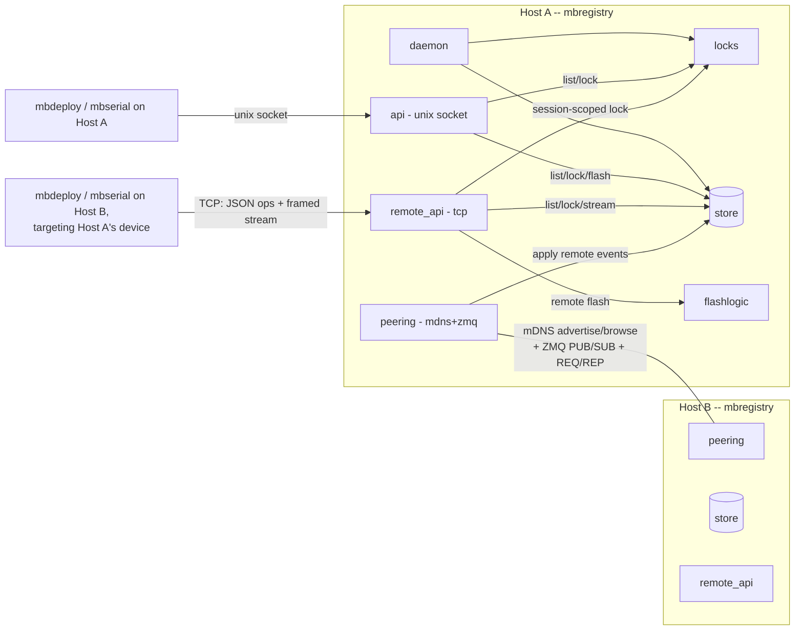
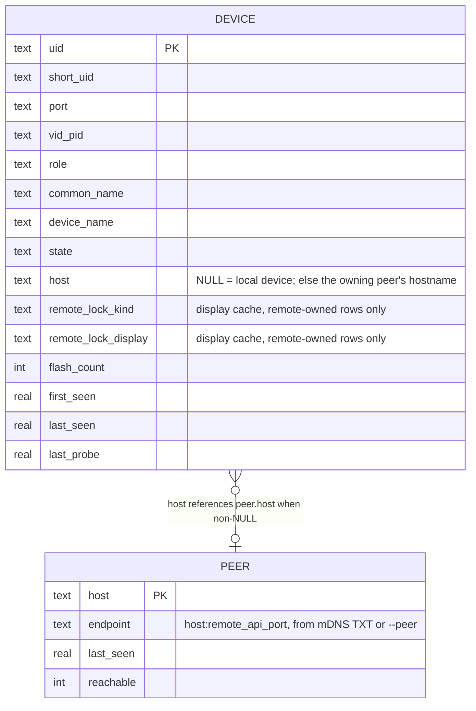

<!-- CLASI: Before changing code or making plans, review the SE process in CLAUDE.md -->

# Sprint 003: Distribution: registry peering and remote streams

## Goals

Make `mbregistry` distributed — mDNS peer discovery plus a ZeroMQ
attach/detach/identity-change event network — and extend `mbdeploy` and
`mbserial` to reach a device on a peer host through *that* host's
registry, never directly.

## Problem

The one-daemon principle only pays off across a fleet if a client on any
host can see and act on devices attached to any other host, mediated
entirely by the owning host's own registry (brief §3.7, §3.9). Sprints 001
and 002 built the local-only daemon and its local-only clients; this
sprint is what turns a set of independent per-host registries into one
logical fleet-wide view.

## Solution

- `mbregistry-peering-mdns-and-zeromq.md`: each `mbregistry` advertises
  and browses `_mbregistry._tcp` via mDNS (used only for peer discovery,
  never device-level announcements); peers connect over ZeroMQ; every
  attach/detach/identity-change event is published and applied into every
  peer's own database, tagged with the owning host; a newly-joining peer
  gets a snapshot then the live stream; `--peer HOST[:PORT]` lets a
  registry or client cross a network mDNS can't reach; the remote stream
  protocol carries control operations (reset/BREAK, DTR) out-of-band —
  the exact mechanism (framed protocol, WebSocket control messages, or
  RFC 2217) is this sprint's to decide or explicitly defer.
- `mbdeploy-flash-by-name-remote.md`: `mbdeploy deploy <name>` resolves a
  peer-owned device via the peer event stream, locks and flashes through
  the *owning* host's registry, and relays the post-flash re-probe back.
- `mbserial-raw-serial-access-remote.md`: `mbserial <name>` opens a
  stream to the owning host's registry carrying both data and the
  out-of-band control operations peering's stream protocol defines.

## Success Criteria

- Two `mbregistry` instances on the same LAN discover each other via
  mDNS and converge to the same combined device view within a bounded
  time.
- `mbregistry list` on either host shows the other's devices, tagged by
  owning host.
- A vanished peer's devices are handled per this sprint's cleanup policy
  (marked unreachable or removed — not left as stale "connected" rows).
- `mbdeploy deploy <name>` and `mbserial <name>` both work end-to-end
  against a peer-owned device, with no client opening a port or SWD
  connection to a board that isn't local to the registry it's talking to.
- A remote `mbserial` session can deliver a reset/BREAK to a relay board
  across the network stream.

## Scope

### In Scope

- `mbregistry-peering-mdns-and-zeromq.md`.
- `mbdeploy-flash-by-name-remote.md`.
- `mbserial-raw-serial-access-remote.md`.

### Out of Scope

- `mbrelay` and robot-console compatibility (sprint 004) — those build on
  top of this sprint's peering and remote-stream work but are scoped
  separately.
- Windows platform work (sprint 004).

## Test Strategy

(Deferred to Phase 2 detail planning — this is a roadmap-only entry. Will
need at least two-host or two-process integration coverage for peering,
not just unit tests.)

## Architecture

**Sizing: Substantial.** This sprint introduces a new cross-host event-bus
subsystem (mDNS + ZeroMQ peering), a new network-facing server subsystem
(the TCP remote API + framed serial-stream protocol) alongside the
existing Unix-socket API, a data-model change (new `peer` table, new
`device` columns), and a new cross-module dependency (the flash
robustness logic, previously `mbdeploy`-only, is now also invoked
server-side by `mbregistry`). All four of the "substantial" triggers
apply, so the full methodology with diagrams is used.

### Step 1-2: Problem and Responsibilities

The one-daemon principle (brief §"Guiding principle") only extends across
a fleet if each host's registry can (a) find its peers, (b) keep a live,
tagged view of every peer's devices without polling, and (c) let a remote
client act on a peer-owned device by talking *only* to the owning host's
registry — never touching the board directly. That splits into six
distinct responsibilities, each changing for its own reason:

1. **Peer discovery** — find other registries on the LAN (mDNS) or
   explicitly (`--peer`). Changes when discovery mechanics change.
2. **Event replication** — snapshot + live attach/detach/identity/
   lock-state propagation across peers, and peer-vanish cleanup. Changes
   when replication semantics change.
3. **Remote control-plane access** — a TCP-based equivalent of the
   existing Unix-socket API (list/get/find/lock/unlock/mark_flashed),
   scoped to *this* registry's own devices, for clients on other hosts.
   Changes when the wire protocol or session/lock model changes.
4. **Remote data-plane access** — the framed binary stream carrying
   serial data plus out-of-band control ops (BREAK/DTR/RTS) for a locked
   device. Changes when the streaming/control-channel protocol changes.
5. **Remote flash execution** — running the *same* retry/mass-erase/
   blank-board-reporting logic `mbdeploy` uses locally, but server-side,
   for a client that isn't on this host. Changes when flash robustness
   logic changes (shared with the local path, see Decision 4 below).
6. **Client-side remote dispatch** — `mbdeploy`/`mbserial` choosing local
   vs. remote transport based on where the resolved device lives, and
   speaking the new remote protocol when it's remote. Changes when the
   client-side selection or remote-client library changes.

(1) and (2) are grouped as one module, `registry.peering`, since neither
is independently useful — discovery without replication finds a peer and
does nothing with it. (3) and (4) share one process-level listener
(`registry.remote_api`) but are kept as clearly separated sub-protocols
within it (JSON-op framing vs. binary stream framing) because they change
for different reasons and have different framing rules. (5) is a new
module, `registry.flashlogic`, factored out from `mbdeploy` rather than
grown inside `registry.remote_api`, because it must be usable unchanged
by both the untouched local path and the new remote path. (6) spans a new
shared library (`registry.remote_client`) plus small, targeted changes to
`deploy.cli` and `serial.cli`/`serial.connect`.

### Step 3: Modules

| Module | Purpose (one sentence) | Boundary | Serves |
|---|---|---|---|
| `registry.peering` | Keep this host's view of every discovered peer's devices synchronized | Owns mDNS advertise/browse, the ZeroMQ PUB/SUB event bus and REQ/REP snapshot exchange, and the `peer` table's lifecycle; never grants or denies a lock, never opens a serial port | UC-005, UC-013, UC-014 |
| `registry.store` (extended) | Persist every record this host knows about — its own devices, peer-owned devices, and peers themselves | Owns the SQLite schema and all CRUD, including remote-tagged rows and `name@host` resolution; still the only module that knows the schema | UC-005, UC-013 |
| `registry.locks` (extended) | Grant exclusive per-device locks to a holder, whether local (pid) or remote (session) | Owns lock state and holder identity; still in-memory only, still knows nothing about sockets or wire formats | UC-006, UC-007, UC-011 |
| `registry.remote_api` | Give a remote host's client the same access to this registry that the local Unix socket gives | Owns the TCP listener, session-id issuance, JSON-op dispatch (shared with the local API's op logic), the binary stream sub-protocol, and invoking `flashlogic` for a remote flash | UC-009, UC-011 |
| `registry.flashlogic` | Flash a hex file to a board with transient-retry and mass-erase recovery | Pure flashing logic, no lock-taking, no registry/socket knowledge — identical contract to today's `deploy.flash.flash_hex` | UC-008, UC-009 |
| `registry.remote_client` | Speak the remote TCP protocol from any host | Owns TCP connect, JSON-op framing, and the stream sub-protocol's client side; mirrors `registry.client`'s shape so callers don't need two mental models | UC-009, UC-011 |
| `deploy.cli` (extended) | Choose local or remote transport when flashing by name | Adds one branch on the resolved device's `host` field; the flash flow itself (relay guard, wait-for-reprobe, reporting) is unchanged and reused for both paths | UC-009 |
| `serial.cli` / `serial.connect` (extended) | Choose local or remote transport when opening a serial session | Adds the same branch; a new `serial.remote_connect` supplies a `Session`-shaped object backed by the remote stream instead of a local port | UC-011 |

### Step 4: Diagrams

**Component diagram** — required: this sprint touches 5+ modules and adds
two new cross-module/cross-host dependencies (peering's host-to-host link,
and `remote_api`'s dependency on `flashlogic`).

`daemon`/`locks`/`store`/`api` on the right-hand host are the same shape
as Host A's (omitted for width — the diagram is symmetric per host).
`deploy.cli`/`serial.cli` are folded into "mbdeploy / mbserial" above;
their internal local-vs-remote branch is Step 3's own table entry, not a
new node here — it doesn't change composition, only which existing edge
(`registry.client` vs `registry.remote_client`) a given invocation uses.

**ERD** — required: the data model changes (new table, new columns).

**Dependency graph**: folded into the component diagram above — no
separate diagram needed, since every new edge is already labeled there
and none of them is cyclic (`peering`/`remote_api` depend on `store`/
`locks`/`flashlogic`; nothing in `store`/`locks`/`flashlogic` depends
back on `peering`/`remote_api`, preserving the existing
[Presentation] → [Domain] → [Infrastructure] direction with `peering`/
`remote_api` as a new presentation-layer pair, not a new domain layer).

### Step 5: What Changed / Why / Impact / Migration

**What Changed**
- New module `registry.peering`: mDNS advertise/browse (`python-zeroconf`)
  plus a ZeroMQ event bus (`pyzmq`) — one PUB socket per registry that
  every peer SUBs to, plus a REQ/REP snapshot endpoint a newly-joining
  peer queries once before subscribing. Publishes this host's own
  attach/detach/identity-change events (already produced by `daemon`) and
  lock-acquire/lock-release display events (from `locks`); applies a
  peer's events into `store`, tagged with that peer's hostname.
- New module `registry.remote_api`: a TCP listener parallel to the
  existing Unix-socket `api`. Reuses the existing op-dispatch logic for
  `list`/`get`/`find`/`lock`/`unlock`/`mark_flashed` (refactored into a
  shared base both `api.RegistryAPIServer` and the new TCP server use,
  rather than duplicated) but issues a per-connection session id instead
  of reading a PID, and adds two ops the Unix socket doesn't need:
  `stream` (switches the connection into the framed binary
  data+control sub-protocol for a locked serial device) and a
  robustness-preserving `flash` (see below).
- New module `registry.flashlogic`: `mbtools.deploy.flash.flash_hex` and
  its transient/locked-signature matching move here unchanged;
  `deploy.flash` becomes a two-line re-export so every existing import
  and test in the already-hardware-validated local flash path is
  untouched. `registry.remote_api`'s `flash` op calls this module
  directly (not the sprint-1 `registry.flash.FlashOp`, which stays as
  the deliberately-minimal local wire-protocol op it always was — see
  Decision 4 below for why the two are not merged).
- New module `registry.remote_client`: the TCP-protocol counterpart to
  `registry.client.RegistryClient`, same method names
  (`find`/`lock`/`unlock`/`mark_flashed`) plus `flash()` (streamed, like
  the Unix socket's) and `open_stream()` for the binary sub-protocol.
- `registry.locks`: `LockStatus`/`LockManager` generalized from a
  bare `pid: int` holder to a `HolderRef(origin, ref, pid=None,
  host=None)` — `origin` is `"local"` or `"remote"`. Every existing local
  code path (`daemon`, `api`) is updated to construct
  `HolderRef(origin="local", ref=str(pid), pid=pid)`, preserving today's
  exact acquire/release/sweep behavior; `remote_api` constructs
  `HolderRef(origin="remote", ref=session_id, host=peer_display_host)`.
  `sweep()`'s liveness check dispatches on `origin`.
- `registry.store`: new `host`, `remote_lock_kind`, `remote_lock_display`
  columns on `device` (migrated in place — see Migration Concerns); new
  `peer` table (`host` PK, `endpoint`, `last_seen`, `reachable`); `find()`
  accepts an optional `@host` suffix and raises a new ambiguous-name error
  when a bare name matches more than one host and no suffix was given;
  new methods for applying remote events and peer reachability.
- `registry.render`: adds a HOST column; a remote-owned device's lock
  display reads from the cached `remote_lock_*` fields instead of a live
  `LockManager` call; a device whose `peer.reachable` is false renders as
  "peer unreachable" rather than its last-known live state.
- `registry.cli`: `mbregistry run --peer HOST[:PORT]`, `--remote-port`,
  `--peer-pub-port`, `--peer-snapshot-port`, `--auth-token` (optional
  shared-secret string, default none); assembles `peering` and
  `remote_api` alongside the existing `daemon`/`api` pairing, sharing the
  same `threading.RLock` `assemble_daemon_and_api` already established.
- `deploy.cli`: `_run_deploy`'s resolve step branches on
  `device.get("host")` — `None` keeps today's untouched local flow
  (`RegistryClient`, direct `flash_hex`, `mark_flashed`); non-`None` uses
  `RegistryClient.find`'s new `endpoint` field to open a
  `remote_client.RemoteRegistryClient` against the owning host and drives
  the same relay-guard/lock/flash/wait-for-reprobe/report sequence
  against it (the remote `flash` op already runs `flashlogic` server-side
  with full robustness and increments `flash_count` itself, so no
  client-side `mark_flashed` call is needed on that branch).
- `serial.cli`/`serial.connect`: same branch; a new
  `serial.remote_connect.connect()` returns a `Session`-shaped object
  (same six duck-typed members) backed by `remote_client.open_stream()`,
  with `--reset` sending a BREAK or DTR-toggle control frame instead of a
  local platform-specific reset.

**Why**: this is the sprint's whole purpose — one logical fleet-wide view,
reached by clients that never touch a board that isn't local to the
registry they're talking to (brief §"Guiding principle").

**Impact on Existing Components**
- `daemon`/`locks`/`store`/`api` (the local Unix-socket path) keep their
  existing behavior for every local client — `HolderRef` generalization
  is additive in effect (local acquire/release/sweep call shapes are
  wrapped, not changed) and is covered by re-running sprint 001's own
  lock test suite against the new holder type.
- `deploy.flash`'s public symbols (`flash_hex`, `DEFAULT_MCU`) keep their
  exact signatures via the re-export, so sprint 002's local flash tests
  need no changes beyond an import-path smoke check.
- `registry.flash.FlashOp` (the sprint-1 minimal op) is untouched — it
  still exists, still minimal, and remains available for a future use
  that wants a no-retry flash without full remote-api machinery.

**Migration Concerns**
- **Schema migration for already-deployed databases.** Four of the five
  hardware hosts (meili, loki, hodr, magni — see
  `docs/acceptance/001-hardware.md`) already run `mbregistry` against a
  live `devices.db` with the sprint-1/2 schema. `Store.__init__` must add
  the new `device` columns and the `peer` table with `ALTER TABLE`/
  `CREATE TABLE IF NOT EXISTS`, guarded by checking `PRAGMA table_info`
  for column existence first (SQLite's `ADD COLUMN` has no
  `IF NOT EXISTS` on every SQLite version this project's Python targets
  bundle) — never a destructive rebuild, per `store`'s own "never delete,
  always update in place" precedent.
- **Deployment sequencing.** A rolling upgrade will briefly mix an
  old (sprint 1/2) daemon on one host with a new one on another. The
  existing `InvalidRequestError`-is-non-fatal pattern (`deploy.cli`'s
  `mark_flashed` handling) is the template: a new client talking to an
  old daemon over the *local* socket already degrades gracefully. A new
  peering registry reaching out to an old, non-peering daemon simply
  finds no `_mbregistry._tcp` peer to connect to (the old daemon
  never advertised one) — this is a silent no-op, not a crash, and is
  called out explicitly so it isn't mistaken for a peering bug during the
  fleet's rollout.
- **Port/firewall exposure.** Three new listening ports per host (mDNS's
  well-known 5353 aside): the remote API TCP port, the ZMQ PUB port, and
  the ZMQ snapshot REQ/REP port, all fixed-default-but-configurable (see
  Decision 7). This is new inbound network surface on every fleet node
  that didn't exist before this sprint; documented here so a firewalled
  deployment knows what to open.

### Step 6: Design Rationale

**Decision 1 — Remote serial control channel: a custom framed protocol,
not RFC 2217.**
- *Context*: brief open decision #5 leaves the mechanism unchosen among a
  framed protocol, WebSocket control messages, or RFC 2217.
- *Alternatives considered*: RFC 2217 is a real, pre-existing spec pyserial
  ships a *client* for (`serial.rfc2217.Serial`), which would buy
  interop with third-party RFC 2217 tools. But pyserial does not ship a
  maintained RFC 2217 *server* — only an unmaintained example script —
  so choosing RFC 2217 does not save server-side implementation work; it
  only adds the burden of implementing telnet IAC option negotiation
  correctly for a protocol whose COM_PORT_OPTION groups are broader than
  the small vocabulary this project actually needs (BREAK, DTR, RTS,
  data). A WebSocket framing would add an HTTP upgrade handshake for no
  benefit here, since neither browser interop nor HTTP infrastructure is
  a requirement.
- *Why this choice*: a minimal length-prefixed binary frame
  (`[1-byte type][4-byte length][payload]`, types `DATA`/`BREAK`/
  `SET_DTR`/`SET_RTS`/`CLOSE`) is fully within this project's control on
  both ends, requires no third-party interop, and is small enough to test
  exhaustively. No external tool is expected to speak to this stream
  directly — only `mbserial` and, in sprint 004, `mbrelay`.
- *Consequences*: no interop with generic RFC 2217 clients; acceptable,
  since none is a requirement. The protocol is versioned informally by
  this sprint's implementation; a future breaking change needs its own
  compatibility story, not designed here.

**Decision 2 — Lock holder identity generalized to `HolderRef`, not a
second lock table.**
- *Context*: brief open decision #3 — local locks are PID-tied; "a PID
  means nothing across hosts," so remote locks must be tied to something
  else (the brief's own sketch: the network session).
- *Alternatives considered*: (a) a second, parallel `RemoteLockManager`
  for session-tied locks, checked alongside the existing PID-tied one;
  (b) encoding a remote holder as a synthetic negative/offset "pid" to
  reuse the existing `int` field.
- *Why this choice*: (a) would let a local and a remote request both
  succeed on the same device at once — exactly the double-lock bug this
  design must prevent, since both request access to the same physical
  board through the same registry. (b) is a type-safety-destroying hack
  that would leak into every log line and wire response. Generalizing
  the one `LockManager`'s holder type keeps exclusivity provably correct
  (one table, one acquire path) at the cost of touching every existing
  call site — contained to `daemon.py`/`api.py`, both of which construct
  their `HolderRef` in one place each.
- *Consequences*: `locks.py`'s test suite must be re-run and extended,
  not just extended — this is flagged as the sprint's highest-regression-
  risk ticket and is sequenced first, before anything depends on it.

**Decision 3 — Remote lock display is a replicated cache, not a live
cross-host call.**
- *Context*: brief open decision #9 asks whether lock/"in use" state is
  replicated; UC-005's error flow expects `list` to be a local read, not
  a live network round-trip per listing.
- *Why this choice*: publishing lock-acquire/lock-release *display*
  events (kind + a human-readable holder description, not the actual
  `LockManager` entry) onto the same event bus as attach/detach keeps
  `list` a pure local read for every row, local or remote — consistent
  with UC-005's explicit "this use case does not make a live network call
  per listing" requirement. The cache is display-only: a remote client
  that actually wants to *act* on a peer-owned device still calls
  `lock()` on the owning host's `remote_api`, which is the sole
  authority over that device's real lock state.
- *Consequences*: the cached display can be briefly stale (bounded by
  event-bus latency) between an actual remote lock change and its
  reflection in a third host's `list` output — acceptable, since no
  correctness property depends on it; only the actual `lock()` call
  against the owning host is authoritative.

**Decision 4 — Flash robustness logic moves to `registry.flashlogic`, a
shared module; local flashing's own call path is left untouched.**
- *Context*: brief open decision #4 asks whether local flashing should
  route through the registry's flash op; this sprint doesn't resolve
  that. But remote flashing has no choice — a remote client cannot run
  `pyocd` itself, so *some* server-side code must carry the same
  retry/mass-erase/blank-board logic `mbdeploy`'s local path already has
  (hardware-proven per `docs/acceptance/001-hardware.md`).
- *Alternatives considered*: (a) reimplement the retry/mass-erase logic
  inside `registry.remote_api` directly; (b) extend the sprint-1 minimal
  `registry.flash.FlashOp` to add retry/mass-erase; (c) extract the pure
  logic into a shared module both paths call.
- *Why this choice*: (a) duplicates logic that must stay in lockstep with
  the local path (mismatched retry heuristics after this sprint would be
  a bug for every remote flash but not a local one). (b) conflates two
  different design intents — `FlashOp` is deliberately minimal per
  sprint 1's Design Rationale ("if you don't need to put flashing in
  MB Registry, don't"), and growing it defeats that intent for the one
  case where a wire-protocol `flash` op genuinely is needed. (c) is a
  pure move: `flash_hex` already has no CLI/argparse dependency, so
  relocating it costs nothing and both call sites (local, unchanged;
  remote, new) share one implementation.
- *Consequences*: `deploy.flash` becomes a re-export shim rather than the
  owning module — a one-time, low-risk rename that must not change any
  externally observable behavior of the already-hardware-validated local
  path (enforced by re-running its existing tests unchanged against the
  new location).
- **Explicitly deferred, not decided by this sprint**: whether
  `mbdeploy`'s own local flash should *also* route through the registry
  (brief open decision #4's original question) is left open. This
  sprint only needs one shared implementation callable from two places;
  it does not need to unify the two call *paths*, and doing so would
  touch sprint 002's hardware-validated local flow without a requirement
  driving it.

**Decision 5 — Peer vanish policy: mark unreachable, never delete.**
- *Context*: brief open decision #9's other unresolved half.
- *Why this choice*: the stakeholder's own instruction for this sprint is
  explicit — vanished peers' devices are marked unreachable, not deleted
  — and it matches `store`'s existing "never delete, always update in
  place" precedent (already used for a locally-detached device). A
  `peer.reachable` flag, joined against `device.host` at render time,
  keeps the mechanism symmetric with the existing `disconnected` device
  state without conflating "this device is gone" (a real disconnect the
  owning host itself observed) with "we lost contact with the host that
  would know" (a peering-link problem, potentially transient and
  independent of the device's real state).
- *Consequences*: a device's `state` column is never mutated by a peering
  event about the *peer's* reachability — only `peer.reachable` is, so a
  reconnecting peer's next snapshot naturally supersedes the stale flag
  without needing to reconcile per-device state that was never touched.

**Decision 6 — Auth: an optional shared token, off by default.**
- *Context*: brief open decision left as "token or none, to begin with."
- *Why this choice*: the existing Unix-socket API has no authentication
  beyond filesystem permissions (sprint 1's own Design Rationale — the
  socket is `0o666` because "it was never designed to restrict which
  local users can connect"), matching the garage LAN's current trust
  model. The new network surface is a materially different exposure
  (reachable from any host on the LAN, not just local users), so an
  optional `--auth-token`/`$MBREGISTRY_TOKEN` shared secret is added,
  checked on every `remote_api` connection and every peering handshake
  when set, but left unset (no auth) by default so today's garage
  deployment doesn't require a coordinated secret rollout as part of this
  sprint.
- *Consequences*: default-off auth means an unconfigured fleet is exactly
  as exposed as the trust model already assumes (anyone on the LAN).
  Flagged as an Open Question below for whether it should become
  mandatory later.

**Decision 7 — Fixed default ports, all configurable.**
- *Why*: matches every other path/socket default this project already
  establishes (flag > env var > default, `registry.client.
  resolve_socket_path`'s own precedent). Defaults: remote API TCP
  `7440`, ZMQ PUB `7442`, ZMQ snapshot REQ/REP `7443`, mDNS service type
  `_mbregistry._tcp.local.` with a TXT record carrying the host's actual
  remote-API/PUB/snapshot ports (so `--peer HOST` alone, without ports,
  still works once mDNS or a first explicit contact has supplied them).

**Decision 8 — A remote client connects directly to the owning host's
registry; the local registry never proxies the operation over the ZMQ
link.**
- *Context*: the brief's own diagram states a remote-acting client talks
  to "that remote host's own `mbregistry`" — not to a peer-to-peer
  protocol of its own.
- *Why this choice*: proxying an entire lock/flash/stream session through
  the initiating host's registry over the ZMQ event link would repurpose
  a fire-and-forget event bus as a request/response transport it wasn't
  designed for, and would make the initiating registry a single point of
  failure for an operation that has nothing to do with any device it
  owns. A direct client-to-owning-registry TCP connection is simpler,
  matches the brief's stated model exactly, and is why `store`/`peering`
  must surface each peer's `endpoint` (host:port) to local clients via
  `find()`'s response.
- *Consequences*: a client needs network reachability to the *peer* host
  directly, not just to its own local registry — true on the garage LAN,
  and the same requirement `--peer` already implies for registry-to-
  registry peering.

### Step 7: Open Questions

- Whether the optional shared-token auth (Decision 6) should become
  mandatory for any deployment reachable beyond the garage LAN is not
  decided by this sprint — flagged for stakeholder input if/when mbtools
  is deployed somewhere less trusted.
- Peering reconnection/backoff behavior (how eagerly a dropped ZMQ link
  retries, and whether a flapping link should have hysteresis before
  flipping `peer.reachable`) is left as an implementation detail of
  ticket work, not specified here — no use case depends on a specific
  timing.
- Brief open decision #4 (should local flashing also route through the
  registry) remains explicitly unresolved by this sprint — see Decision
  4's "Explicitly deferred" note.
- `mbrelay`/robot-console compatibility and Windows platform support
  remain out of scope per this sprint's existing Scope section (sprint
  004) — the peering/remote-stream foundation this sprint builds is
  designed to be usable by both without rework, but neither is verified
  here.

## Use Cases

Sized to the substantial-tier decision above — full narrative treatment,
since this sprint's whole purpose is these five cross-host use cases.

### SUC-001: Peer discovery converges two registries into one view

Implements UC-013 (mDNS discovery) and UC-014 (explicit `--peer`).
**Actor**: two or more `mbregistry` instances on the garage LAN, or across
a network boundary mDNS can't span. **Flow**: each registry advertises
`_mbregistry._tcp` (TXT: remote-API/PUB/snapshot ports) and browses for
the same; on discovering a peer (via mDNS or `--peer HOST[:PORT]`), it
opens a ZMQ REQ/REP snapshot exchange, applies the peer's snapshot into
its own `store` tagged with that peer's hostname, records the peer in the
`peer` table (`reachable=true`), and SUBs to the peer's PUB socket for
live events from then on. **Postcondition**: `mbregistry list` on either
host shows both hosts' devices, HOST-tagged. **Error flow**: the peer
link drops — the losing side sets that peer's `reachable=false` (Decision
5); it does not delete or mutate the peer's device rows.

### SUC-002: List across peers shows a combined, host-tagged view

Implements UC-005. **Actor**: any client tool, local or the `mbregistry
list` CLI itself. **Flow**: `list`/`find` reads `store` only — never a
live cross-host call (Decision 3) — combining locally-owned rows (live
lock status from `locks`) and peer-owned rows (cached `remote_lock_*`
display fields, `peer.reachable`-derived reachability). **Postcondition**:
read-only; a name that collides across two hosts requires `name@host` to
resolve unambiguously, per the stakeholder's explicit requirement.

### SUC-003: Remote flash by name

Implements UC-009. **Actor**: a user running `mbdeploy deploy <name>`
where `<name>` resolves to a peer-owned device. **Flow**: resolve via the
local registry (learns `host`+`endpoint`); connect a
`remote_client.RemoteRegistryClient` to the owning host's `remote_api`;
relay guard, lock (`kind=flash`, session-tied), request `flash` (which
runs `flashlogic.flash_hex` server-side, with the same retry/mass-erase/
blank-board behavior as a local flash, and increments `flash_count`
itself); wait for the owning host's re-probe and relayed announcement,
same reporting as the local flow. **Postconditions**: identical to
UC-008's local flow, but every device-touching step happened on the
owning host. **Error flow**: the owning host's registry becomes
unreachable mid-flash — the client fails the attempt cleanly; the owning
registry's own session-drop-releases-lock (same mechanism as a local
PID dying, generalized per Decision 2) ensures the device isn't left
locked.

### SUC-004: Remote serial connect with a working control channel

Implements UC-011. **Actor**: a user running `mbserial <name>` where
`<name>` resolves to a peer-owned device. **Flow**: resolve, connect
directly to the owning host's `remote_api`, lock (`kind=serial`,
session-tied), open the framed binary stream (Decision 1); by default no
reset is sent (same no-reboot default as local); `--reset` sends a BREAK
control frame (Linux-hosted target) or a DTR-toggle control frame
(macOS-hosted target) — the *owning host's* platform decides which,
mirroring `serial.connect`'s existing local platform branch, now
evaluated on the remote side. **Postcondition**: same as UC-010, mediated
entirely through the owning host. **Error flow**: busy-board errors name
host as well as lock kind (the `HolderRef.host` field, Decision 2, makes
this direct rather than inferred).

### SUC-005: A vanished peer's devices degrade visibly, not silently

Implements UC-013's error flow and UC-007's remote-session-drop flow.
**Actor**: `mbregistry` on the surviving side of a dropped peer link.
**Flow**: the ZMQ link drop is detected (socket-level, not a timeout
guess); `peer.reachable` is set false (Decision 5); any in-flight remote
lock held by a session on that peer's `remote_api` was never this host's
concern (locks are peer-owned, not replicated as authoritative — only
their display is cached, Decision 3) so nothing here needs to force-
release anything remotely. **Postcondition**: `list` shows that peer's
devices as "peer unreachable" rather than stale "connected" rows, per
UC-005's error flow.

## GitHub Issues

(GitHub issues linked to this sprint's tickets. Format: `owner/repo#N`.)

## Definition of Ready

Before tickets can be created, all of the following must be true:

- [ ] Sprint planning document is complete (sprint.md, including its
      Architecture and Use Cases sections)
- [ ] Architecture review passed (or skipped, for changes with no
      architectural impact)
- [ ] Stakeholder has approved the sprint plan

## Tickets

| # | Title | Depends On |
|---|-------|------------|
| 001 | registry.store: peer/host schema and name@host resolution | — |
| 002 | registry.locks: generalize holder identity for local and remote sessions | — |
| 003 | registry.flashlogic: extract shared flash-with-recovery logic from deploy.flash | — |
| 004 | registry.peering: mDNS advertise and browse for peer discovery | 001 |
| 005 | registry.peering: ZeroMQ snapshot exchange and live event bus | 001, 004 |
| 006 | registry.remote_api: TCP control-plane server (list/find/lock/unlock/mark_flashed) | 001, 002 |
| 007 | registry.remote_api: framed binary stream sub-protocol (data + BREAK/DTR/RTS control) | 006 |
| 008 | registry.remote_api: remote flash op with full retry and mass-erase robustness | 003, 006 |
| 009 | registry.cli: assemble peering + remote_api, --peer flag, port/auth flags | 004, 005, 006, 007, 008 |
| 010 | registry.render: HOST column, remote lock-state display, peer-unreachable rendering | 001, 009 |
| 011 | registry.remote_client: typed TCP client library for mbdeploy/mbserial | 006, 007, 008 |
| 012 | mbdeploy: flash a peer-owned device by name (remote transport) | 010, 011 |
| 013 | mbserial: connect to a peer-owned device (remote transport, --reset over control channel) | 010, 011 |
| 014 | Hardware acceptance: peering, remote flash, and remote serial across all five hosts | 009, 010, 012, 013 |

Tickets execute serially in the order listed.
