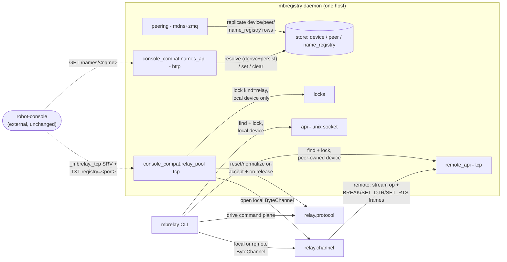
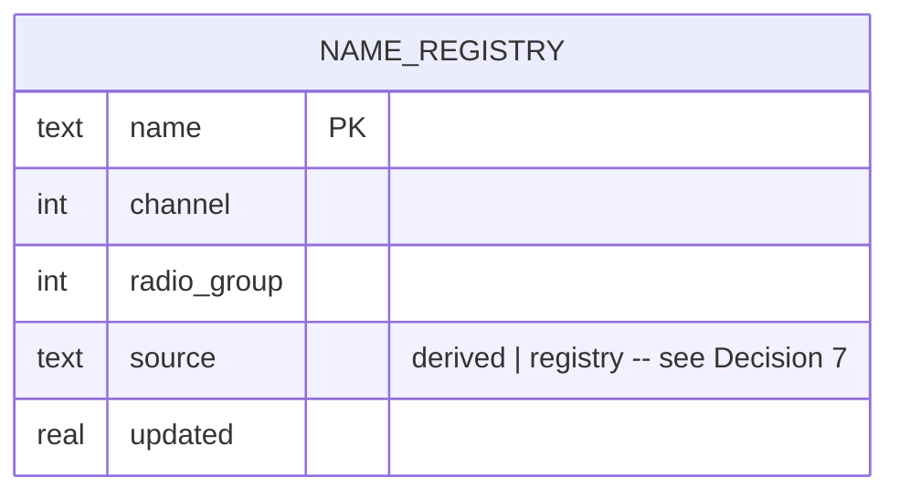

<!-- CLASI: Before changing code or making plans, review the SE process in CLAUDE.md -->

# Sprint 004: mbrelay, robot-console compatibility, and fleet migration

## Goals

Close out the four-program set with `mbrelay` (rebuilt as a pure relay
protocol client over `mbregistry`), preserve robot-console's contract
without any change on robot-console's side, and fix the two known
real-hardware defects blocking a clean fleet cutover (non-root USB
access / pyOCD permission hangs, and braeburn's mDNS/peering failure).

**Scope note (planning):** the original roadmap bundled four issues
into this sprint. `mbregistry-windows-platform-support.md` and the
fleet-migration (Ansible/golden-image/wikis) work have been split out
into sprint 005 for scope realism — see that sprint's Goals for why, and
its Problem section for the explicit dependency this sprint's
robot-console compatibility work creates for it. This sprint carries the
other three issues in full.

## Problem

`mbrelay` is the last of the three client tools and the one with the
widest blast radius if broken: robot-console silently mistunes moved
robots if the `_mbrelay._tcp` pool port, `registry=` TXT record, or
`/names` HTTP endpoint disappear (spec §"robot-console compatibility
contract"). Separately, two real-hardware defects found during sprints
002/003 hardware acceptance are still open and both block a safe fleet
migration: the Nolanet nodes need `sudo` for every local pyOCD/serial
access (no udev rule), and a permission failure makes pyOCD hang forever
instead of failing fast; and `braeburn` (the macOS registry) cannot be
discovered by, or peer with, the rest of the fleet over mDNS.

## Solution

- `mbrelay-relay-protocol-client-over-mbregistry.md`: `mbrelay connect
  [robot[@host]]` asks the registry which attached devices are relays
  and free, locks one (local or remote, using sprint 003's peering and
  remote-lock machinery), resets and normalizes on acquire
  (BREAK/reset, `HELLO`, `!VER?`, RAW250/frag-off/echo-off/P7/ch0-grp10),
  tunes to a robot via the name registry (`!CG`, `!GO`, optional `PING`),
  supports `--send`/`--expect` scripting and an interactive terminal, and
  restores defaults (`!DEFAULTS`) on release. The name registry (robot →
  channel/group) gets a home: a table in the registry database,
  replicated to peers over sprint 003's event bus (see Architecture).
- Robot-console compatibility: a compatibility endpoint hosted inside
  `mbregistry` itself (not a robot-console migration, not a
  dual-running transition period — see Architecture Decision 1),
  preserving the `_mbrelay._tcp` / `registry=` TXT / `/names` HTTP
  contract exactly, verified against robot-console's own source.
- `non-root-usb-access-and-pyocd-permission-hang.md`: a udev rule (and
  group membership) so local `mbdeploy`/`mbserial`/pyOCD access needs no
  `sudo` on Linux nodes, plus a fail-fast (permission pre-check and a
  no-progress timeout) so a permission failure reports in seconds
  instead of hanging `mbdeploy deploy`/`debug` forever.
- `macos-registry-mdns-discovery-and-outbound-peering-fail-on-braeburn.md`:
  a best-effort fix against the remaining candidate causes (not yet
  root-caused — see Architecture Decision 10), verified on real
  hardware, with the existing `--peer braeburn:7440` workaround
  documented as a fallback if the root cause isn't fully resolved this
  sprint.
- Real-hardware acceptance (final ticket): flash relay and robot
  firmware onto test boards, verify `mbrelay connect` end to end
  (including cross-host), verify robot-console's actual compatibility
  endpoints, verify non-root access on a Nolanet node, and verify
  braeburn's peering — results to `docs/acceptance/004-hardware.md`. Pick
  a spare board (no announcing firmware, e.g. `togov`) for any hands-on
  verification, per this project's standing rule about not disturbing
  robots in use.

## Success Criteria

- `mbrelay connect` reaches a free relay (local or remote), normalizes
  and restores it correctly, and supports scripted and interactive
  sessions, matching today's `mbrelay` behavior.
- robot-console continues to resolve relays and names without falling
  back to derived addresses — verified against the actual contract
  (SRV record, TXT `registry=`, `GET /names/<name>`), not just unit
  tests of the new code.
- A Nolanet node runs `mbdeploy deploy`/`debug` and `mbserial` without
  `sudo`, and a permission failure reports within seconds rather than
  hanging.
- `braeburn` peers with the fleet over mDNS with no `--peer` flag needed
  in either direction — or, if not fully root-caused, the workaround is
  re-confirmed and documented and the residual issue is flagged rather
  than silently dropped.

## Scope

### In Scope

- `mbrelay-relay-protocol-client-over-mbregistry.md`.
- `non-root-usb-access-and-pyocd-permission-hang.md`.
- `macos-registry-mdns-discovery-and-outbound-peering-fail-on-braeburn.md`.

### Out of Scope

- Any further protocol or peering changes beyond what robot-console
  compatibility and the name registry require — this sprint consumes
  sprint 003's peering and remote-lock machinery as-is.
- `mbregistry-windows-platform-support.md` and fleet migration (Ansible,
  golden image, wikis) — moved to sprint 005.

## Test Strategy

- `relay.protocol` (pure command-plane logic against a `ByteChannel`
  Protocol) gets fast, deterministic unit tests using a fake in-memory
  channel — no serial hardware, no registry — mirroring how
  `microbit-radio-relay`'s own `relay.py`/`session.py` were tested. This
  is where `naming.py`'s ported address-derivation is checked against the
  original test vectors (the `canonical_form()` sha256 check the research
  found).
- `relay.channel` (the local/remote `ByteChannel` adapters) is tested the
  way `serial.connect`/`serial.remote_connect` already are: a fake serial
  port for local, a fake `RemoteStream` for remote — no hardware.
- `console_compat.relay_pool` and `console_compat.names_api` are network
  services with an existing precedent (`registry.remote_api`'s own test
  suite drives it over a real loopback TCP socket against a fake device);
  the same pattern applies here, plus one integration test that opens a
  raw TCP connection to the pool port and checks it behaves like the
  brief's contract (banner first, in command plane, freshly normalized).
- **The robot-console compatibility contract is the sprint's one
  explicit-integration-required area, not just unit coverage** (carried
  from the roadmap plan): the acceptance criteria for tickets 006/007 are
  written directly against robot-console's own source
  (`mbrelayRegistry.ts`'s expected JSON shape, `mdnsDiscovery.ts`'s exact
  service-type string, `relayBridger.ts`'s pool-port assumptions), not
  against this sprint's own guess at the contract — see ticket 011 for
  running robot-console itself (headless, per Part 1 research showing
  every relevant module there is built around fake-injectable seams)
  against the new compatibility endpoints if that proves feasible during
  ticket work.
- Bugfix tickets (008 non-root USB, 009 pyOCD fail-fast, 010 braeburn)
  each get a regression test for the specific failure mode described in
  their issue, plus real-hardware verification in ticket 011 — these are
  exactly the kind of defect a unit test alone would not have caught
  (008/010 are permission/network-environment issues; 009 is a hang, so
  its unit test asserts a bounded wall-clock failure, not just an
  exception type).
- Ticket 011 is real-hardware acceptance end to end (see Scope and the
  ticket itself), results recorded to `docs/acceptance/004-hardware.md`,
  following the format of `001`-`003`.

## Architecture

**Sizing: Substantial.** This sprint introduces a new client subsystem
(`mbrelay`'s relay-protocol client, itself split into a protocol module
and a channel-adapter module — 3 new modules), a new in-daemon
compatibility subsystem hosted inside `mbregistry` (2 more new modules:
the relay pool-port service and the `/names` HTTP service), a data-model
change (a new `name_registry` table, replicated across peers), and a new
cross-module dependency (`mbrelay` depends on `registry.client`/
`registry.remote_client`, and the two new compatibility modules depend on
the new relay-protocol modules plus existing `locks`/`store`). That is
every one of the substantial-tier triggers, so the full methodology with
diagrams is used. The non-root-USB, pyOCD-hang, and braeburn bugfix work
in this sprint is smaller in scope (extensions to existing modules, no
new subsystem) and is covered under "Impact on Existing Components"
rather than the diagrammed core, but is still real sprint work with its
own tickets and acceptance criteria.

### Step 1-2: Problem and Responsibilities

The one-daemon principle only extends to relay boards if `mbrelay` never
enumerates or opens a board itself — every board access still goes
through `mbregistry`'s lock, exactly like `mbdeploy`/`mbserial` already
do. Layered on top of that is a hard external constraint: robot-console,
a consumer this project does not control the release schedule of, must
keep working against the exact `_mbrelay._tcp` / `registry=` / `/names`
contract it has today (brief §8, confirmed against robot-console's own
source this sprint). That splits into six distinct responsibilities:

1. **Relay command-plane protocol** — BREAK/reset, `HELLO`, `!VER?`,
   normalize (RAW250/frag off/echo off/P7/ch0-grp10), tune (`!CG`/`!GO`/
   `PING`), restore-defaults on release. Pure protocol logic; changes
   only when the radio-relay firmware's command language changes.
2. **Adapting a registry-obtained device connection to what that
   protocol needs** — a byte-in/byte-out channel with an out-of-band
   BREAK, whether the device is local or on a peer. Changes when the
   registry's local/remote connection primitives change, not when the
   relay protocol changes.
3. **Giving a user a relay CLI session** — resolve a relay or robot by
   name, lock it, drive (1) over (2), interactive or scripted. Changes
   when the CLI's own UX changes.
4. **Robot-console's pool-port contract** — a raw TCP port where every
   fresh connection gets a freshly-reset, normalized relay in the command
   plane, advertised over `_mbrelay._tcp` with a `registry=<port>` TXT
   record. Changes only if robot-console's own expectations change (they
   are pinned by an external consumer, not by this project).
5. **Robot-console's `/names` contract** — `GET/PUT/DELETE /names/<name>`
   with derive-and-persist-on-miss semantics. Same external-pinning
   property as (4), but a different protocol (HTTP vs. raw TCP) and a
   different backing concern (addressing, not board access) — grouped
   separately from (4) for that reason, sharing the same lock-free
   `name_registry` storage that `mbrelay`'s own CLI also reads.
6. **The name registry itself: storage, conflict detection, and
   fleet-wide replication** — persisting robot name → (channel, group),
   flagging same-link and same-channel conflicts, and keeping every
   peer's view converged the way `device`/`peer` rows already do.
   Changes when the addressing model or replication semantics change,
   not when either HTTP or CLI callers change.

(1) and its close relative naming/address-derivation are grouped as
`relay.protocol`, ported near-verbatim from
`microbit-radio-relay/server/src/mbrelay/relay.py` and `naming.py` since
neither needs to know it's now inside `mbtools`. (2) is a new module,
`relay.channel`, precisely because (1) must not know whether it's
running against a local serial port or a peer's remote stream — this
mirrors the `ByteChannel`/`ChannelFactory` seam the old codebase already
built for exactly this kind of portability. (3) is `relay.cli`, built the
same local/remote-dispatch shape as `serial.cli`/`serial.connect`. (4)
and (5) are two new modules under a `registry.console_compat` package —
kept separate because a fresh TCP pool-port listener and an HTTP `/names`
service are different network protocols with different failure modes,
even though both exist for the same one external reason (robot-console
compatibility) and both are hosted inside `mbregistry` under the
one-daemon rule rather than as a second `mbrelay serve`. (6) is `name
_registry` support added to `registry.store` (storage/conflict logic,
symmetric with how `device`/`peer` already live there) and
`registry.peering` (replication, extending the existing event bus rather
than building a second one).

### Step 3: Modules

| Module | Purpose (one sentence) | Boundary | Serves |
|---|---|---|---|
| `relay.protocol` (new) | Speak the relay command-plane protocol (reset/normalize/tune/restore) against any byte-oriented channel | Pure logic against a `ByteChannel`-shaped Protocol (ported from `transport.py`'s interface, not its `SerialChannel` implementation); includes the ported, verbatim `naming.py` address-derivation; no knowledge of `mbregistry`, sockets, or the CLI | UC-012 |
| `relay.channel` (new) | Adapt a registry-obtained device connection, local or remote, into the `ByteChannel` interface `relay.protocol` needs | Owns two thin adapters (`LocalRelayChannel`, `RemoteRelayChannel`) over `registry.client`/`registry.remote_client`; no relay-protocol knowledge of its own | UC-012 |
| `relay.cli` (new) | Give a user a relay session to a named robot or a free relay, from the command line | CLI/UX and local-vs-remote dispatch only (mirrors `serial.cli`'s shape); delegates all protocol work to `relay.protocol` and all connection work to `relay.channel` | UC-012 |
| `registry.console_compat.relay_pool` (new) | Give a raw TCP client a freshly-reset, normalized *local* relay per connection, matching today's `mbrelay` pool port | Owns the `_mbrelay._tcp` mDNS advertisement and the pool-port TCP listener; reuses `relay.protocol`/`relay.channel` (local only — see Decision 5) and `locks` (kind `relay`); no name lookup | robot-console compatibility (SUC-002) |
| `registry.console_compat.names_api` (new) | Serve the `/names/<name>` HTTP contract robot-console already expects | Owns the HTTP listener and GET/PUT/DELETE handling; delegates all storage/derivation to `registry.store`'s name-registry methods; no protocol/radio knowledge | robot-console compatibility (SUC-003) |
| `registry.store` (extended) | Persist the robot name → (channel, group) mapping alongside the devices/peers it already persists | Adds a `name_registry` table and CRUD/conflict-detection methods (`resolve`/`get`/`set`/`clear`/`name_for`/`conflicts`/`channel_conflicts`/`listing`); still the only module that knows the schema | UC-012, SUC-002, SUC-003, SUC-004 |
| `registry.peering` (extended) | Keep every peer's name registry converged, the same way device/peer state already converges | Adds `name_registry` row events to the existing ZMQ PUB/SUB bus and to the REQ/REP snapshot for late joiners; no name-registry business logic of its own (that stays in `store`) | SUC-004 |
| `registry.cli` (extended) | Set up a host's local USB permissions as part of the existing one-time install step | Adds a udev-rule-install step to `install-service`, alongside its existing systemd-unit write; no new command | SUC-005 |
| `registry.flashlogic` (extended) | Fail fast instead of hanging when pyOCD can't get device permission | Adds a permission pre-check and a no-progress timeout to `_run_streamed`; the retry/mass-erase logic it already owns is unchanged | SUC-005 |
| `registry.peering` (bugfix) | (Same module as above, different concern) Let macOS registries peer over mDNS like every other platform | Targeted fix to advertise/browse/REQ-socket setup on macOS; no interface or protocol change for Linux peers | SUC-006 |

### Step 4: Diagrams

**Component diagram** — required: this sprint adds five new modules and
two new cross-module dependencies (`relay.*` depending on
`registry.client`/`registry.remote_client`; `console_compat.*` depending
on `relay.protocol`/`relay.channel`).

`daemon`/`flashlogic` are omitted from the diagram for width — this
sprint's changes to them (Step 5) don't add new composition, only extend
existing modules already shown in sprint 003's diagram.

**ERD** — required: the data model changes (new table).

`name_registry` has **no foreign key to `device`**, by design — a
robot's radio address is a property of its *name*, not of any specific
relay board that happens to serve it today (a robot can be reached
through any free relay tuned to the right channel/group). `device` and
`peer` are unchanged this sprint (already diagrammed in sprint 003) and
are omitted here.

**Dependency graph**: folded into the component diagram above. New edges
all point from presentation/compatibility modules (`relay.cli`, `Pool`,
`NamesAPI`) toward protocol/storage modules (`relay.protocol`,
`relay.channel`, `Store`), never the reverse — no cycles, and the
existing [Presentation] → [Domain] → [Infrastructure] direction holds
with `relay.*` and `console_compat.*` as new presentation-layer members.

### Step 5: What Changed / Why / Impact / Migration

**What Changed**
- New module `relay.protocol`: ports `RelayControl`'s `hello`/
  `normalize`/`query`/`reset_and_normalize`/`clear_stored_config`/
  `firmware_version` and the `NORMALIZE_STEPS` sequence from
  `microbit-radio-relay/server/src/mbrelay/relay.py`, near-verbatim,
  against a `ByteChannel` Protocol ported from that repo's
  `transport.py`. Also ports `naming.py` verbatim (pure functions,
  checked against its existing sha256 canonical-form test vector).
  Explicitly does not port `inventory.py`, `firmware.py`, `admin.py`, or
  the mDNS advertiser implementation (only its wire *shape* is reused, in
  the new `console_compat.relay_pool` module, not its code).
- New module `relay.channel`: `LocalRelayChannel` (opens the local serial
  port the same way `serial.connect` does, uses `ser.send_break()`
  directly) and `RemoteRelayChannel` (wraps `registry.remote_client
  .RemoteStream`, using its existing `send_break()`/`set_dtr()`/
  `set_rts()`) — both satisfying the same `ByteChannel` interface
  `relay.protocol` expects.
- New module `relay.cli`: `mbrelay connect [robot[@host]]`, `mbrelay
  tune`, `--send`/`--expect` scripting, and an interactive terminal,
  structured exactly like `serial.cli`'s local/remote dispatch (resolve
  via `registry.client`/`registry.remote_client`'s `find`, branch on the
  resolved device's `host` field, lock kind `relay`). Ported from
  `microbit-radio-relay/server/src/mbrelay/client.py`'s socket/terminal
  helpers and `tune_to_robot` sequencing, adapted to call `relay.protocol`
  over `relay.channel` instead of a raw socket.
- New `registry.store` methods and a new `name_registry` table (`name`
  PK, `channel`, `radio_group`, `source`, `updated`), conceptually ported
  from `microbit-radio-relay/server/src/mbrelay/registry.py`'s
  `NameRegistry` (`resolve`/`get`/`set`/`clear`/`name_for`/`conflicts`/
  `channel_conflicts`/`listing`), SQL-backed instead of a `names.json`
  file, and with the `pins` (TOML) precedence tier dropped (see Decision
  7).
- `registry.peering` extended: `name_registry` set/clear events publish
  onto the existing ZMQ PUB bus the same way attach/detach/identity
  events already do, and `name_registry` rows join the existing REQ/REP
  snapshot a newly-joining peer requests.
- New package `registry.console_compat` with two modules:
  - `relay_pool`: advertises `_mbrelay._tcp` (SRV → the live pool-port
    socket, TXT `registry=<names_api port>`), and on every new TCP
    connection: picks a free *local* relay (`role` contains `RELAY`/
    `BRIDGE`, `host IS NULL`), locks it (kind `relay`), resets/normalizes
    via `relay.protocol` over a `relay.channel.LocalRelayChannel`, then
    pumps raw bytes between the socket and the channel until disconnect,
    at which point it resets/normalizes again and releases the lock —
    this is what makes a fresh TCP connection equivalent to "freshly
    reset relay in the command plane" (reset-by-reconnect, per
    `docs/relay-server.md`'s documented model).
  - `names_api`: `GET /names/<name>` (calls `store`'s `resolve`, which
    derives-and-persists on miss, matching robot-console's own
    documented "write-on-read" expectation exactly), `PUT /names/<name>`
    (calls `set`), `DELETE /names/<name>` (calls `clear`), returning
    `{"channel": int, "group": int, "source": "derived"|"registry"}` —
    the exact shape `mbrelayRegistry.ts` parses.
- `registry.cli`'s `install-service` gains a udev-rule-install step
  (VID:PID `0d28:0204`, covering both the tty and the CMSIS-DAP USB
  device node) and adds the operating user to the needed group,
  alongside its existing systemd-unit write.
- `registry.flashlogic`'s `_run_streamed` gains a device-permission
  pre-check (fail immediately, don't invoke pyOCD, if the device node
  isn't accessible) and a no-output-progress timeout (bounded silence,
  not total runtime — a slow-but-real flash must not be cut off), so a
  permission failure reports cleanly instead of hanging forever.
- `registry.peering`'s mDNS advertise/browse and ZMQ REQ-socket setup get
  a targeted macOS fix (see Decision 10 — not fully root-caused going
  into this sprint; ticket 010 applies the most-likely candidates and
  ticket 011 verifies on real hardware).

**Why**: close out the four-program set (brief §2) without breaking the
one external consumer this project doesn't control (robot-console), and
without leaving two known real-hardware defects (non-root USB, braeburn
peering) unresolved going into the fleet migration sprint 005 depends on.

**Impact on Existing Components**
- `registry.locks`: no change — `relay` is already a first-class lock
  kind (sprint 1), so `relay.cli` and `console_compat.relay_pool` use it
  as-is.
- `registry.remote_client`/`stream_frame`: no change — `RemoteStream
  .send_break()`/`set_dtr()`/`set_rts()` already exist and are exactly
  what `RemoteRelayChannel` needs (see Decision 4). This sprint consumes
  sprint 003's remote-stream machinery unmodified, per its own Scope.
- `serial.connect`/`serial.remote_connect`: no change — `relay.channel`
  is a new, parallel adapter pair, not a modification of these; the two
  are structurally similar (both give a `ByteChannel`-ish local/remote
  duck-typed object) but serve different protocols and are not merged,
  since `mbserial`'s job (raw serial passthrough) and `mbrelay`'s job
  (drive a specific command language) are different concerns even though
  the underlying transport looks similar.
- `deploy.flash`/`registry.flash.FlashOp`: unaffected by the pyOCD
  fail-fast change beyond the shared `_run_streamed`-style helper;
  existing local-flash behavior for a device that *does* have permission
  is unchanged.

**Migration Concerns**
- **Schema migration for already-deployed databases.** The four Nolanet
  hosts and `braeburn` already run a sprint-1/2/3-shape `devices.db`.
  Adding `name_registry` is a `CREATE TABLE IF NOT EXISTS` — no
  `ALTER TABLE` needed since it's a brand-new table, lower migration risk
  than sprint 003's device-column additions.
- **New listening ports.** Two more per host: the pool-port TCP listener
  and the `names_api` HTTP listener (defaults chosen deliberately
  different from legacy `mbrelay`'s 8760/8761 — see Decision 6 — to avoid
  a collision during sprint 005's transition window when an old
  `mbrelay.service` might briefly coexist with the new compatibility
  layer on the same node). Firewall/reachability implications are the
  same as sprint 003's port disclosure. **Unlike** `remote_api`/
  `peering`, these two listeners are deliberately **exempt** from sprint
  003's optional `--auth-token` check: robot-console (the only intended
  caller) has no mechanism to send one, matching legacy `mbrelay`'s own
  documented no-auth, internal-LAN-service posture for this exact
  surface. This is a conscious trust-model carry-over, not an oversight —
  flagged here so it isn't mistaken for a missed auth check during
  review or later hardening work.
- **Deployment sequencing with sprint 005.** This sprint's compatibility
  layer must be running and verified against robot-console *before*
  sprint 005 retires any node's old `mbrelay.service` — sprint 005's
  Problem section states this dependency explicitly.
- **udev rule installation on already-running hosts.** `install-service`
  is normally run once at setup; re-running it on a host that's already
  in service (to pick up the new udev-rule step) needs to not disrupt a
  running `mbregistry.service` — the ticket's acceptance criteria require
  this to be idempotent and safe to re-run.
- **braeburn fix is best-effort, not guaranteed.** The issue is not
  root-caused as of this sprint's planning (three hypotheses already
  refuted per `docs/acceptance/003-hardware.md`). If ticket 010's fix
  doesn't resolve it on real hardware, the existing `--peer
  braeburn:7440` workaround remains available and ticket 011's acceptance
  criteria account for that possibility (see Open Questions).

### Step 6: Design Rationale

**Decision 1 — Robot-console compatibility is hosted inside `mbregistry`
(a compatibility endpoint), not a robot-console migration or a
dual-running transition period.**
- *Context*: brief open decision #6 leaves this unchosen among three
  options.
- *Alternatives considered*: migrating robot-console itself is outside
  this project's control — it's a separate repo/team's release schedule,
  and the brief treats "robot-console keeps working unchanged" as a hard
  constraint, not a negotiable target. Running the old `mbrelay` server
  and the new `mbregistry` side by side for a transition period
  reintroduces exactly the port-collision problem the whole project
  exists to fix (brief §1 — "run both on one machine and they compete for
  the same serial ports").
- *Why this choice*: hosting the compatibility surface inside
  `mbregistry` preserves the one-daemon rule (it's not a second server,
  it's two more listeners on the existing one) and requires zero changes
  to robot-console.
- *Consequences*: `mbregistry` grows two new externally-facing protocols
  it must keep byte-for-byte compatible with an external consumer it
  doesn't control — this is exactly why ticket 011's acceptance criteria
  are written against robot-console's own source, not this sprint's
  paraphrase of the brief.

**Decision 2 — Name registry storage: a SQL table in the registry
database, replicated over the existing peering event bus.**
- *Context*: brief open decision #6's other half.
- *Alternatives considered*: a per-host `names.json` file (today's
  model) doesn't fleet-replicate on its own, and would be a second
  persistence mechanism alongside the SQLite `device`/`peer` tables the
  one-daemon rule already centralized. A dedicated separate name-registry
  service would itself be a second daemon, violating the guiding
  principle outright.
- *Why this choice*: one table, one storage mechanism, replicated the
  same way `device`/`peer` state already is — no new persistence or
  replication technology introduced.
- *Consequences*: `name_registry` rows are subject to the same
  eventual-consistency window as `device`/`peer` replication (bounded by
  event-bus latency); acceptable since address lookups aren't
  safety-critical the way lock exclusivity is.

**Decision 3 — `relay.protocol` is ported against a `ByteChannel`
Protocol, not rewritten against `mbregistry`'s APIs directly.**
- *Context*: the old codebase's `relay.py`/`session.py` (acquire/release/
  sniffing) were already written entirely against `transport.py`'s
  `ByteChannel`/`ChannelFactory` Protocols, not against a concrete
  serial object — confirmed by this sprint's own code research.
- *Alternatives considered*: rewriting the protocol logic directly
  against `registry.client`/`registry.remote_client` would tangle
  protocol sequencing with locking/networking concerns and lose an
  already-designed, already-tested seam for no benefit.
- *Why this choice*: `relay.channel` is the *only* new code needed to
  make the old protocol logic work against a completely different
  transport (a registry-owned device instead of a directly-opened tty) —
  `relay.protocol` itself needs no logic changes, only relocation.
- *Consequences*: `relay.protocol` stays trivially unit-testable with a
  fake in-memory channel, exactly as it was in the old codebase.

**Decision 4 — Remote relay reset reuses sprint 003's existing BREAK/
SET_DTR/SET_RTS stream frame ops; no new out-of-band control mechanism
is built.**
- *Context*: the brief's own open decision #5 ("remote serial streams
  must carry control operations... BREAK and DTR cannot cross a plain TCP
  pipe") reads as still-open going into this sprint, but sprint 003
  already resolved it for `mbserial`'s use case.
- *Why this choice*: `registry.remote_client.RemoteStream` already
  exposes `send_break()`/`set_dtr()`/`set_rts()` over the exact framed
  binary sub-protocol (`stream_frame`'s `BREAK`/`SET_DTR`/`SET_RTS` frame
  types) that `relay.protocol`'s reset/normalize sequence needs —
  confirmed by this sprint's research against the live
  `remote_api`/`stream_frame`/`remote_client` code, not assumed from the
  brief. `RemoteRelayChannel` simply calls these existing methods.
- *Consequences*: this sprint adds **zero** new wire protocol to
  `registry.remote_api`/`stream_frame` — a smaller, lower-risk footprint
  than the roadmap plan's "Deferred to Phase 2" note anticipated.

**Decision 5 — The compatibility pool port serves only this host's local
relays; it does not proxy a peer's relay.**
- *Context*: legacy `mbrelay` ran one server per host, with its own
  local board pool; robot-console selects a specific host via its mDNS
  *instance* name before connecting to that host's pool port.
- *Alternatives considered*: making the pool port registry-aware (serve
  any relay reachable via peering, local or remote) would require a new
  remote data-plane proxying layer — streaming raw relay bytes from one
  host's `console_compat.relay_pool` through to another host's device —
  which nothing in this sprint's scope or the brief's contract requires.
- *Why this choice*: matches the existing external contract exactly
  (robot-console already picks the host first, via mDNS), and reuses
  `LocalRelayChannel` directly with no new remote-proxying code.
- *Consequences*: a host with no local free relay simply has nothing to
  offer on its pool port — robot-console's own multi-candidate discovery
  (confirmed in `relayBridger.ts`'s research) already handles trying a
  different host.

**Decision 6 — New default ports for the pool and `/names` HTTP
listener, distinct from legacy `mbrelay`'s 8760/8761.**
- *Context*: sprint 005's fleet migration will have a window where an old
  `mbrelay.service` (still bound to 8760/8761) and the new compatibility
  layer could both be present on a node mid-cutover.
- *Why this choice*: choosing new defaults (documented in the relevant
  ticket, in this project's existing `7440`/`7442`/`7443` port-numbering
  sequence) avoids a bind collision during that window, at zero cost
  since both port numbers are discovered live via mDNS SRV/TXT anyway —
  no client hardcodes them.
- *Consequences*: an operator who *does* hardcode the legacy port numbers
  anywhere outside mDNS discovery (not expected, but not verified against
  every possible deployment) would need to update that. Flagged, not
  expected to matter given robot-console's own discovery-only design
  (confirmed by Part 1 research: no CLI flag for a fixed host/port was
  found in robot-console).

**Decision 7 — The name registry keeps two source tiers (`derived`,
`registry`), dropping the old third tier (`config`/TOML pins).**
- *Context*: `microbit-radio-relay`'s `NameRegistry` had `pins` (TOML,
  highest precedence) > `_learned` (HTTP-set) > `derived`.
- *Why this choice*: nothing in this project's scope introduces a
  per-host TOML config file with name pins, and the brief doesn't ask for
  one; carrying a three-tier precedence model for a tier with no writer
  would be speculative generality.
- *Consequences*: if fixed-pin overrides are wanted later, adding a third
  tier is a contained follow-up (the `source` column already
  discriminates cleanly); not designed here.

**Decision 8 — pyOCD fail-fast uses a no-progress timeout, not a
total-runtime cap.**
- *Context*: the issue itself proposes both options.
- *Why this choice*: a total-runtime cap would risk cutting off a slow
  but genuinely-in-progress flash (mass-erase recovery already retries);
  a bounded-silence timeout (no new output for N seconds) only fires when
  pyOCD has actually gone quiet, which is what a permission hang looks
  like, combined with treating an early "no permission"/"unable to open"
  line as immediately fatal rather than waiting out any timeout at all.
- *Consequences*: a pyOCD invocation that legitimately produces no output
  for a stretch (not observed in this project's flash logs, but not
  provably impossible) could still false-positive; the permission
  pre-check (checked before invoking pyOCD at all) is the primary fix,
  and the timeout is the fallback for whatever the pre-check doesn't
  catch.

**Decision 9 — udev-rule installation folds into the existing
`install-service` command rather than a new one.**
- *Context*: `registry.cli`'s `install-service` is already this
  project's one "run this once to set up the host" entry point
  (currently: write and print instructions for the systemd unit).
- *Why this choice*: an operator already runs this command once per host;
  adding the udev-rule write and group-membership step there means one
  setup step, not two to remember and keep in sync.
- *Consequences*: `install-service` needs `sudo` for the udev-rule write
  (it likely already assumes root for the systemd unit path) — no new
  privilege requirement, just a second file written under the same
  invocation.

**Decision 10 — The braeburn peering fix is best-effort against the
candidates already identified, not a guaranteed root cause.**
- *Context*: the issue's own "Candidates still to check" list (macOS
  Application Firewall/local-network privacy prompt treating the venv
  python differently from an interactive script; which interface/address
  zeroconf binds on macOS; REQ-socket-creation ordering relative to the
  event loop) was written after three other hypotheses were already
  refuted (`docs/acceptance/003-hardware.md`).
- *Why this choice*: applying and testing the remaining candidates in
  order, with better diagnostics added along the way, is the honest
  amount of investigation this sprint can commit to without an unbounded
  debugging ticket; a documented workaround (`--peer braeburn:7440`)
  already exists as a fallback.
- *Consequences*: ticket 010/011's acceptance criteria must allow for
  "root cause found and fixed" and "not resolved, workaround
  re-confirmed and documented" as two different but both-acceptable
  outcomes — see Open Questions.

### Step 7: Open Questions

- **braeburn root cause**: may still be open after ticket 010 — see
  Decision 10. If unresolved after this sprint's best-effort pass, it
  should be re-filed (or left open) as its own issue rather than block
  sprint close; not a reason to hold the rest of sprint 004.
- **Two robot-console checkouts exist** on this machine
  (`/Volumes/Proj/proj/robot-projects/robot-console` and
  `/Volumes/Proj/proj/league-projects/microbit/robot-console`, same
  package layout, different mtimes — found during this sprint's
  research). Ticket 006/007/011 should confirm with the stakeholder which
  is authoritative before treating either as the spec of record; this
  plan defaults to the first (`robot-projects/robot-console`) as it was
  the first match in the priority order given.
- **Whether local flashing should also route through the registry**
  (brief open decision #4) remains explicitly unresolved, carried over
  from sprint 003 — out of this sprint's scope.
- **Whether `name_registry` needs a config-pin tier later** (Decision 7)
  is deferred, not designed here.

## Use Cases

Sized to the substantial-tier decision above. SUC-001 through SUC-004
cover the new relay/name-registry/robot-console subsystem in full
narrative treatment; SUC-005/SUC-006 are lighter since they extend
existing use cases (UC-008/UC-010, UC-013) rather than introducing new
actors or flows.

### SUC-001: `mbrelay` connects to a robot by name

Implements UC-012's main flow, now with a concrete architecture. **Actor**:
a user running `mbrelay connect [robot[@host]]`. **Flow**: `relay.cli`
resolves a free relay (named robot's preferred relay, or any free one)
through `registry.client`/`registry.remote_client`'s `find`, exactly as
`mbserial` resolves a device (UC-009/UC-011's pattern); locks it (kind
`relay`); opens a `relay.channel` adapter (local or remote, matching
where the relay lives); `relay.protocol` resets and normalizes over that
channel (BREAK/reset, `HELLO`, `!VER?`, RAW250/frag off/echo off/P7/ch0
grp10, verified with `?`); looks up the robot's channel/group via
`registry.store`'s name-registry `resolve` (deriving-and-persisting if
unseen); sends `!CG`, `!GO`, optional `PING`; hands the user an
interactive terminal or runs `--send`/`--expect` scripting.
**Postconditions**: on release, `!DEFAULTS` restores the relay to its
normalized resting state and the lock is released — identical to today's
`mbrelay` behavior. **Error flows**: no free relay (reported, not
blocked); named robot not in the name registry is a distinct,
reported error, not silently derived without telling the user (the CLI
path, unlike robot-console's, should surface which source answered).

### SUC-002: robot-console gets a freshly-reset relay from a host's pool port

New use case (this sprint); parented to UC-012's explicit
robot-console-compatibility forward-reference — promoting it to a
standalone master use case is a natural follow-up for architecture
consolidation, outside this sprint-planner's write scope
(`docs/design/`). **Actor**: robot-console, unmodified, via
`connect/relayBridger.ts`. **Preconditions**: `mbregistry` is running
`console_compat.relay_pool` and has at least one local relay
(local to that host). **Flow**: robot-console browses `_mbrelay._tcp`,
resolves a host's SRV (pool port) and TXT `registry=<port>`; for each
candidate host it opens a fresh TCP connection to the pool port;
`relay_pool` locks a free local relay, resets/normalizes it via
`relay.protocol`/`relay.channel`, and hands the connection a live
command-plane session starting with the boot banner; robot-console runs
its own preamble/sync and `!GO` sequence exactly as it does against
today's `mbrelay`, with no changes on its side.
**Postconditions**: on disconnect, `relay_pool` resets/normalizes again
and releases the lock — reset-by-reconnect, matching
`docs/relay-server.md`'s documented model exactly, which is why
robot-console's own "reset the relay on every candidate attempt" logic
(confirmed in `relayBridger.ts`) is compatible without modification.
**Error flow**: no free local relay on this host — the TCP connection
simply has nothing to offer; robot-console's own multi-candidate,
multi-host failover (confirmed in research) already tries elsewhere.

### SUC-003: robot-console resolves a robot's channel/group over HTTP

Same new-use-case status as SUC-002, same parent. **Actor**:
robot-console, via `mbrelayRegistry.ts`, GET-only. **Flow**: GET
`/names/<name>` on `names_api`; `names_api` calls `registry.store`'s
`resolve`, which returns an existing `registry`-sourced entry unchanged,
or computes and **persists** a `derived` one on first ask (matching
robot-console's own documented "write-on-read" expectation exactly —
robot-console's client never treats a 200 response as proof the
registry "knew" the mapping, precisely because of this semantic);
responds `{"channel": int, "group": int, "source": "derived"|
"registry"}`. **Postconditions**: none from the read itself beyond the
possible derive-and-persist side effect, which also triggers replication
(SUC-004) so every peer converges on the same value (harmless even if two
hosts derive it independently and concurrently, since derivation is a
pure deterministic function of the name). **Error flow**: any failure
(timeout, network error, malformed request) — robot-console's own client
already falls back to a locally-computed derived address and never
blocks on this endpoint (confirmed in research); this sprint's endpoint
does not need to compensate for that client-side behavior, only to
answer correctly when reachable.

### SUC-004: A robot's radio address converges across every peered host

Implements UC-013's replication mechanism, extended to a new record kind.
**Actor**: two or more peered `mbregistry` instances. **Flow**: a
`name_registry` set/clear (from `mbrelay tune`, a `PUT`/`DELETE` on
`names_api`, or a derive-on-miss `resolve`) publishes onto the same ZMQ
PUB bus that already carries attach/detach/identity events; every peer
applies it to its own `store`; a newly-joining peer receives the current
`name_registry` rows as part of its existing REQ/REP snapshot exchange
(UC-013 step 4), the same call that already hands it `device`/`peer`
rows. **Postconditions**: `GET /names/<name>` on *any* peered host
returns the same answer, whichever host a robot was actually tuned
through. **Error flow**: same as UC-013's — a peer link drop degrades
that peer's replication the same way it already degrades device-state
replication (Decision 5 from sprint 003), not specific to name-registry
rows.

### SUC-005: Local USB/serial/flash access works without `sudo`, and a permission failure fails fast

Hardens UC-008 (flash) and UC-010 (`mbserial` connect, local)'s
preconditions rather than introducing a new actor or flow. **Actor**: an
operator on a Linux node (confirmed affected: the four Nolanet hosts).
**Flow**: `mbregistry install-service` writes a udev rule for VID:PID
`0d28:0204` (covering both the tty and the CMSIS-DAP USB device node) and
adds the operating user to the needed group, so `mbdeploy deploy/debug`
and `mbserial` need no `sudo` locally — matching `braeburn`'s (macOS)
existing no-`sudo` behavior. Separately, if permission is *still* denied
(rule not yet applied, wrong device), `flashlogic`'s pre-flight check
reports it immediately rather than invoking pyOCD, and a no-progress
timeout bounds any residual hang. **Postconditions**: `mbdeploy
deploy`/`debug` and `mbserial` succeed without `sudo` on a freshly
provisioned Nolanet-like host; a permission failure reports in seconds,
not never. **Error flow**: udev rule not yet loaded (needs a re-plug or
`udevadm trigger`) — documented in the ticket's acceptance criteria, not
silently retried forever.

### SUC-006: `braeburn` peers with the fleet over mDNS with no `--peer`

Implements UC-013's LAN-native path, currently broken on macOS. **Actor**:
`braeburn`'s `mbregistry` and any Linux peer on the garage LAN.
**Flow**: same as UC-013's main flow, with this sprint's fix applied to
whichever of the candidate causes (Decision 10) is confirmed — either
`braeburn`'s advertisement becomes visible to Linux peers' raw
`avahi-browse`, or its outbound ZMQ snapshot request to a peer stops
hanging, or both. **Postconditions**: `mbregistry list` on a Linux node
shows `braeburn`'s devices, and vice versa, with no `--peer` flag needed
in either direction. **Error flow**: if not fully resolved, the existing
`--peer braeburn:7440` workaround remains documented and acceptance
criteria treat "workaround re-confirmed, root cause still open" as a
valid (if disappointing) sprint outcome — see Open Questions.

## GitHub Issues

(GitHub issues linked to this sprint's tickets. Format: `owner/repo#N`.)

## Definition of Ready

Before tickets can be created, all of the following must be true:

- [ ] Sprint planning document is complete (sprint.md, including its
      Architecture and Use Cases sections)
- [ ] Architecture review passed (or skipped, for changes with no
      architectural impact)
- [ ] Stakeholder has approved the sprint plan

## Tickets

| # | Title | Depends On |
|---|-------|------------|
| 001 | Name registry data model | — |
| 002 | Name registry replication | 001 |
| 003 | Relay protocol core | — |
| 004 | Relay channel adapters | 003 |
| 005 | mbrelay CLI | 001, 004 |
| 006 | robot-console compatibility: relay pool | 003, 004 |
| 007 | robot-console compatibility: names HTTP API | 001 |
| 008 | Non-root USB access: udev rule install | — |
| 009 | pyOCD permission fail-fast | — |
| 010 | braeburn mDNS discovery and peering fix | — |
| 011 | Real-hardware acceptance | 005, 006, 007, 008, 009, 010 |

Tickets execute serially in the order listed.
