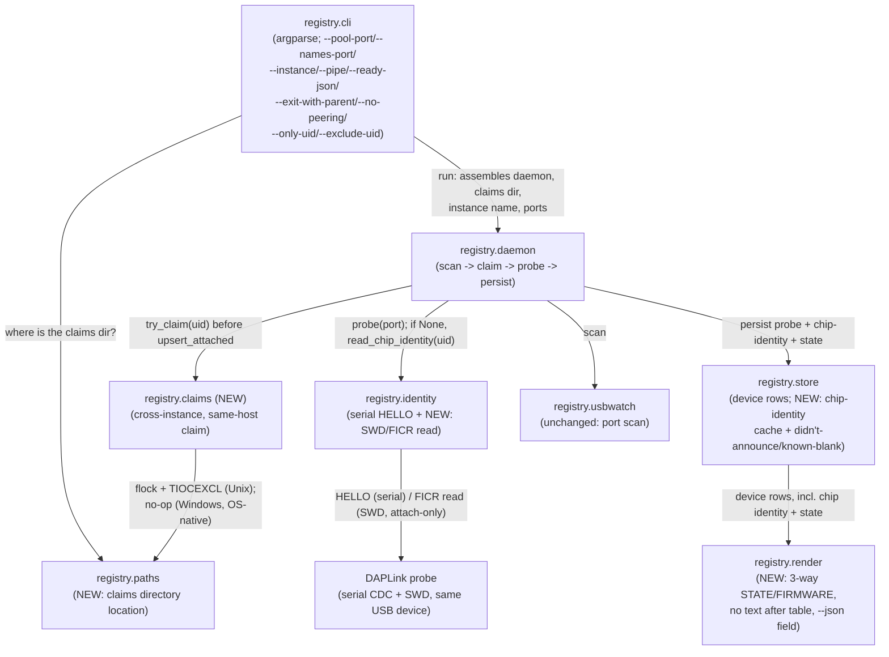

<!-- CLASI: Before changing code or making plans, review the SE process in CLAUDE.md -->

# Sprint 007: Silent-board SWD naming and multi-instance mbregistry

## Goals

Two independent but code-path-adjacent gaps in `mbregistry`, both surfaced
during hardware acceptance / the robot-console integration proposal:

1. A board that doesn't announce over its CDC serial port (blank, or
   running student/robot firmware with no `HELLO` handler) still has a
   real five-letter name — it lives in `FICR.DEVICEID[1]` on the target
   nRF, readable over SWD through the same DAPLink probe, without halting
   or resetting the board. Read it, cache it, and stop conflating "didn't
   answer" with "known blank" in both the `STATE`/`FIRMWARE` columns and
   `list`'s printed output.
2. Several `mbregistry` instances must be able to run on one host (so
   robot-console can spawn its own when no system daemon is reachable,
   per `docs/design/robot-console-integration.md`), without two instances
   ever opening the same board, colliding in mDNS, or fighting over fixed
   ports.

## Problem

**Silent boards (issue 1).** `mbregistry list` currently shows `-` in
`NAME` for any board that didn't answer `HELLO`, even though its name is
a fixed property of the chip and is knowable without firmware. Worse, the
`STATE`/`FIRMWARE` columns conflate two different facts under one state
(`connected_no_firmware`): "we asked and got nothing back" (the board
almost certainly has *some* firmware, it just doesn't announce) and "we
know for a fact the board is blank" (e.g. right after a mass erase whose
reflash then failed). A related, concrete symptom of the same conflation:
after a failed flash mass-erased `togov`, `list` kept showing its old
`JOYSTICK/joystick` firmware instead of reflecting that the board was now
blank. Finally, `render_table` prints per-device `error_note` lines
*after* the table, which breaks any caller (a script, a future
`--json`-adjacent consumer) that expects the printed output to be exactly
one header, one rule, and one row per device.

**Multi-instance (issue 2).** Today, `mbregistry run` binds the relay-pool
(7444) and `/names` (7445) ports with no override, uses `gethostname()`
for both the mDNS instance name and the `peer.host`/`device.host` value,
and has no notion of "another `mbregistry` process on this same host
might also be probing this board right now." Two instances on one
machine collide in mDNS (`_mbregistry._tcp`, `_mbrelay._tcp`), overwrite
each other in peers' `peer` table, and can both try to open the same
serial port. `docs/design/robot-console-integration.md` §4-§5 needs all
of this to let robot-console spawn a private, unpeered `mbregistry` when
no system instance is reachable, alongside a possible system instance,
without either one disturbing the other's boards.

## Solution

**Silent-board naming.** When `identity.probe` returns `None` (no
announcement arrived), read `FICR.DEVICEID[1]` over SWD through the same
probe UID — `connect_mode="attach"`, `auto_unlock=False`, no halt, no
reset, no serial port — and encode it with CODAL's five-letter
friendly-name codebook, the same algorithm `mbdeploy`'s
`read_device_id`/`friendly_name`/`read_board_name`
(`src/mbdeploy/devices.py`) already implement and this sprint ports into
`mbtools.registry.identity`. `FICR.DEVICEID[1]` is a fixed property of
the physical chip, so once read for a UID it is cached forever (a new
persisted column on the `device` row) and never re-read, even across
reflashes, detaches, or failed probes.

The `STATE` column gains a real three-way distinction: **announced**
(the existing `connected` state), **didn't announce** (a new state — a
probe ran, got nothing, but the board plausibly has firmware we simply
don't hear from), and **known blank** (the existing
`connected_no_firmware` state, now reserved for cases we can actually
assert, principally the post-flash re-probe that still gets nothing after
a mass erase). `FIRMWARE` reads `unknown` for the "didn't announce" case
and `no firmware` only for "known blank". `render_table` stops printing
anything after the table; the same structured detail goes into a
`--json` field instead of free-text `error_note` prose after the table.

**Multi-instance.** `--pool-port`/`$MBREGISTRY_POOL_PORT` and
`--names-port`/`$MBREGISTRY_NAMES_PORT` make every listener configurable,
with `0` meaning "bind ephemeral, advertise whatever actually bound" —
extending the pattern `--remote-port`/`--peer-pub-port`/
`--peer-snapshot-port` already use. `--instance NAME` (default: short
hostname, as today) names this instance in mDNS
(`_mbregistry._tcp`/`_mbrelay._tcp`) and in `peer.host`/`device.host` —
the constructor parameters (`PeerDiscovery.host`,
`assemble_relay_pool`'s `instance_host`) already exist; this sprint wires
a flag to them. `--pipe NAME` gives the same override on Windows, where
the pipe name is currently a hardcoded constant. A new cross-process,
same-host **claim** (Unix: `flock` on
`<shared-runtime>/mbtools/claims/<uid>.lock` plus `TIOCEXCL` on the open
tty; Windows: COM-port exclusivity is already native, so no new code is
needed there) is taken before any instance treats a board as its own —
an instance that can't claim a board skips it entirely, so it never
appears in that instance's own `list`. `--only-uid`/`--exclude-uid` let
an operator partition boards deliberately. `--ready-json`,
`--exit-with-parent`, and `--no-peering` make `mbregistry run` spawnable
as a short-lived child process, per
`docs/design/robot-console-integration.md` §4 item 4's spawn recipe.

## Success Criteria

- A board with no announcing firmware shows its real five-letter name in
  `NAME` whenever the SWD read succeeds, and keeps showing it across
  reflashes and reattaches without a second SWD read.
- `mbregistry list` / `mbdeploy list` print only the header, the rule,
  and one row per device — nothing after the table.
- `STATE` (and `--json`) distinguish announced, didn't-announce, and
  known-blank; `FIRMWARE` reads `unknown` vs. `no firmware` accordingly.
- Two `mbregistry run` instances on one machine, each with its own
  `--instance`, socket, database, and ephemeral ports, both appear
  correctly in mDNS and on a third peer; a board plugged into that host
  is listed by exactly one of the two instances.
- A parent process can spawn `mbregistry run --ready-json
  --exit-with-parent --no-peering`, read the bound ports from the ready
  line, and the child exits when the parent's stdin reaches EOF.
- `docs/service.md` (port table, flags/env table, §1's "run exactly one
  per host" framing) and `docs/design/registry-api.md` are updated for
  every new flag, state value, and `--json` field.

## Scope

### In Scope

- `identity.py`: SWD-over-probe chip-identity read (`FICR.DEVICEID[1]`),
  friendly-name encoding, ported from `mbdeploy/src/mbdeploy/devices.py`.
- `store.py`: a new, persisted "chip identity" cache (name + decimal
  serial) keyed by UID, independent of the announcement-derived
  `device_name`; a new `STATE` value distinguishing "didn't announce"
  from "known blank"; a store-level way for a flash-triggered re-probe
  that still gets nothing to land on "known blank" rather than "didn't
  announce".
- `render.py`: `NAME` falls back to the cached chip identity when
  `device_name` is blank; new `STATE`/`FIRMWARE` cell text for the
  three-way state; drop the free-text line(s) after the table; a
  structured `--json` field carrying the same detail.
- A new cross-instance, same-host **claim** on a board's UID (new
  module), consulted by the daemon before a board is treated as attached
  by this instance, with `--only-uid`/`--exclude-uid` CLI flags.
- `cli.py` / `paths.py` / `peering.py` (call-site only) / `api_windows.py`:
  `--pool-port`, `--names-port`, `--instance`, `--pipe` (Windows),
  `--ready-json`, `--exit-with-parent`, `--no-peering`; every advertised
  port/instance name is the one actually bound/used, not the one
  requested.
- Documentation: `docs/service.md`, `docs/design/registry-api.md`, and
  any user-facing doc describing `list` output.
- A hardware acceptance ticket covering two instances on one host plus a
  silent board named over SWD.

### Out of Scope

- The `watch` op, lock `label`/`since`, `unlock --force`, and the
  local-socket `stream` op — these are sprint 008's (per
  `docs/design/robot-console-integration.md` §5 items 2, 3, 7, 8).
- Any robot-console-side change (client, watcher, stream adapter) — a
  separate issue in that repo.
- Defaulting the robot-console compatibility shims (relay pool, `/names`
  HTTP) off — a later, separate issue once robot-console is native.
- Any change to `registry.service`/`service install|uninstall|status`
  (sprint 006, executing concurrently on its own branch) — this sprint
  reads that work for context (it touches `registry.cli` and
  `docs/service.md` too) but does not modify it.
- Windows hardware acceptance for the claim (COM-port exclusivity is
  asserted as already-native OS behavior, not verified on real Windows
  hardware this sprint — no Windows host is available in the fleet).

## Test Strategy

Unit tests cover: the friendly-name codebook against known
device-id/name pairs (ported fixtures from `mbdeploy`'s own test data
where available); `identity`'s SWD read behind a faked pyOCD session
(never a real probe in the automated suite, mirroring `identity.probe`'s
own `serial_factory` escape hatch); `store`'s new chip-identity cache and
state transitions (never re-reading once cached; the flash-triggered
"still nothing" path landing on known-blank; an ordinary attach/reattach
silent probe landing on didn't-announce); `render`'s three-way
`STATE`/`FIRMWARE` cells and the no-text-after-table invariant, plus the
`--json` structured field; the claim module against a real filesystem
`tmp_path` (real `flock` semantics, no real board) proving two
claim-attempts on the same UID from two independent processes/threads
never both succeed, and that a crashed holder's claim is released
(process exit closes the fd); daemon-level tests proving an unclaimed
uid is never `upsert_attached`'d (never appears in `list`) for that
instance; CLI tests for every new flag/env var pair (`--pool-port`,
`--names-port`, `--instance`, `--pipe`, `--ready-json`,
`--exit-with-parent`, `--no-peering`, `--only-uid`/`--exclude-uid`)
following the existing `--remote-port`-style test pattern; an
integration-style test standing up two `Daemon`/`Store` pairs sharing one
fake claims directory to prove the cross-instance skip end-to-end without
real hardware.

Hardware acceptance (manual, tracked like sprints 005/006's own hardware
passes, not part of the automated suite): two `mbregistry run` instances
on one spare host from `meili`/`loki`/`hodr`/`magni`/`braeburn`, and a
silent board (blank, or running non-announcing firmware) named correctly
over SWD on a second spare host or the same one. `torture`'s relays are
excluded per CLAUDE.md's standing hardware rule.

## Architecture

**Substantial** — the change touches 6+ modules (`identity`, `store`,
`render`, `daemon`, `cli`, `paths`, `api_windows`, plus one brand-new
module) and introduces two new cross-module dependencies: `daemon` gains
a dependency on a new claim-management module, and `identity` gains a
new, second I/O transport (SWD via pyOCD, alongside its existing serial
transport) that `daemon` also calls into. There is also a data-model
change (new persisted columns on `device`, one new `STATE` value). Any
one of these — 3+ modules, a new cross-module dependency, a data-model
change — already rules out "compact"; this sprint has all three, so it
uses the full methodology below, including a component diagram.

### Step 1: Understand the Problem

Covered above. Two issues share one architectural seam — the
attach→probe pipeline in `daemon.py`, fed by `usbwatch.py`'s scan and
`identity.py`'s probe — because both need a hook at the exact point a
board is about to be treated as "this instance's own": the claim (issue
2) must gate *whether* a board is claimed and probed at all by this
instance; the SWD read (issue 1) is a *second* identity source consulted
when the first (serial `HELLO`) comes back empty, on a board this
instance already holds the claim for. Landing the claim first and having
the SWD read consult it too is what stops two instances from both
opening a debug session on the same probe (a real risk the issue text
doesn't mention explicitly, but a straightforward extension of "never
open the same board twice").

### Step 2: Responsibilities

1. **Reading a chip's fixed identity over SWD** — attach-only,
   no-halt-no-reset access to `FICR.DEVICEID[1]` through the probe, plus
   the friendly-name encoding. A new capability of the module that
   already owns "the one place mbtools opens a board to learn its
   identity" (`identity.py`'s existing docstring claim, previously true
   only of the serial `HELLO` transport).
2. **Persisting and never-re-reading a chip's identity** — once known
   for a UID, keep it forever, independent of `device_name` (which comes
   from the announcement and can go blank again on a reflash to
   non-announcing firmware). A store-layer responsibility, alongside the
   existing announcement-field persistence.
3. **Distinguishing "didn't announce" from "known blank" in state and
   presentation** — a new `STATE` value, and `render.py`'s column logic
   updated to read it. Presentation-layer, downstream of responsibility
   2 only in the sense that `render.py` needs a `NAME` fallback source.
4. **Keeping the printed table free of anything after it** — a narrow
   `render.py` fix, independent of the state-model work (it's about
   *where* `error_note`-equivalent detail goes, not what it says).
5. **A cross-instance, same-host physical claim on a board** — before
   any instance treats a UID as its own (upserts it as attached, opens
   its port for probing or SWD), it must hold this claim. Entirely new:
   no existing module owns "is some other *process* already touching
   this board."
6. **Making every mbregistry listener's port/pipe/instance-name
   configurable, and advertising what actually bound** — `--pool-port`,
   `--names-port`, `--instance`, `--pipe`, mirroring the existing
   `--remote-port`-family pattern. A `cli.py`/`paths.py` presentation and
   location-knowledge responsibility; no new module needed, since the
   underlying constructor parameters (`PeerDiscovery.host`,
   `assemble_relay_pool`'s `instance_host`) already exist.
7. **Letting a parent process spawn and supervise an instance** —
   `--ready-json`, `--exit-with-parent`, `--no-peering`. A `cli.py`
   responsibility: emit a machine-readable ready line, watch stdin for
   EOF, skip constructing the peering component entirely.

Responsibilities 1-2 extend `identity.py`/`store.py` (existing modules,
new capability, same "the one place this kind of I/O/persistence
happens" cohesion they already have). 3-4 extend `render.py`.
Responsibility 5 is one new module, `registry.claims` — cohesive under
"take and release the one cross-process claim a UID needs before this
instance touches it," a single sentence with no "and" even though it has
two platform-specific mechanisms (flock+TIOCEXCL on Unix, a no-op on
Windows where the OS already enforces it), the same "platform dispatch is
an implementation detail inside one responsibility" reasoning sprint
006's `registry.service` used for its own two-platform module. 6-7 extend
`cli.py`, with `paths.py` gaining one new location-knowledge helper (the
claims directory) and `api_windows.py` gaining a parameterized pipe name
in place of its current constant.

### Step 3: Modules

- **`registry.identity`** (existing, extended). Purpose: read a board's
  identity, however it can be read. Boundary: the *only* module that
  opens a board (serial or SWD) to learn what it is; new this sprint,
  a second transport (SWD via pyOCD, in-process — see Design Rationale
  for why not a subprocess like `flash.py`'s pyOCD calls) alongside the
  existing serial `HELLO` transport. Never itself decides whether a UID
  is claimed — that check happens in `daemon` before `identity` is ever
  called. Serves SUC-001, SUC-002.
- **`registry.store`** (existing, extended). Purpose: persist everything
  known about a device, updated in place, never deleted. New this
  sprint: a chip-identity cache (name + decimal serial) independent of
  the announcement fields, a new `STATE` value, and a way for a
  flash-triggered re-probe's "still nothing" outcome to land on
  known-blank rather than didn't-announce. Boundary: unchanged — no I/O
  beyond SQLite, no knowledge of *how* an identity was learned (SWD vs.
  serial vs. peer-replicated), only what was learned. Serves SUC-001,
  SUC-002, SUC-003.
- **`registry.render`** (existing, extended). Purpose: turn a list of
  device dicts into the STATE/NAME/UID/FIRMWARE/HOST/PORT table or its
  `--json` structured form. Boundary: unchanged — pure presentation, no
  socket calls. New this sprint: a `NAME` fallback to the chip-identity
  cache, three-way `STATE`/`FIRMWARE` cell logic, no text after the
  table, and the structured `--json` field. Serves SUC-002, SUC-003.
- **`registry.claims`** (new). Purpose: give one `mbregistry` process at
  a time the right to treat a given board UID as its own, on one host.
  Boundary: owns the flock-file/`TIOCEXCL` mechanism (Unix) and the
  Windows no-op (COM exclusivity is native); knows nothing about
  probing, identity, or the store — a caller asks "can I have uid X?"
  and gets yes/no, and releases it (or the OS releases it on process
  exit). Serves SUC-005, SUC-006.
- **`registry.daemon`** (existing, extended). Purpose (unchanged):
  orchestrate the scan→claim→probe→persist pipeline and the re-probe
  policy. New this sprint: consult `registry.claims` before
  `upsert_attached`-ing a newly-seen uid (an unclaimed uid is never
  upserted, so it never appears in this instance's own `list`); consult
  `identity`'s new SWD path when a serial probe returns nothing; route a
  flash-triggered re-probe's "still nothing" outcome to the store's
  known-blank path rather than the ordinary didn't-announce path.
  Boundary: still no persistent state of its own; still never holds the
  shared lock across real I/O (the claim check, like the probe itself,
  is a real filesystem/OS call, so it runs the same way the existing
  probe call does — outside the lock). Serves SUC-001 through SUC-006.
- **`registry.cli`** (existing, extended). Purpose (unchanged): the
  `mbregistry` command-line entry point. New this sprint: `--pool-port`,
  `--names-port`, `--instance`, `--pipe` (Windows), `--only-uid`,
  `--exclude-uid`, `--ready-json`, `--exit-with-parent`, `--no-peering`,
  and threading `--instance`'s value into `PeerDiscovery(host=...)` and
  `assemble_relay_pool(instance_host=...)`. Boundary: unchanged —
  argument parsing, resolution (flag/env/default), and dispatch only; no
  new business logic lives here (the claim decision lives in `daemon`
  via `registry.claims`; the ready-line/exit-with-parent behavior is
  thin enough — print a line, watch a file descriptor — to stay in
  `cli.py` rather than justify its own module). Serves SUC-004 through
  SUC-008.
- **`registry.paths`** (existing, extended). Purpose (unchanged): know
  where mbtools's on-disk/OS-namespace state lives. New this sprint: the
  shared claims directory location
  (`<shared-runtime>/mbtools/claims/`), alongside the service-artifact
  helpers sprint 006 already added. Serves SUC-005.
- **`registry.api_windows`** (existing, extended). Purpose (unchanged):
  the Windows named-pipe transport for the local API. New this sprint:
  the pipe name becomes a parameter (`--pipe`) instead of the fixed
  `DEFAULT_PIPE_NAME` constant; the constant remains as the default.
  Serves SUC-004.
- **`registry.peering`** (existing, unmodified). Its constructor already
  accepts `host=`; `assemble_relay_pool`'s `instance_host=` already
  exists too (per `docs/design/robot-console-integration.md`'s own
  note). This sprint only changes *what `cli.py` passes in* — no change
  to `peering.py`'s own code. Not pictured as a changed node in the
  diagram below for that reason (it gains no new responsibility, only a
  new caller-supplied value it already knew how to accept).

### Step 4: Diagrams

Component diagram — required: a new module (`registry.claims`) is
composed into an existing pipeline, and `registry.identity` gains a new
transport `registry.daemon` calls into.

No entity-relationship diagram: the data-model change is additive
columns and one new enum value on the existing `device` entity, not a
new entity or relationship — nothing an ERD would clarify beyond the
prose in Step 5. No separate dependency-graph diagram: the component
diagram above already shows every new edge (`daemon` → `claims`,
`claims` → `paths`, `identity`'s new internal transport); nothing else
in the existing dependency graph changes direction or gains a new edge.

### Step 5: What Changed / Why / Impact / Migration

**What Changed**

- `registry.identity`: new `read_chip_identity(uid, ...)` (SWD,
  attach-only, in-process pyOCD) and `friendly_name(device_id)`, ported
  from `mbdeploy`'s `read_device_id`/`friendly_name`/`read_board_name`.
  Existing `probe()` is unchanged.
- `registry.store`: new persisted columns for the chip-identity cache
  (name + decimal serial), migrated in place the same way sprint 003's
  `_NEW_DEVICE_COLUMNS` extended an existing table; a new `STATE` value
  for "didn't announce" (`STATE_CONNECTED_NO_FIRMWARE` is repurposed to
  mean, and only mean, "known blank" from this sprint forward); a new
  sibling to `apply_probe_result` (mirroring the existing
  `apply_remote_probe` sibling-method precedent) for the flash-triggered
  re-probe call site, so a `None` result reached via that path lands on
  known-blank instead of didn't-announce.
- `registry.render`: `NAME` cell falls back to the chip-identity cache;
  `_state_cell`/`_firmware_cell` read the new three-way state;
  `render_table` no longer appends per-device note lines; `render_json`
  carries the same detail as a field instead.
- `registry.claims` (new module): `try_claim(uid) -> ClaimHandle | None`,
  `release(handle)` (or a context-manager form); Unix implementation over
  `flock`+`TIOCEXCL`; Windows implementation is a no-op that always
  succeeds (COM-port exclusivity already prevents the collision at the OS
  level).
- `registry.daemon`: `run_once`'s newly-seen-uid path calls
  `claims.try_claim` before `store.upsert_attached`; an unclaimed uid is
  skipped for this cycle and retried later (never upserted, so never
  listed by this instance); `_maybe_probe` calls `identity
  .read_chip_identity` when `identity.probe` returns `None` and the uid
  has no cached chip identity yet; the flash-pending give-up path (and
  any other post-flash re-probe that still gets nothing) calls the new
  known-blank store method instead of the didn't-announce one.
- `registry.cli`: `--pool-port`/`$MBREGISTRY_POOL_PORT`,
  `--names-port`/`$MBREGISTRY_NAMES_PORT` wired to
  `assemble_relay_pool`/`assemble_names_api`, replacing their hardcoded
  defaults; every mDNS TXT/SRV value that advertises a port is read from
  the actually-bound listener (`relay_pool.bound_port`,
  `names_api.bound_port`, extended the same way for the other ports),
  never the requested value; `--instance`/`$MBREGISTRY_INSTANCE` wired
  into `PeerDiscovery(host=...)` and `assemble_relay_pool
  (instance_host=...)`; `--pipe NAME` (Windows) wired to
  `api_windows`'s now-parameterized pipe name; `--only-uid`/
  `--exclude-uid` wired into `daemon`'s claim-check (an excluded/
  not-included uid is treated as never-claimable by this instance);
  `--ready-json` prints the one-line ready record once every listener is
  bound; `--exit-with-parent` starts a stdin-EOF watcher that sets the
  same `stop_event` a `SIGTERM` does; `--no-peering` skips constructing
  `PeerDiscovery` (and, transitively, the mDNS/ZeroMQ machinery)
  entirely rather than starting and immediately stopping it.
- `registry.paths`: new claims-directory helper, following the existing
  shared-runtime-location convention.
- `registry.api_windows`: `DEFAULT_PIPE_NAME` stays as the default;
  the pipe name becomes a constructor/call parameter threaded from
  `cli.py`'s `--pipe`.

**Why**

Both issues need the same thing at bottom: a board must be knowable and
exclusively owned by exactly one thing before anything acts on it. Issue
1 extends *what* "knowable" means (a chip has a name even with no
cooperating firmware); issue 2 extends *who* "exclusively owned" applies
across (not just this instance's own lock table, but every `mbregistry`
process on the host). Doing both in one sprint, with the claim landing
first in ticket order, means the SWD read (which also opens the debug
probe) is never racing another instance for the same probe — a failure
mode neither issue's text calls out explicitly but that falls out
naturally from sequencing the claim before any board-opening code.

**Impact on Existing Components**

- `STATE_CONNECTED_NO_FIRMWARE`'s *meaning* narrows (it no longer covers
  "didn't announce"), which is a behavior change for any existing caller
  or test asserting on that state for a silent-but-not-known-blank board
  — those call sites/tests are updated as part of this sprint's tickets,
  not left to drift.
  `docs/design/registry-api.md`'s state-value documentation is updated
  to match.
- `render_table`'s output shape changes (no lines after the table) —
  any existing test or scripted consumer asserting on the old
  "table + note lines" shape needs updating; `mbdeploy list` (which
  shares `registry.render` verbatim) gets the same fix automatically,
  with no `mbdeploy`-side code change.
- No change to `registry.locks`' `LockManager` — the new claim (issue 2)
  is a same-host, cross-*process* mechanism entirely separate from
  `LockManager`'s existing cross-*peer*, per-connection lock; a board can
  be claimed by this instance and still be lock-free, or claimed and
  locked, exactly as today for the single-instance case.
- No change to `registry.api`/`registry.remote_api`/the wire protocol —
  `list`'s response gains fields (chip identity, the new state value,
  the structured `--json` detail), which is additive, not
  breaking, for any client that already ignores unknown fields.
- Sprint 006 (executing concurrently) touches `registry.cli` and
  `docs/service.md` too, but in unrelated sections (`service
  install/uninstall/status` vs. this sprint's `run` flags); the two
  sprints' branches are expected to merge cleanly, and this sprint's
  docs edits should be written against sprint 006's `service`-command
  documentation already being present once 007 branches from `main`
  after 006 merges (per this sprint's own concurrency constraint —
  007 branches after 006, not before).

**Migration Concerns**

- The `device` table gains columns via the same in-place migration
  pattern sprint 003's `_NEW_DEVICE_COLUMNS` already established —
  additive, backward compatible, no data loss for an existing
  `devices.db`.
- A device row already sitting at `connected_no_firmware` from before
  this sprint (under the old, broader meaning) is not retroactively
  reclassified — it is relabeled correctly the next time it is probed
  (attach, reattach, or flash-triggered re-probe), which happens
  naturally since every board eventually detaches/reattaches or gets
  reflashed. No explicit backfill migration is warranted for a
  display-only label that self-corrects on the next real event.
  Documented as a one-line note in `docs/service.md`'s upgrade section
  (mirroring sprint 006's own upgrade note there).
  Flagged as an open question below regarding severity.
- The claims directory (`<shared-runtime>/mbtools/claims/`) is created
  on first use if missing, world-writable-sticky like `/tmp`, so any
  user's `mbregistry` process can create/lock a claim file without
  needing to pre-provision the directory — no separate install step.

### Design Rationale

**Decision: read chip identity via pyOCD's Python API in-process, not a
subprocess.**
*Context*: `flash.py`/`flashlogic.py` invoke `pyocd` as a subprocess
(`[sys.executable, "-m", "pyocd"]`) deliberately, so they can scrape its
output for mass-erase-recovery decisions and bound a hung flash with a
watchdog. `mbdeploy`'s existing `read_device_id` instead imports
`pyocd.core.helpers.ConnectHelper` directly and does one `read32` inside
a `with` block.
*Alternatives considered*: shell out to `pyocd` the same way `flash.py`
does — rejected: a single 32-bit register read has no multi-minute
hang risk to watchdog against and no multi-line output to scrape; a
subprocess would add real latency (Python startup, pyOCD's own import
time) to every silent-board probe for no benefit, and `mbdeploy`'s
in-process approach already works in production.
*Why this choice*: matches the already-proven precedent exactly (same
`connect_mode="attach"`/`auto_unlock=False`/no-halt semantics), and
keeps the common, fast path (a board that already answers `HELLO`) from
paying any pyOCD cost at all — SWD is only ever consulted on the `None`
branch.
*Consequences*: `identity.py` now has an optional import on `pyocd`
(mirroring its existing optional import on `serial`), so unit tests fake
the `ConnectHelper`/session the same way they already fake
`serial.Serial`; a probe failure (busy probe, locked part, pyOCD
unavailable) returns `None` from the SWD path exactly like a serial
probe failure does — the caller in `daemon.py` doesn't need to
distinguish "SWD failed" from "no cached identity yet," it just leaves
`NAME` as `-` for this cycle and tries again next time the uid is
eligible.

**Decision: repurpose `STATE_CONNECTED_NO_FIRMWARE` for "known blank"
rather than adding two brand-new state constants.**
*Context*: the issue asks for a three-way distinction
(announced/didn't-announce/known-blank), and today only two states exist
(`connected`/`connected_no_firmware`) for that axis.
*Alternatives considered*: add two new constants
(`STATE_SILENT`/`STATE_KNOWN_BLANK`) and retire
`STATE_CONNECTED_NO_FIRMWARE` outright — rejected as pure churn: every
existing reference to the "known blank" concept already uses
`STATE_CONNECTED_NO_FIRMWARE`'s name and semantics for the one case that
concept was originally *meant* for (a board known to have no firmware);
the actual bug is that it was also being used for the *other*,
more-common case (a board that simply didn't answer). Narrowing an
existing constant's meaning and adding exactly one new one
(`STATE_ATTACHED_NO_ANNOUNCE`, or similar — exact name is the
implementing ticket's call) is a smaller, more legible diff than
replacing both.
*Why this choice*: minimizes the blast radius of the change while still
giving every call site (`render.py`, any future API consumer) the
three-way distinction the issue requires.
*Consequences*: every existing test/call site asserting
`STATE_CONNECTED_NO_FIRMWARE` for a plain silent-board case must be
updated to the new state — an explicit, enumerable diff (grep for the
constant), not a silent behavior change a test would miss.

**Decision: the cross-instance claim is a new module, not folded into
`registry.locks` or `registry.usbwatch`.**
*Context*: `registry.locks`' `LockManager` already does "exclusive
access to a uid," but across *peers*, scoped to one *connection*, with
replicated state; `registry.usbwatch` only enumerates ports, doing no
I/O beyond a USB descriptor read.
*Alternatives considered*: extend `LockManager` with a "physical claim"
kind — rejected, `LockManager`'s whole model (holder = PID/session,
released on disconnect, visible across peers) doesn't fit a same-host,
same-boot-session, OS-filesystem-primitive claim that has nothing to do
with client connections at all; conflating the two would make
`LockManager`'s single sentence ("who currently holds this uid for a
client session") no longer true without an "and." Put it in `usbwatch`
instead — rejected, `usbwatch.scan()`'s whole contract (per its own
module docstring) is "a pure, stateless snapshot source"; taking and
holding an OS-level claim is exactly the kind of side-effecting I/O that
contract exists to keep out.
*Why this choice*: a claim is genuinely a third kind of exclusivity
(after "who's flashing/streaming this uid right now" and "which peer
owns this uid's canonical row"), so it earns its own single-sentence
module: "let one process at a time treat this uid as its own, on this
host."
*Consequences*: `daemon.py` now calls into one more module before
probing, but the call is a single, narrow yes/no (plus release), the
same shape `LockManager.status` already has — no new orchestration
complexity, just one more gate.

### Open Questions

1. **Exact new `STATE` constant name and its `--json` string value** —
   left to the implementing ticket; candidates include
   `attached_no_announce`, `silent`, `no_announcement` (the issue itself
   suggests either `silent` or `no-announce`). Whatever is chosen must
   read clearly in a fixed-width `STATE` column alongside `free`/`gone`/
   `locked by ...`.
2. **Root cause of the pre-existing `togov` finding** (list showing
   stale `JOYSTICK/joystick` instead of any no-firmware indication after
   a mass-erase-fail) is not fully traced at the architecture level —
   the flash-pending → re-probe → `apply_probe_result(None)` pipeline
   *appears*, by reading `daemon.py`, to already reach the right call
   site whenever a flash-kind lock releases and the uid never re-answers
   `HELLO`. Whether that pipeline has a real gap (and if so, where), or
   whether the symptom was actually a stale-until-next-probe display
   issue that this sprint's state-model split resolves on its own, is
   the implementing ticket's own investigation — flagged here rather
   than architected around a guess.
3. **Migration severity for pre-sprint `connected_no_firmware` rows**
   (Migration Concerns above) — is "relabels on next real event, no
   backfill" acceptable, or does an operator-visible fleet need an
   active backfill/rescan on upgrade? Leaning toward "no backfill
   needed" given how quickly boards cycle through attach/detach/reflash
   in practice, but this is a stakeholder call if a long-lived,
   rarely-touched deployment turns out to matter.
4. **Exact directory permissions/ownership for the claims directory**
   under `--user` vs. `--system` scope (sprint 006's service-scope
   split) — a system-scope daemon (root) and a user-scope daemon (an
   unprivileged user) sharing one claims directory need it to be
   writable by both; world-writable-sticky (`/tmp`-style, `01777`) is
   the working assumption above, but the implementing ticket should
   confirm this against sprint 006's actual `--user`/`--system` split
   rather than assume it.

## Use Cases

Sprint-level use cases: SUC-001 through SUC-003 refine UC-001 (Board
attach identification) and UC-004 (List devices, local host only) with
the silent-board naming and state-model detail those use cases left
open; SUC-004 through SUC-008 are new, introduced by this sprint under
UC-013 (Peer discovery via mDNS) and UC-001, since no existing use case
covers running more than one `mbregistry` per host.

### SUC-001: A silent board is named over SWD
Parent: UC-001

- **Actor**: `mbregistry`'s own daemon, on behalf of any client that
  later runs `list`.
- **Preconditions**: A DAPLink-shaped board is attached; the daemon's
  serial `HELLO` probe gets no usable announcement within its probe
  window; this instance holds the cross-instance claim on the board's
  UID (SUC-005); no chip identity is yet cached for this UID.
- **Main Flow**:
  1. The daemon's serial probe returns `None` (or a malformed/blank
     result).
  2. The daemon reads `FICR.DEVICEID[1]` over SWD through the same
     probe UID, attach-only, no halt, no reset.
  3. The 32-bit value is encoded into a five-letter name via CODAL's
     codebook and persisted to the device row's chip-identity cache,
     along with the decimal serial.
  4. `mbregistry list` shows the real name in `NAME`, `unknown` in
     `FIRMWARE`, and the new didn't-announce value in `STATE`.
- **Alternate Flow — SWD read fails** (probe busy, part locked, pyOCD
  unavailable): `NAME` stays `-` for this cycle; the daemon retries on a
  later eligible cycle. No error is raised to the caller.
- **Postconditions**: The chip identity, once successfully read, is
  cached forever for this UID and never re-read, even across reflashes
  or a full detach/reattach cycle.
- **Acceptance Criteria**:
  - [ ] A board that never announces still shows its real five-letter
        name in `NAME` once the SWD read succeeds.
  - [ ] The chip identity is read at most once per UID, ever (verified
        by a test asserting no second SWD call across a simulated
        reattach).
  - [ ] A failed SWD read leaves `NAME` at `-` and does not raise or
        crash the probe cycle.

### SUC-002: STATE and FIRMWARE tell apart announced, didn't-announce, and known-blank
Parent: UC-004

- **Actor**: An operator or script running `mbregistry list` /
  `mbdeploy list`.
- **Preconditions**: None.
- **Main Flow**:
  1. A board that answered `HELLO` shows `STATE=free` (or a lock state)
     and its real role/name in `FIRMWARE`.
  2. A board that was probed but gave no usable announcement shows the
     new didn't-announce `STATE` value and `FIRMWARE=unknown`.
  3. A board known to be blank (a flash-triggered re-probe that still
     gets nothing after a mass erase) shows `STATE` as known-blank and
     `FIRMWARE=no firmware`.
- **Postconditions**: No state change; read-only.
- **Acceptance Criteria**:
  - [ ] The three cases above are each individually reachable in a test
        and produce visibly different `STATE`/`FIRMWARE` text.
  - [ ] `--json` carries the same three-way distinction as a structured
        field, not prose.
  - [ ] A board previously flashed with real firmware that is later
        reflashed to something non-announcing correctly moves from
        `free`/role text to the didn't-announce state (not known-blank)
        on its next probe.

### SUC-003: `list` output is exactly the table, nothing after
Parent: UC-004

- **Actor**: Any caller of `mbregistry list` / `mbdeploy list`
  (interactive or scripted).
- **Preconditions**: None.
- **Main Flow**:
  1. The caller runs `list` (with or without `--json`).
  2. Text output is exactly: one header line, one rule line, one row
     per device — nothing else, regardless of whether any device has an
     error condition to report.
  3. `--json` output carries the same per-device detail as a structured
     field on that device's object.
- **Postconditions**: No state change; read-only.
- **Acceptance Criteria**:
  - [ ] A device with an error condition (e.g. didn't-announce) produces
        no line after the table in text mode.
  - [ ] `--json`'s structured field for that same device carries
        equivalent detail to what the old free-text line said.
  - [ ] `mbdeploy list` (sharing `registry.render`) exhibits the same
        fix with no `mbdeploy`-side code change.

### SUC-004: Every mbregistry listener port is configurable and advertises what actually bound
Parent: UC-013

- **Actor**: An operator (or robot-console, spawning a child instance)
  running `mbregistry run` with `--pool-port 0 --names-port 0` (or any
  explicit port).
- **Preconditions**: None.
- **Main Flow**:
  1. The operator runs `mbregistry run --pool-port 0 --names-port 0`
     (or `$MBREGISTRY_POOL_PORT`/`$MBREGISTRY_NAMES_PORT`).
  2. Both listeners bind an ephemeral port.
  3. The `_mbregistry` TXT record, the `_mbrelay` SRV record, and its
     `registry=` TXT key all advertise the port actually bound, not `0`
     and not the old fixed default.
- **Postconditions**: A peer or client resolving this instance via mDNS
  reaches the real, bound ports.
- **Acceptance Criteria**:
  - [ ] `--pool-port 0`/`--names-port 0` each bind an ephemeral port and
        advertise it correctly in mDNS.
  - [ ] An explicit non-zero value for either flag is used and
        advertised as given.
  - [ ] `$MBREGISTRY_POOL_PORT`/`$MBREGISTRY_NAMES_PORT` behave
        identically to their flag counterparts, with the flag winning if
        both are given (matching the existing `--remote-port` precedent).

### SUC-005: Two instances on one host never open the same board
Parent: UC-001

- **Actor**: Two `mbregistry run` processes on one machine, each with
  its own `--instance` name.
- **Preconditions**: Both instances are running with peering enabled (or
  one with `--no-peering`); at least one DAPLink board is attached.
- **Main Flow**:
  1. Both instances' daemons see the board in their own USB scan.
  2. One instance's claim attempt on the board's UID succeeds; the
     other's fails.
  3. The instance that failed the claim never upserts the board into
     its own store, so it never appears in that instance's `list`.
  4. The instance that succeeded proceeds with its normal probe
     pipeline, including SUC-001's SWD fallback if applicable.
- **Alternate Flow — the claiming instance exits**: the OS releases the
  claim (the `flock`'d file descriptor closes); on a later scan cycle,
  the other instance's next claim attempt on that UID succeeds.
- **Postconditions**: Exactly one instance lists the board at any given
  time; no crash, hang, or repeated retry storm on the losing instance.
- **Acceptance Criteria**:
  - [ ] Two real `mbregistry run` processes (hardware acceptance) or two
        `Daemon`/`Store` pairs sharing one fake claims directory (unit/
        integration test) never both list the same UID.
  - [ ] A crashed/killed claiming process's claim is available to the
        other instance on its next attempt, with no manual cleanup.
  - [ ] `--only-uid`/`--exclude-uid` let an operator deliberately
        partition which UIDs an instance will ever attempt to claim.

### SUC-006: Two instances on one host each get their own mDNS/peer identity
Parent: UC-013

- **Actor**: An operator running two `mbregistry run` processes on one
  host with distinct `--instance` values.
- **Preconditions**: Both instances have peering enabled.
- **Main Flow**:
  1. Each instance advertises `_mbregistry._tcp`/`_mbrelay._tcp` under
     its own `--instance` name, not the shared hostname.
  2. A third peer's `peer`/`device.host` table shows both instances
     distinctly, never overwriting one with the other.
- **Postconditions**: Both instances are independently addressable by a
  third peer.
- **Acceptance Criteria**:
  - [ ] Two instances with distinct `--instance` values produce two
        distinct mDNS advertisements, verified on real hardware
        (two processes on one spare host) and in a mocked-zeroconf unit
        test.
  - [ ] A third peer's device table attributes each instance's boards to
        the correct `--instance` name in `HOST`, never colliding.
  - [ ] `--instance` defaults to the short hostname when omitted,
        unchanged from today's single-instance behavior.

### SUC-007: `mbregistry run` is spawnable and supervisable by a parent process
Parent: UC-001

- **Actor**: A parent process (robot-console, or a test harness) that
  spawns `mbregistry run --ready-json --exit-with-parent --no-peering`
  as a child.
- **Preconditions**: `mbregistry` is installed and reachable on `PATH`
  or via an explicit interpreter path.
- **Main Flow**:
  1. The parent spawns the child with the flags above (plus `--socket`/
     `--db`/`--pool-port 0`/etc. as needed).
  2. Once every listener is bound, the child prints exactly one JSON
     line to stdout naming its instance, socket, and bound ports.
  3. The parent reads that line to learn the real addresses to connect
     to.
  4. `--no-peering` means no mDNS advertisement/browsing and no ZeroMQ
     sockets are ever constructed for this instance.
  5. When the parent's process ends (stdin reaches EOF for the child),
     the child exits cleanly.
- **Postconditions**: The child never outlives its parent; no hidden
  service is left running.
- **Acceptance Criteria**:
  - [ ] The ready line is valid JSON, printed exactly once, after every
        listener is bound and before the daemon's poll loop starts.
  - [ ] `--no-peering` results in no mDNS registration and no ZeroMQ
        socket bind, verified by asserting `PeerDiscovery` (or the
        peering component) is never constructed, not merely
        started-then-stopped.
  - [ ] Closing the parent's end of the child's stdin causes the child
        to exit within the test's timeout, with the same clean shutdown
        path `SIGTERM` already takes.

### SUC-008: Windows named-pipe name is configurable
Parent: UC-001

- **Actor**: An operator running two `mbregistry run` instances on one
  Windows host.
- **Preconditions**: `sys.platform == "win32"`.
- **Main Flow**:
  1. The operator runs each instance with a distinct `--pipe NAME`.
  2. Each instance's local API listens on its own named pipe instead of
     the fixed `\\.\pipe\mbregistry`.
- **Postconditions**: Two instances' local APIs are independently
  reachable by pipe name.
- **Acceptance Criteria**:
  - [ ] `--pipe NAME` overrides the pipe name used by
        `api_windows`'s named-pipe transport, verified in a
        Windows-independent unit test (the transport is already
        exercised without real Windows hardware, per existing test
        conventions in that module).
  - [ ] Omitting `--pipe` keeps today's fixed default, unchanged.
  - [ ] Not hardware-verified this sprint (no Windows host in the
        fleet) — noted in the hardware acceptance ticket as an explicit
        gap, not silently skipped.

## GitHub Issues

(No GitHub issues linked yet — this sprint tracks the two CLASI issues
listed in frontmatter.)

## Definition of Ready

Before tickets can be created, all of the following must be true:

- [x] Sprint planning document is complete (sprint.md, including its
      Architecture and Use Cases sections)
- [x] Architecture review passed (or skipped, for changes with no
      architectural impact)
- [ ] Stakeholder has approved the sprint plan

## Tickets

| # | Title | Depends On |
|---|-------|------------|
| 001 | Store/render state-model foundation: chip-identity cache, didn't-announce vs. known-blank, clean table output, `--json` field | — |
| 002 | Cross-instance board claim (`registry.claims`) + `--only-uid`/`--exclude-uid` | — |
| 003 | Silent-board SWD naming + flash-triggered known-blank wiring | 001, 002 |
| 004 | Configurable ports and instance identity (`--pool-port`, `--names-port`, `--instance`, `--pipe`) | — |
| 005 | Spawn support (`--ready-json`, `--exit-with-parent`, `--no-peering`) | 004 |
| 006 | Documentation: `docs/service.md`, `docs/design/registry-api.md` | 001, 002, 003, 004, 005 |
| 007 | Hardware acceptance: two instances on one host + a silent board named over SWD | 006 |

Tickets execute serially in the order listed.
