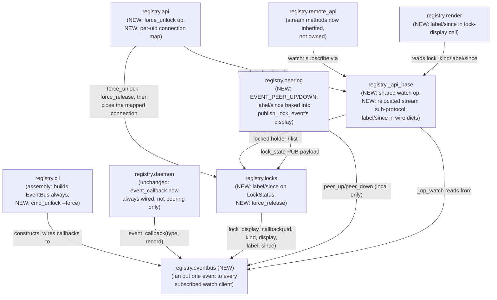

<!-- CLASI: Before changing code or making plans, review the SE process in CLAUDE.md -->

# Sprint 008: mbregistry client API for robot-console

## Goals

Give robot-console everything it needs to become a native mbregistry
client — no ZeroMQ, no HTTP compatibility shims — for the parts of the
protocol that are still missing: change notifications, an operator-legible
lock display, a way to break a stale lock, and streaming over the local
socket as well as the remote TCP port.

## Problem

`docs/design/robot-console-integration.md` (§3, §5 items 2, 3, 7, 8) lays
out what robot-console needs from mbregistry to drop its direct-USB /
mbrelay-HTTP path. Today's local-socket API (`src/mbtools/registry/api.py`,
dispatch table in `_api_base.py`) has no `watch` or `stream` op — only
`remote_api.py` (the remote TCP port) has `stream`, added in ticket 007.
`locks.py`'s `HolderRef` carries `origin`/`ref`/`pid`/`host` but no
display label and no acquisition timestamp, so a student or operator
looking at `mbregistry list` or a `locked` reply has no way to tell who
holds a lock, for how long, or whether it looks stale — and no supported
way to clear a stale one short of killing the holding process.

## Solution

Extend the local-socket and remote-port JSON-op protocol (both currently
dispatched through the shared `_api_base.py` helpers) with:

- a `watch` op, on both the local socket and the remote port, that pushes
  JSON-lines events after the `ok` reply — the same event types the
  ZeroMQ PUB bus already emits (`attach`, `detach`, `identity`,
  `lock_state`, `name_set`, `name_clear`, `peer_up`, `peer_down`) — so a
  Node client gets change notifications without speaking ZeroMQ;
- a `stream` op on the local socket, mirroring the framed binary
  sub-protocol `remote_api.py` already implements for the remote port
  (`stream_frame.py`), so an in-process or same-host client can flash and
  read serial output without opening TCP;
- an optional, display-only `label` on `lock`, carried on `HolderRef`
  alongside a `since` timestamp, both surfaced in `locked.holder`, in
  `list`, and in `lock_state` events;
- `mbregistry unlock --force UID|NAME`, local-socket only, that drops a
  lock and closes the holder's connection or stream so the holder
  observes EOF rather than silently losing exclusivity — a manual,
  operator-only override with no automatic pre-emption and no equivalent
  on the remote TCP port.

`docs/design/registry-api.md` gets updated alongside the code as the new
ops and wire fields land, not as an afterthought.

## Success Criteria

- A `watch` client, local or remote, observes `attach`/`detach`/lock
  events without a ZeroMQ dependency.
- A `locked` reply and `mbregistry list` show the holder's `label` (when
  set) and `since`.
- `mbregistry unlock --force` on a board locked by a live client releases
  the lock and closes that client's connection/stream.
- `stream` over the local socket behaves identically (same framing, same
  precondition checks) to `stream` over the remote port.
- `docs/design/registry-api.md` reflects the new ops and wire fields.

## Scope

### In Scope

- `watch` op on the local socket (`api.py`) and the remote port
  (`remote_api.py`), reusing the existing PUB-bus event vocabulary.
- `label` on `lock`, added to `HolderRef` (`locks.py`) and surfaced in
  `locked.holder`, `list`, and `lock_state` events. Display only — never
  used for authorization or holder identity.
- `since` on the lock holder record, surfaced the same three places.
- `mbregistry unlock --force UID|NAME`: local-socket-only CLI op that
  drops the lock and closes the holder's connection/stream.
- `stream` op added to the local socket, matching the remote port's
  existing framed sub-protocol.
- Updating `docs/design/registry-api.md` for all of the above.

### Out of Scope

- Defaulting the HTTP/relay-pool compatibility shims off
  (`clasi/issues/default-mbregistry-compatibility-shims-off-once-robot-console-is-native.md`)
  — blocked on robot-console actually migrating, which is outside this repo.
- The robot-console-side implementation — a separate repository.
- Everything carried by sprint 007 (instance naming/`--instance`,
  multi-instance per-board claims, spawn flags such as `--ready-json`,
  `--exit-with-parent`, `--no-peering`). Sprint 008 depends on 007's
  instance naming and on the local socket that `--no-peering`-spawned
  instances expose, but does not redo that work.
- Any pre-emption between clients. `unlock --force` remains the only
  override, per the stakeholder decision in §7 of the design doc.

## Test Strategy

Unit/integration tests alongside each op, following this codebase's
existing per-op test pattern in `tests/registry/` (e.g. a `watch` test
asserting event delivery and ordering against a live `attach`/`detach`
sequence; a `label`/`since` round-trip through `lock` → `list` →
`locked`; an `unlock --force` test asserting the held connection observes
EOF; a local-socket `stream` test mirroring the existing remote-port
`stream` tests, reusing `stream_frame.py` framing helpers and the
`FakeSerial` test seam already used for ticket 007). No new
system-level/hardware test is anticipated — a spare board (per this
project's testing-against-real-hardware convention) is enough for any
manual verification. Full test-strategy detail (specific files, fixtures,
coverage targets) is deferred to detail planning.

## Architecture

**Substantial** — overriding the roadmap's own provisional "compact"
guess (written before detail planning read the actual code). Reading
`daemon.py`/`cli.py`'s assembly shows `event_callback`/
`lock_display_callback`/`name_set_callback`/`name_clear_callback` are
each wired, today, to exactly one consumer — `PeerDiscovery`'s
`publish_*` methods when peering is on, or `None` (no-op) when
`--no-peering` is set (per sprint 007). `watch` needs a *second*,
always-present consumer (any connected `watch` client) fed from the
*same* production points, regardless of whether peering is on — that is
a new fan-out component composed into an existing pipeline, exactly the
kind of new cross-module dependency that made sprint 007 substantial for
`registry.claims`. Two more independent signals confirm the tier: `list`
of touched modules is 6 (`locks`, `_api_base`, `api`, `remote_api`,
`peering`, `cli`), and `peer_up`/`peer_down` — named in the issue and the
design doc as events `watch` relays — do not exist anywhere in the
codebase today (`peering.py` tracks reachability via
`_on_peer_reachable`/`_on_peer_unreachable`, but neither publishes an
event for it); adding them is new production logic, not a rewire of
something that already emits it. No data-model change (see Decision 1
below), so no ERD.

### Step 1: Understand the Problem

Four related gaps, all in the same seam — the local/remote JSON-op
dispatch (`api.py`/`remote_api.py`, sharing `_api_base.py` since ticket
006) and the in-memory lock table (`locks.py`) — because robot-console
needs to become a native client of that one seam rather than speaking
ZeroMQ or falling back to HTTP. `watch` needs a way to reach a connected
client with events regardless of transport or peering state.
`label`/`since` extend what a lock holder record carries. `unlock
--force` needs a way to reach back into a *different* connection's own
socket and close it. `stream` needs the remote port's existing framed
sub-protocol to exist on the local socket too. All four read or write
through `_api_base.py`'s shared dispatch, `locks.py`'s `LockManager`, or
both.

### Step 2: Responsibilities

1. **Fanning one produced event out to every currently-watching
   client** — decoupled from whether that event also goes out over
   ZeroMQ. Entirely new; no existing module owns "here is an event,
   deliver it to whoever is listening right now" as opposed to "deliver
   it to a specific named consumer."
2. **Sourcing `peer_up`/`peer_down`** from `peering.py`'s existing
   reachability callbacks, so they reach the new fan-out even though
   they never went out on the PUB bus before.
3. **Carrying a display label and an acquisition timestamp on a held
   lock**, surfaced in three existing places (`locked.holder`, `list`,
   the `lock_state` event/PUB payload) without changing what identifies
   a holder for matching/release purposes.
4. **Breaking a lock without being its holder**, and reaching back into
   the holder's own connection to close it — a capability today's
   `LockManager.release` deliberately refuses (holder-matched release is
   the whole point of its equality check) and today's `api.py` has no
   mechanism for at all (a connection only ever closes itself or the uids
   *it* acquired).
5. **Running the existing framed stream sub-protocol on a second
   transport** (the local Unix/Windows-pipe socket, alongside the
   existing remote TCP port) — the sub-protocol itself
   (`stream_frame.py`) and the serial-open mechanics
   (`serial.connect.open_no_reboot`) are already transport-agnostic; only
   the *server loop* that drives them lives solely in `remote_api.py`
   today.

Responsibilities 1-2 are one new module. 3 extends `locks.py` (a data
shape change to what a lock's record carries, not to what identifies a
holder) plus the three existing surfacing points in `_api_base.py`/
`render.py`/`peering.py`. 4 extends `locks.py` (a new release path) and
`api.py` (new per-uid connection bookkeeping, local-socket only — never
shared into `_api_base.py`, since the remote port explicitly gets no
force option). 5 is a relocation: the parts of `remote_api.py`'s
`_handle_stream`/`_op_stream_precheck` that don't depend on being the
*remote* server move into `_api_base.py`, mirroring exactly how ticket
006 moved `list`/`find`/`lock`/`unlock`/`mark_flashed` there.

### Step 3: Modules

- **`registry.eventbus`** (new). Purpose: hand a produced event to every
  client currently subscribed via `watch`. Boundary: holds a set of
  live subscriber queues and a `publish(event: dict)` method; knows
  nothing about ZeroMQ, sockets, or *why* an event was produced — a
  caller publishes a fully-shaped dict (`{"type": ..., ...}`, the same
  shape `peering.publish_event` already builds) and every subscriber's
  queue receives it. Never itself decides whether an event also goes out
  over PUB — that remains `cli.py`'s assembly decision (see below).
  Serves SUC-001.
- **`registry.locks`** (existing, extended). Purpose (unchanged): the
  exclusive per-device lock table. New this sprint: `LockStatus` gains
  `label: str | None` and `since: float`, set by `LockManager.acquire`
  from the caller-supplied `label` and an injected `now_fn` (mirroring
  `store`/`identity`/`usbwatch`'s existing `now_fn` convention) — see
  Design Rationale for why these live on `LockStatus`, not `HolderRef`.
  `LockManager` gains `force_release(uid) -> LockStatus | None`, a
  release path that skips the holder-equality check `release()` enforces
  and returns the record that was released (so a caller can report what
  it broke) — it funnels through the same shared `_release` mechanics
  (flash-release callback, lock-display callback) as `release`/`sweep`,
  so a forced release is indistinguishable, downstream, from an ordinary
  one. Serves SUC-002, SUC-003.
- **`registry._api_base`** (existing, extended). Purpose (unchanged):
  the shared per-op dispatch mixin. New this sprint: `_op_lock` accepts
  an optional `label`; `_holder_wire_dict`/`_device_dict` fold in
  `label`/`since` from the resolved `LockStatus`; a new shared
  `_op_watch`/`_handle_watch` pair (subscribe to `self._eventbus`, write
  each event as one JSON line until the client disconnects) that both
  `api.py` and `remote_api.py` dispatch into, exactly as they already do
  for the five ticket-006 ops; the stream sub-protocol
  (`_op_stream_precheck`/`_handle_stream`), relocated here from
  `remote_api.py` unchanged in mechanics — still no I/O beyond what those
  two methods already did, just no longer tied to one subclass. Serves
  SUC-001, SUC-002, SUC-004.
- **`registry.api`** (existing, extended). Purpose (unchanged): the
  local Unix-socket/Windows-pipe server. New this sprint: dispatches
  `watch` and `stream` into the newly-shared `_api_base.py` methods;
  tracks a per-uid `{uid: connection}` map, populated on a successful
  `lock` and cleared on release (any path), so a `force_unlock` op —
  local-socket only, not shared into `_api_base.py`, mirroring how
  `_op_flash`'s asymmetry between `api.py` and `remote_api.py` already
  works — can find and shut down a *different* connection's socket. This
  is the same connection whether that holder later switches it into
  `stream` mode or not, so no separate bookkeeping is needed for a
  streaming holder. Serves SUC-002, SUC-003, SUC-004.
- **`registry.remote_api`** (existing, extended). Purpose (unchanged):
  the remote TCP control-plane server. New this sprint: dispatches
  `watch` into the shared `_api_base.py` method (no remote-side
  `force_unlock` — out of scope, per the design doc's Decisions); its own
  `_handle_stream`/`_op_stream_precheck` are removed in favor of the
  inherited, relocated versions, with no behavior change for an existing
  remote `stream` caller. Serves SUC-001.
- **`registry.peering`** (existing, extended). Purpose (unchanged): mDNS
  advertise/browse plus the ZeroMQ PUB/REP event bus. New this sprint:
  `EVENT_PEER_UP`/`EVENT_PEER_DOWN` constants; `_on_peer_reachable`/
  `_on_peer_unreachable` additionally publish one of these to
  `registry.eventbus` (a purely local notification — a peer's
  reachability from *this* host's point of view is never re-published
  onward to that peer or any third host); `publish_lock_event`'s
  `display` string, sent over PUB for a remote peer's replicated
  `remote_lock_display` cache, now includes `label`/`since` text inline
  when present (no new PUB wire field, no new SQLite column — see
  Decision 2). Serves SUC-001, SUC-002.
- **`registry.cli`** (existing, extended). Purpose (unchanged): the
  `mbregistry` command-line entry point plus daemon assembly. New this
  sprint: constructs one `registry.eventbus.EventBus` unconditionally
  (whether or not `--no-peering` is set — SUC-001's own requirement);
  wires `Daemon`'s `event_callback`/`lock_display_callback` and
  `_api_base`'s `name_set_callback`/`name_clear_callback` to small
  adapter closures that always publish to the event bus and, only when a
  `PeerDiscovery` was constructed, also call the matching
  `publish_daemon_event`/`publish_lock_event`/`publish_name_set`/
  `publish_name_clear` — the fan-out lives in these closures, not as new
  multi-subscriber machinery inside `Daemon`/`LockManager`/
  `_api_base`, which keeps each of those three at "one injected
  callback" exactly as today; a new `unlock` subcommand (`cmd_unlock`,
  `--force`), a local-socket client like `cmd_list`, sending the new
  `force_unlock` op and printing what it released. Serves every SUC.
- **`registry.render`** (existing, extended). Purpose (unchanged): table/
  JSON rendering. New this sprint: the local-row "locked by `<kind>` pid
  `<n>`" cell appends label/since text when present (e.g. "locked by
  serial pid 4821 (alice-laptop, 12m)"); the peer-owned row's existing
  `remote_lock_display` cell needs no change (Decision 2: the label/since
  text is already baked into that cached string by `peering.py`). Serves
  SUC-002.

### Step 4: Diagrams

Component diagram — required: a new module (`registry.eventbus`) is
composed into an existing pipeline with three new producers
(`daemon`'s event callback, `locks`' lock-display callback, `peering`'s
new peer-up/down source) and one new consumer path (`watch`, shared via
`_api_base`).

No entity-relationship diagram: `label`/`since` live only in
`LockManager`'s existing in-memory table (never persisted — locks have
never survived a restart, and this sprint does not change that), so
there is no schema change to draw. No separate dependency-graph diagram:
the component diagram above already shows every new edge; nothing in the
existing graph changes direction.

### Step 5: What Changed / Why / Impact / Migration

**What Changed** — see Step 3's per-module bullets for the full list;
summarized: one new module (`registry.eventbus`); `locks.py` gains
`label`/`since` on `LockStatus` and `force_release`; `_api_base.py`
gains shared `watch` and (relocated) `stream`; `api.py` gains
`force_unlock` and a per-uid connection map; `remote_api.py` gains
`watch`, loses its private copy of `stream`'s mechanics (inherited
instead); `peering.py` gains `peer_up`/`peer_down` and bakes label/since
into its existing `display` string; `cli.py` wires the event bus
unconditionally and adds `mbregistry unlock --force`; `render.py`'s lock
cell gains label/since text.

**Why** — robot-console needs one seam (the JSON-op protocol) to carry
everything it needs, so it never has to link ZeroMQ or fall back to the
remote TCP port purely to reach the local socket's own devices. `watch`
is the one piece that needs a genuinely new capability (event fan-out
independent of peering); the other three (label/since, force-unlock,
local stream) are additive extensions of existing per-op logic.

**Impact on Existing Components**

- No existing `watch`-less caller changes behavior: `list`/`locked`
  responses gain `label`/`since` fields additively (`null` when unset),
  which every existing client that ignores unknown fields already
  tolerates (the same additive-superset precedent ticket 006 set for
  `origin`/`host` on a remote holder).
- `remote_api.RemoteAPIServer`'s existing `stream` behavior is unchanged
  from an external caller's point of view — the code that implements it
  moves, the wire contract does not.
- `LockManager.release`'s holder-equality check is untouched;
  `force_release` is a new, separate method, not a parameter on
  `release`, so no existing caller of `release` can accidentally bypass
  the check it depends on.
- `docs/design/registry-api.md` is updated in the same ticket that lands
  each change (per this sprint's Solution paragraph), not batched into a
  separate docs ticket.

**Migration Concerns** — none requiring data migration: no SQLite schema
change, no persisted lock state, no wire-breaking change to any existing
op. An already-running `mbregistry` instance simply doesn't have `watch`/
`force_unlock`/local `stream` until it's restarted onto the new build,
same as every other purely-additive ticket in this project's history.

### Step 6: Design Rationale

**Decision 1: `label`/`since` live on `LockStatus`, not `HolderRef`
(refining the roadmap's own placeholder wording).** Context: the
roadmap's Solution paragraph sketched both fields as living on
`HolderRef`, written before detail planning re-read `locks.py`.
`HolderRef` is frozen and equality-compared to decide who may release a
lock (`LockManager.release`); it is constructed once per connection
(`api.py`'s `_holder_for_connection`) and reused across every lock that
connection acquires. `label` and `since`, by contrast, are per-*lock*
(supplied fresh on each `lock` request; `since` is when *that*
acquisition happened) — putting them on `HolderRef` would either make
every lock from one connection share one `since`/`label`, or force a
fresh `HolderRef` per lock whose changed fields would break the very
equality check `release()` relies on to find "the same holder that
acquired it." Alternatives considered: (a) as the roadmap sketched, on
`HolderRef` — rejected for the reason above; (b) a new small wrapper
dataclass alongside `HolderRef` and `kind` inside `LockStatus` — no
benefit over adding the two fields directly to `LockStatus`, which
already exists for exactly this ("what does this held lock look like
right now"). Chosen: fields directly on `LockStatus`. Consequences:
`HolderRef`'s equality contract is completely untouched, so `release()`/
`force_release()`/`sweep()` need no new reasoning about which fields
participate in matching; call sites that fold `LockStatus` into a wire
dict (`_holder_wire_dict`, `_device_dict`) read `label`/`since` off it
alongside `kind`, one small localized change.

**Decision 2: a peer-owned row's label/since ride inside the existing
`remote_lock_display` string, not a new replicated field.** Context: a
peer-owned device's `list` row shows `remote_lock_kind`/
`remote_lock_display` — a cached, pre-rendered string from a peer's
`lock_state` PUB event, not structured fields (per sprint 003's Decision
3, "remote lock display is a replicated cache, not a live cross-host
call"). Showing label/since for a *peer's* device (not this host's own)
is not in this sprint's stated acceptance criteria (`locked.holder`,
`list`, `lock_state` all describe the registry that actually holds the
lock) — robot-console always locks/streams against the *owning* host
directly (§3.2), so a peer-side display of someone else's label/since is
a nice-to-have, not a requirement. Alternatives: (a) add
`remote_lock_label`/`remote_lock_since` columns and PUB fields — real
schema/wire growth for a case no use case in this sprint needs; (b) leave
peer rows showing no label/since at all — loses information for free.
Chosen: (c), bake label/since into the existing `display` string
`publish_lock_event` already sends (e.g. append `" (alice-laptop,
12m)"`), so a peer's `remote_lock_display` cell shows it automatically,
with zero schema change and zero `render.py` change beyond what's
already there for that column. Consequences: a peer's display of
label/since is prose inside one string, not independently queryable
structured fields — acceptable, since nothing in this sprint's scope
needs to query it separately, only display it.

**Decision 3: the event fan-out lives in `cli.py`'s assembly closures,
not as multi-subscriber support inside `Daemon`/`LockManager`/
`_api_base`.** Context: those three modules each already accept exactly
one injected callback per hook (`event_callback`,
`lock_display_callback`, `name_set_callback`/`name_clear_callback|`),
today wired to `PeerDiscovery` or `None`. `watch` needs events to reach
*both* the event bus and (when peering is on) `PeerDiscovery`.
Alternatives: (a) change each hook to accept a list of callbacks —
touches three modules' constructors and every existing test that passes
a single callable; (b) have `registry.eventbus` itself know about
`PeerDiscovery` and call it — inverts the dependency direction the
component diagram establishes (`eventbus` would import `peering`,
though `peering` also depends on `eventbus`for peer_up/down, a cycle).
Chosen: (c) a plain closure defined once in `cli.py`'s assembly function
that calls both, passed as the single callback each module already
expects — no constructor signature changes to `Daemon`/`LockManager`/
`_api_base`, and no cyclical module dependency. Consequences: the
fan-out logic is assembly-only, invisible to and untestable through
`Daemon`/`LockManager` directly — tests for "does peering still get
called when it's on" and "does the event bus get called when peering is
off" both live at the `cli.py`/integration level, mirroring how ticket
009's original single-callback wiring was already tested.

### Step 7: Open Questions

- **Does a `watch` client that connects mid-session get a snapshot of
  current state, or only changes from that point on?** The issue and
  design doc describe `watch` purely as a change feed (mirroring the
  existing PUB bus, which is also change-only — a new peer already gets
  a snapshot separately, via the REQ/REP snapshot exchange). This sprint
  assumes change-only, matching `list`'s existing role as the
  point-in-time snapshot call a client makes before `watch`-ing (per
  §3.1's own two-step "call `list`, then `watch`" sequence) — flagged
  here in case the stakeholder wants `watch` itself to open with a
  snapshot instead.
- **Should `force_unlock`'s response echo the label/since of the lock it
  broke?** Useful operator feedback ("released: alice-laptop's lock,
  held for 20 min") but not called out explicitly in the issue's
  acceptance criteria. Left to ticket 003's implementation judgment
  rather than gating architecture on it.

## Use Cases

**SUC-001: A Node client watches the fleet without ZeroMQ.** robot-console
(or any local/remote JSON-lines client) sends `{"op": "watch"}` on the
local socket or the remote TCP port. After the `ok` reply, the connection
receives one JSON line per change — `attach`, `detach`, `identity`,
`lock_state`, `name_set`, `name_clear`, `peer_up`, `peer_down` — for as
long as the connection stays open, and never needs to link `pyzmq` or
know this registry's PUB port. Explicitly includes the `--no-peering`
case (per `docs/design/robot-console-integration.md` §4's spawned,
unpeered instance): a `watch` client on such an instance still sees
`attach`/`detach`/`lock_state`/`name_set`/`name_clear` (sourced from the
daemon's own event hooks, not a ZeroMQ subscription that doesn't exist
there); it never sees `peer_up`/`peer_down`, since an unpeered instance
has no peers to report on.

**SUC-002: An operator or UI sees who holds a lock, and for how long.**
`mbregistry list` and a `locked` reply's `holder` both show a `label`
(when the locking client supplied one) and `since` (when the lock was
acquired). A student sees "in use by alice-laptop / robot-console for 12
min" instead of an opaque pid.

**SUC-003: An operator clears a lock that looks stale.** Told by
robot-console's UI (or by `mbregistry list`'s own `since`) that a lock
looks old, an operator runs `mbregistry unlock --force UID|NAME` on the
box that owns the board. The lock is dropped immediately and the
holder's connection (ordinary JSON-lines session or an active `stream`
session) is closed from the server side, so the holder observes EOF
rather than silently losing exclusivity. No pre-emption, no remote
equivalent — operator-only, local-socket-only, per the design doc's
Decisions.

**SUC-004: A same-host client flashes or reads serial without opening
TCP.** A client already talking to the local socket (an in-process
caller, or a same-host process that would otherwise open
`127.0.0.1:<remote-port>` per §3.2's interim workaround) sends
`{"op": "lock", ...}` then `{"op": "stream", "uid": "..."}` on that same
connection, and gets the identical framed binary sub-protocol
(`stream_frame.py`) `remote_api.py` already offers on the remote TCP
port — same framing, same preconditions, same close-on-`CLOSE`/EOF
behavior.

**SUC-005: `docs/design/registry-api.md` stays the one source of truth.**
Anyone reading the wire-protocol doc after this sprint finds `watch`,
the `label`/`since` fields, `unlock --force`'s CLI/wire shape, and the
local-socket `stream` op documented in place, alongside the ops they
extend — not a separate changelog.

## GitHub Issues

(GitHub issues linked to this sprint's tickets. Format: `owner/repo#N`.)

## Definition of Ready

Before tickets can be created, all of the following must be true:

- [ ] Sprint planning document is complete (sprint.md, including its
      Architecture and Use Cases sections)
- [ ] Architecture review passed (or skipped, for changes with no
      architectural impact)
- [ ] Stakeholder has approved the sprint plan

## Tickets

| # | Title | Depends On |
|---|-------|------------|
| 001 | watch op and event bus (local socket + remote port) | — |
| 002 | Lock label and since | 001 |
| 003 | mbregistry unlock --force | 002 |
| 004 | stream op on the local socket | 002 |
| 005 | Hardware acceptance: watch and unlock --force | 001, 002, 003, 004 |
| 006 | mbregistry --version flag and version in --ready-json | — |
| 007 | Make test_peering.py use ephemeral ports instead of the fixed production peering ports | — |

Tickets execute serially in the order listed.
