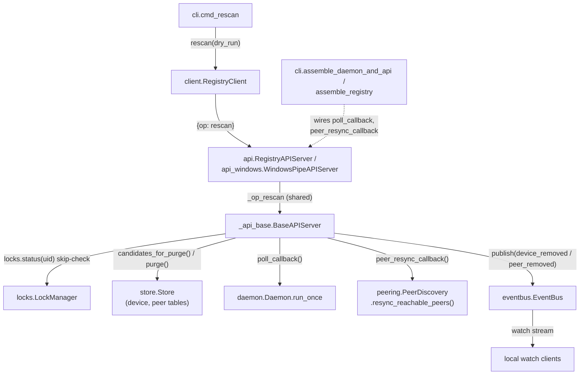

<!-- CLASI: Before changing code or making plans, review the SE process in CLAUDE.md -->

# Sprint 010: mbregistry rescan command

## Goals

Add an operator-invoked `mbregistry rescan` command that clears cruft
from a host's local registry view — gone device rows and unreachable
peers (and their rows) — then forces an immediate rescan (USB poll +
peer resync) so anything actually still alive reappears right away.

See `clasi/issues/mbregistry-rescan-command.md` for the full requested
behaviour and team-lead defaults (confirm/adjust during detail
planning).

## Problem

Today, `gone` device rows and unreachable-peer rows are never deleted
(store's "Decision 5" / never-delete precedent) — they accumulate and
clutter `mbregistry list` output over a long-running daemon's
lifetime. Operators have no way to explicitly clear this cruft without
restarting the daemon.

## Solution

A new local-only API op (`{"op": "rescan"}`, local Unix socket /
Windows pipe only — not on the remote TCP control plane) that, under
the store's lock:

- deletes local device rows in `STATE_DISCONNECTED` ("gone");
- deletes every row owned by a currently-unreachable peer;
- deletes remote-owned rows in `STATE_DISCONNECTED` (stale since
  sprint 005 ticket 011);
- deletes `peer` rows with `reachable = false`;
- skips (and reports as skipped) any row with an active lock;
- keeps `name_registry` untouched.

Deletion is by uid at delete time, only if the row is still in the
gone/unreachable state (handles a mid-reattach race). After deleting,
triggers an immediate USB poll and asks each reachable peer for a
fresh snapshot (not waiting for the next `--interval` tick), and
publishes removal events on the event bus for `watch` clients and
peers. CLI output is a short removal summary followed by the fresh
`list` table; supports `--json` and `--dry-run`.

## Success Criteria

- `mbregistry rescan` removes gone/unreachable-peer cruft and leaves
  everything else (locked rows, `name_registry`, connected/attached
  rows) untouched.
- A board or peer that is actually still alive reappears immediately
  after rescan, without waiting for the next poll interval.
- `--dry-run` reports what would be removed without removing it;
  `--json` gives script-consumable output.
- Verified on real hardware (two Nolanet nodes): unplug/replug or
  reflash to create a `gone` row, stop a peer's service to create an
  unreachable peer, run `rescan`, confirm the list is clean and that
  restarting the peer brings it straight back.

## Scope

### In Scope

- New local API op `rescan` (Unix socket + Windows pipe).
- `mbregistry rescan` CLI command, with `--json` and `--dry-run`.
- Deletion logic for gone/unreachable rows, lock-skip handling, and
  `name_registry` preservation, scoped as the explicit exception to
  the store's never-delete design.
- Forced immediate USB poll + peer resync after deletion.
- Event-bus publication for removed rows (may need a new event kind).
- Updates to `store.py`'s never-delete docstrings/design notes to
  document `rescan` as the one explicit exception.
- `daemon.py`'s attach/detach diff (`previously_attached`, ticket
  005-011) reviewed so a row vanishing underneath it doesn't confuse
  the diff.
- `docs/design/` and CLI help/README updates.
- Hardware acceptance on two Nolanet nodes.

### Out of Scope

- Remote TCP rescan (exposing `rescan` on the remote control plane,
  `remote_api.py`) — local daemon only for this sprint.
- Any automatic/background pruning of gone or unreachable rows — this
  stays a purely operator-invoked, explicit action; the automatic
  paths keep today's never-delete behaviour unchanged.

## Test Strategy

Unit/integration tests around the new API op's deletion logic (lock
skip, `name_registry` preservation, the mid-reattach uid race,
event-bus publication) plus CLI tests for `--json`/`--dry-run`
rendering. Hardware acceptance pass on two Nolanet nodes per the
Success Criteria above, sized during detail planning (compact/single
new API op — no new subsystem or cross-module dependency expected).

## Architecture

**Sizing: Substantial.** Although each individual change is small, this
sprint touches more than three existing modules (`store`, `daemon`,
`_api_base`/`api`/`api_windows`, `peering`, `client`, `cli`, `render`)
and introduces one genuinely new cross-module capability: the local API
layer must trigger an immediate `Daemon` poll cycle and an immediate
`PeerDiscovery` peer-snapshot resync, both of which are currently
triggered only from their own owning module's internal thread (the
daemon's poll loop; `PeerDiscovery`'s own monitor/resync threads), never
from an API request thread. That is a new dependency-bearing
interaction between the API layer and both the daemon and peering
layers, even though (per the Design Rationale below) it is implemented
through the existing callback-injection convention rather than a direct
import — the module boundary changes in *what crosses it*, which is
what the sizing tiers care about, not just import statements. Per the
sizing rubric this is "any of: 3+ modules touched, a new or changed
cross-module dependency" — both apply — so this gets the full 7-step
treatment with a diagram, not the compact variant.

### Step 1: Understand the Problem

`store.py`'s "never delete, always update in place" precedent (module
docstring; `peer` table Decision 5: "a vanished peer is marked
unreachable, never deleted") is correct for the automatic paths — an
operator should never lose device history to a transient USB glitch or
peer hiccup. But it means a long-running daemon's `mbregistry list`
accumulates `gone` rows and `peer unreachable` peers (plus their
mirrored device rows) forever, with no way to clear them short of
restarting the daemon (which loses everything, not just the cruft).
`mbregistry rescan` is a deliberate, narrow, operator-invoked exception:
delete exactly the rows that are demonstrably stale (locally
disconnected, or owned by a peer this host currently can't reach), skip
anything locked or otherwise live, then immediately re-poll so anything
actually still alive reappears without waiting for the next interval
tick. It must not touch `name_registry` (names/channels are fleet
identity, unrelated to device/peer liveness) and must not be reachable
over the remote TCP control plane (only an operator with a local socket
connection to *this* host's own daemon may invoke it — same trust
boundary `force_unlock` already established).

### Step 2: Identify Responsibilities

1. **Compute and execute the purge** — decide which device/peer rows
   are stale (local `disconnected`, unreachable-peer-owned, or a
   reachable-peer's stale `disconnected` mirror) and delete them,
   race-safely (re-check state at delete time) and lock-aware (skip and
   report, never delete a locked uid). This is data-layer policy over
   what "stale" means for *this* operation only — distinct from every
   existing `store` write, which never deletes.
2. **Force a fresh view** — after purging, get the daemon to run an
   immediate scan/probe cycle (so a still-attached board that was
   wrongly `gone` — the race case — or a freshly-replugged one reappears
   now, not on the next `--interval` tick) and get `PeerDiscovery` to
   re-fetch a fresh snapshot from every currently-connected peer link
   (so a peer that's actually still reachable — the analogous race for
   peers — has its devices re-verified rather than staying purged from a
   stale read). Both of these are *existing* modules' own jobs
   (`Daemon.run_once`, `PeerDiscovery`'s per-peer snapshot fetch); this
   sprint needs a way to *trigger* them on demand from an API request,
   not reimplement them.
3. **Expose it as an operation** — a new request/response shape on the
   local-only transports (Unix socket, Windows pipe), and a CLI
   subcommand that calls it, renders a removal summary, then renders a
   fresh `list` table — mirroring `unlock --force`'s existing
   local-socket-only precedent, but available on Windows too (unlike
   `force_unlock`, which today is Unix-socket-only — see Design
   Rationale below for why this sprint doesn't just copy that
   precedent).

These three responsibilities change for different reasons (storage
policy vs. triggering existing subsystems' work vs. wire/CLI surface),
so they map to three different tickets rather than one.

### Step 3: Define Subsystems and Modules

- **`store` (existing module, extended)** — purpose: persist the
  device/peer/name_registry tables. Boundary: gains two new read/write
  primitives (`candidates_for_purge()`, `purge()`) that are the *only*
  place in the codebase allowed to `DELETE` a `device` or `peer` row;
  every other write stays update-in-place. Serves: this sprint's purge
  step. Does **not** know about locks (as today) — lock-skip is decided
  one layer up, by the caller that already holds both `store` and
  `locks`.
- **`_api_base` (existing module, extended)** — purpose: shared per-op
  JSON dispatch for the local transports. Boundary: gains `_op_rescan`,
  which orchestrates steps 1-2 above (compute candidates, filter out
  locked uids via `self._locks`, purge, then — unless `dry_run` — call
  two newly-injected callables to trigger a poll and a peer resync).
  Serves: the local-only `rescan` op. Placed in the *shared* base
  (unlike `force_unlock`, which lives directly in `api.py` only) so
  both `api.py` and `api_windows.py` get it for free — see Design
  Rationale.
- **`api` / `api_windows` (existing modules, extended)** — purpose:
  transport-specific dispatch (Unix socket / Windows named pipe) plus
  construction wiring. Boundary: each adds one `elif op == "rescan"`
  line to its own `_dispatch_line`, and each constructor gains two new
  optional parameters (`poll_callback`, `peer_resync_callback`) forwarded
  into `BaseAPIServer.__init__`. `remote_api.py` is **not** touched —
  its own `_dispatch_line` simply never adds the branch, the same
  precedent `names_*`/`force_unlock` already establish for "implemented
  in the shared base but not every dispatcher routes to it."
- **`peering` (existing module, extended)** — purpose: mDNS
  discovery, live event replication, and the snapshot exchange with
  each peer. Boundary: gains one new public method on `PeerDiscovery`,
  `resync_reachable_peers()`, that re-fetches every currently-connected
  peer link's snapshot right now, off its own thread — a sibling to
  the existing drop-triggered `_PeerLink.resync()`/`start_resync()`,
  not a replacement for either. Serves: rescan's "ask each reachable
  peer for a fresh snapshot" step.
- **`daemon` (existing module, unchanged)** — `Daemon.run_once()` is
  reused as-is as the "force an immediate USB poll" primitive; no new
  method needed. Reviewed (see Migration Concerns) to confirm a row
  rescan deletes can never be one `run_once`'s own attach/detach diff
  is relying on mid-cycle.
- **`cli` (existing module, extended)** — purpose: argument parsing,
  transport selection, rendering orchestration, and (its `assemble_*`
  functions) cross-module wiring. Boundary: gains a `rescan`
  subcommand (`cmd_rescan`) and, in `assemble_daemon_and_api`/
  `assemble_registry`, the closures that turn `daemon.run_once` and
  `peer_discovery.resync_reachable_peers` into the `poll_callback`/
  `peer_resync_callback` the API constructors now accept — the same
  "assembly module is the one place that wires two otherwise-decoupled
  modules together" convention `event_callback`/`lock_display_callback`
  already established for daemon->peering wiring.
- **`client` / `render` (existing modules, extended)** — `client.py`
  gains a typed `rescan(dry_run=False)` method (same shape as
  `list`/`force_unlock`); `render.py` gains the removal-summary
  formatting (plain text and `--json`), reusing its existing
  `render_table`/`render_json` for the fresh list half rather than
  inventing a second table renderer.

### Step 4: Component Diagram

`remote_api.RemoteAPIServer` is deliberately absent from this diagram —
it shares `_api_base.BaseAPIServer` for every *other* op but never
dispatches `rescan`, per this sprint's explicit out-of-scope boundary.
`Bus` fan-out is local-only (see Design Rationale); no new edge is
added onto `peering`'s own cross-host PUB socket.

### Step 5: What Changed / Why / Impact / Migration Concerns

**What Changed**

- `store.py`: two new methods, `candidates_for_purge()` (read-only —
  computes the local-disconnected / unreachable-peer-owned /
  reachable-peer-stale-disconnected candidate sets, used directly for
  `--dry-run`) and `purge(device_uids, peer_hosts)` (the actual
  conditional deletes, each re-checking the row's state at delete time
  so a uid that reattached or a peer that reconnected in the gap is
  left untouched — the mid-reattach race the issue calls out). Module
  docstring and the `Store`/`peer`-table docstrings gain a paragraph
  documenting `rescan` as the one explicit, operator-invoked exception
  to "never delete."
- `_api_base.py`: new `_op_rescan(req)`, plus two new optional
  constructor parameters (`poll_callback`, `peer_resync_callback`,
  both `Callable[[], None] | None`, default `None`) on
  `BaseAPIServer.__init__`, mirroring the existing
  `event_callback`/`lock_display_callback` no-op-by-default convention.
- `api.py` / `api_windows.py`: one new dispatch line each; constructors
  forward the two new parameters through to `BaseAPIServer.__init__`.
- `peering.py`: new `PeerDiscovery.resync_reachable_peers()` and a
  matching `_PeerLink.force_resync()` (an unconditional sibling to the
  existing drop-gated `resync()`) — both run the snapshot fetch on
  their own thread, so the caller (an API request thread) is never
  blocked for a peer's full snapshot round-trip.
- `cli.py`: `cmd_rescan`, its `argparse` subparser, and the
  `poll_callback=daemon.run_once` /
  `peer_resync_callback=peer_discovery.resync_reachable_peers if
  peer_discovery is not None else None` wiring in
  `assemble_daemon_and_api`/`assemble_registry`.
- `client.py`: `RegistryClient.rescan(dry_run=False)`.
- `render.py`: a removal-summary formatter (text and JSON shapes).
- `docs/design/registry-api.md`, `docs/README`/CLI help: new `rescan`
  op/subcommand documented, including its local-only status.

**Why**: see Step 1 (Problem) — an explicit, bounded way to clear
demonstrably-stale rows without restarting the daemon or weakening the
automatic never-delete guarantee.

**Impact on Existing Components**: `store`'s existing read/write
methods are unchanged — `purge`/`candidates_for_purge` are additive.
`daemon.run_once` is unchanged; it is only *called* from a new place
(and see Migration Concerns below for why that's safe). `remote_api.py`
is unaffected — no new op reaches it. Every existing `watch` event
shape (`attach`/`detach`/`identity`/`lock_state`/`name_set`/
`name_clear`/`peer_up`/`peer_down`) is unchanged; `rescan` only adds
two new event *types* (`device_removed`, `peer_removed`) to the same
bus.

**Codebase-alignment finding from this review**: `BaseAPIServer`
declares `_eventbus: EventBus` as a required attribute, but
`WindowsPipeAPIServer.__init__` never sets it (`eventbus` was
deliberately scoped out of Windows-pipe support — see
`assemble_daemon_and_api`'s own docstring: "not wired into
`WindowsPipeAPIServer`, this ticket's own scope"). `_op_rescan`, being
shared in `_api_base.py`, must not assume `self._eventbus` exists —
it has to look it up defensively (e.g. `getattr(self, "_eventbus",
None)`) and skip publishing when it's absent, rather than crash on
Windows. This is an implementation detail for ticket 002, not a new
architectural decision (it doesn't change the module boundary above),
but is called out here because it's exactly the kind of
codebase/architecture mismatch a self-review is supposed to catch
before ticketing, not after a Windows test fails.

**Migration Concerns**: None for data — `rescan` is purely additive
(new methods/ops) and touches no existing schema. The one behavioral
risk reviewed explicitly: `daemon.run_once`'s attach/detach diff
(`previously_attached`, sprint 005 ticket 011) computes "previously
attached" from `store.list_devices()` filtered to `host is None and
state != disconnected` — i.e. only locally-owned, currently-attached
rows. `rescan`'s purge candidates are exactly the complement of that
set (locally-owned-but-`disconnected`, or not locally-owned at all), so
a row `rescan` deletes was never a member of `previously_attached` and
its deletion can never desync that diff. This is confirmed by reading
the existing code, not a new guard added to `daemon.py` — no code
change is needed there, only this documented review (satisfies the
issue's "must not be confused by a row vanishing underneath it" and
the sprint scope's "reviewed" item).

### Design Rationale

**Decision: `_op_rescan` lives in the shared `_api_base.BaseAPIServer`,
not directly in `api.py` (departing from the nearest precedent,
`force_unlock`).**
*Context*: the closest existing local-only, operator-triggered op is
`force_unlock`, which is implemented directly in `api.py` and is
*not* available on `api_windows.py` at all today.
*Alternatives considered*: (a) copy the `force_unlock` precedent
exactly — implement `_op_rescan` in `api.py` only; (b) implement it
separately, once in each of `api.py` and `api_windows.py`; (c)
implement it once in the shared `_api_base.py` and dispatch it from
both.
*Why this choice*: the issue explicitly requires both "Unix socket +
Windows pipe" — option (a) would leave Windows unsupported, which is
out of scope to also silently fix for `force_unlock`. Option (b)
duplicates non-trivial purge-orchestration logic across two files that
would need to be kept in lockstep. Option (c) (chosen) reuses the
existing shared-base convention every other multi-platform op already
follows (`list`, `find`, `lock`, `unlock`, `mark_flashed`), and keeps
platform-specific code limited to the one-line dispatch addition and
the two new constructor parameters, exactly as thin as every other op's
platform seam already is.
*Consequences*: `_api_base.py` now has one op (`rescan`) that
`force_unlock` doesn't share the pattern with — a future reader
comparing the two needs this rationale to understand why they differ;
the docstring/architecture-review notes above exist for that reason.

**Decision: purge-removal events are published only on the local
`EventBus`, never over `PeerDiscovery`'s cross-host PUB socket.**
*Context*: the issue's "Publishes events on the event bus for the
removed rows, so `watch` clients and peers see them disappear" could be
read as requiring a new wire event other hosts' `_apply_event` must
learn to handle.
*Alternatives considered*: (a) publish a new `EVENT_REMOVED` type over
PUB, extending `peering.py`'s wire protocol and `_apply_event`'s
dispatch to delete a row on the *receiving* peer too; (b) publish
locally only (chosen).
*Why this choice*: `rescan` is explicitly local-host bookkeeping — it
purges *this* host's own stale local view (either its own disconnected
rows, or its stale mirror of an unreachable peer's rows). No other
host's own store is wrong or stale as a result of this host's purge:
the unreachable peer, when it does become reachable again, re-syncs its
own devices via the ordinary reconnect snapshot path (already existing
peering behavior, unchanged); a third host mirroring that same peer
independently is unaffected, since it has its own separate link to it.
Extending the wire protocol (option a) would mean every peer's
`_apply_event` has to special-case "someone else deleted their local
mirror of a third host's device" — real complexity for no correctness
benefit, and it would be the first ever *delete* semantics on the
replicated event bus, undermining the "peers never delete, only mark
unreachable" precedent (Decision 5) for a case that doesn't need it.
*Consequences*: a `watch` client on a *different* host than the one
that ran `rescan` never sees a `device_removed`/`peer_removed` event
for that purge — only a `watch` client connected to the host that ran
it does. This is intentional and matches `rescan`'s own local-only,
local-daemon-only scope (mirrors the op itself never being available
over the remote TCP control plane).

**Decision: `Daemon.run_once()` is reused directly as the
`poll_callback`, rather than adding a new `Daemon.force_scan()`
method.**
*Context*: "forces an immediate USB poll" needs some daemon-side
primitive to call.
*Alternatives considered*: (a) add a new `Daemon` method distinct from
`run_once`; (b) call `run_once()` directly (chosen).
*Why this choice*: `run_once()` already *is* "one scan-diff-probe
cycle, right now" — exactly what's being asked for, with no daemon-side
state a new method would need to duplicate or wrap. Introducing a
second entry point with overlapping behavior would be the kind of
speculative generality the architecture-quality checklist flags.
*Consequences*: `_op_rescan` calling `poll_callback()` blocks its own
request thread for one full scan-diff-probe cycle (bounded by
`probe_timeout_s` per newly-eligible device, same as any ordinary poll
tick) — acceptable for an operator-invoked, occasional command, and
consistent with the issue's own expectation that `rescan`'s CLI output
waits for the fresh list before printing it.

### Open Questions

- Exact wire shape of `device_removed`/`peer_removed` events (field
  names) is left to ticket 002's implementation, following the existing
  `daemon_event_payload`/`lock_event_payload` "uid + whatever changed"
  shape — no stakeholder decision needed, this is ordinary
  implementation detail.
- Whether `force_unlock` should also gain Windows-pipe support is
  explicitly out of scope here (pre-existing gap, unrelated to this
  issue) — flagged for a future sprint, not decided now.

## Use Cases

### SUC-001: Operator clears stale rows with `mbregistry rescan`
Parent: UC-004 (device listing / lifecycle visibility)

- **Actor**: Operator with a local shell session on the host running
  `mbregistry run` (local Unix socket / Windows pipe access only).
- **Preconditions**: The daemon is running. The store has at least one
  local device row in `disconnected` state, or at least one `peer` row
  with `reachable = false` (and, transitively, device rows owned by
  that peer).
- **Main Flow**:
  1. Operator runs `mbregistry rescan`.
  2. The client sends `{"op": "rescan"}` over the local transport.
  3. The daemon computes the purge candidates, skips (and records) any
     candidate uid that is currently locked, deletes the rest
     (devices and peers) inside the shared lock, race-checking each
     row's state at delete time.
  4. The daemon runs an immediate scan/probe cycle and asks every
     currently-connected peer link to re-fetch its snapshot.
  5. The daemon publishes `device_removed`/`peer_removed` events on the
     local event bus for every row actually removed.
  6. The CLI prints a short summary ("removed 3 gone devices, 1
     unreachable peer (braeburn) and its 2 devices; skipped 1 locked")
     followed by a fresh `mbregistry list` table.
- **Postconditions**: Every purged row is gone from `list`/`--json`
  output. Any row that was actually still alive (a board that
  re-enumerated during the race window, a peer that reconnected)
  reappears in the fresh table from step 4's forced re-poll/resync,
  not the purge. `name_registry` is untouched. Any locked row is
  unchanged and reported as skipped.
- **Acceptance Criteria**:
  - [ ] A local `disconnected` device row is removed by `rescan`.
  - [ ] An unreachable peer's row, and every device row it owns
        (regardless of that device row's own state), are removed.
  - [ ] A reachable peer's `disconnected`-state device row is removed
        (stale per sprint 005 ticket 011).
  - [ ] A locked row (local or remote-owned with a cached lock display)
        is never deleted and is reported as skipped.
  - [ ] `name_registry` rows are never touched by `rescan`.
  - [ ] After a non-dry-run `rescan`, an immediate USB poll runs (no
        wait for the next `--interval` tick) and every reachable peer
        link is asked for a fresh snapshot.
  - [ ] A device mid-reattach at the moment of deletion (its state
        changes between candidate computation and delete) survives —
        the conditional delete re-checks state and skips it.

### SUC-002: Operator previews a rescan with `--dry-run`
Parent: UC-004

- **Actor**: Same as SUC-001.
- **Preconditions**: Same as SUC-001.
- **Main Flow**:
  1. Operator runs `mbregistry rescan --dry-run`.
  2. The client sends `{"op": "rescan", "dry_run": true}`.
  3. The daemon computes the same candidate set and lock-skip filter as
     SUC-001, but performs no deletes, no forced poll, and no forced
     peer resync.
  4. The CLI prints what *would* be removed/skipped; the existing
     `list` table is unaffected (nothing changed).
- **Postconditions**: Store state is byte-for-byte unchanged. No events
  are published. No poll or peer resync is triggered.
- **Acceptance Criteria**:
  - [ ] `--dry-run` reports the same candidate/skip sets `rescan`
        would act on, without deleting, polling, resyncing, or
        publishing anything.
  - [ ] `--json` on both `rescan` and `rescan --dry-run` produces
        script-consumable output (summary counts/lists, not just the
        human-readable sentence).

## GitHub Issues

(GitHub issues linked to this sprint's tickets. Format: `owner/repo#N`.)

## Definition of Ready

Before tickets can be created, all of the following must be true:

- [ ] Sprint planning document is complete (sprint.md, including its
      Architecture and Use Cases sections)
- [ ] Architecture review passed (or skipped, for changes with no
      architectural impact)
- [ ] Stakeholder has approved the sprint plan

## Tickets

| # | Title | Depends On |
|---|-------|------------|
| 001 | Store: purge primitives for gone devices and unreachable peers | — |
| 002 | Daemon/API: local rescan op with forced poll and peer resync | 001 |
| 003 | CLI: mbregistry rescan command, client, and docs | 002 |
| 004 | Hardware acceptance: rescan on two Nolanet nodes | 003 |

Tickets execute serially in the order listed.
