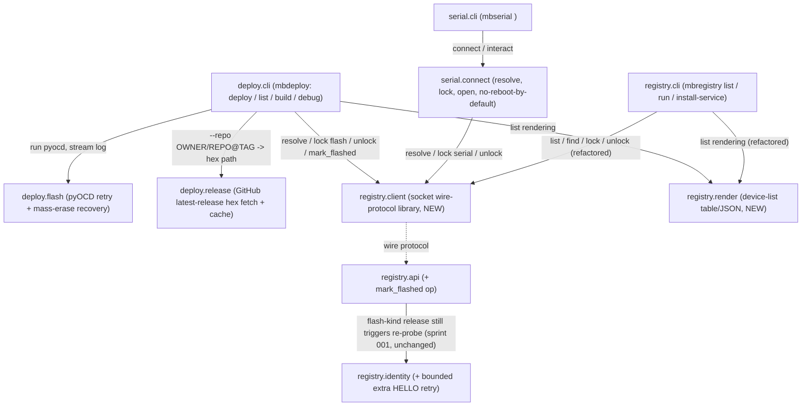

<!-- CLASI: Before changing code or making plans, review the SE process in CLAUDE.md -->

# Sprint 002: Local clients: mbdeploy flash-by-name and mbserial connect

## Goals

Build the two client tools that operate purely on **local** devices
through sprint 001's `mbregistry`: `mbdeploy` (flash by name) and
`mbserial` (raw serial connect). Both are rebuilt as thin registry
clients — no `mbdeploy serve` any more.

## Problem

`mbdeploy` currently runs its own server and touches devices directly;
that's exactly the competing-daemon problem this project exists to fix.
With sprint 001's registry in place, `mbdeploy` and the new `mbserial`
can become pure clients: resolve, lock, act, release — never opening a
port or SWD connection to a board the local registry doesn't own.

## Solution

- `mbdeploy-flash-by-name-via-mbregistry.md` (local half): `mbdeploy
  deploy <name> [--hex FILE]` resolves through the local registry, locks
  with kind `flash`, flashes (locally or via the registry's minimal
  flash op — this sprint should record which path it takes), verifies,
  waits for the post-flash re-probe, and reports the new announcement.
  Keeps the hard-won behavior: retry once on transient probe error,
  erase-and-reflash a locked device, explicit blank-board reporting,
  build integration, and the `--force-relay` guard. `mbdeploy list` as a
  thin view over the registry.
- `mbserial-raw-serial-access-local-or-remote.md` (local half): `mbserial
  <name>` gives an interactive terminal or library-usable serial-like
  object for a locally-attached board, locked with kind `serial`, never
  rebooting the board on connect unless `--reset` is given.

## Success Criteria

- `mbdeploy deploy <name>` flashes a local board end-to-end through the
  registry, with retry/erase/blank-board behavior intact.
- `mbdeploy list` renders the same information as `mbregistry list`.
- `mbserial <name>` opens a local board's serial port without rebooting
  it by default, locks it for the session, and releases on exit.
- Both tools fail fast with a clear message (holder kind + PID) when the
  target is already locked.

## Scope

### In Scope

- `mbdeploy-flash-by-name-via-mbregistry.md` (local flash flow only).
- `mbserial-raw-serial-access-local-or-remote.md` (local transport only).

### Out of Scope

- Remote flash and remote serial connect — split to
  `mbdeploy-flash-by-name-remote.md` and
  `mbserial-raw-serial-access-remote.md` (sprint 003), since both need
  the peering network built there.
- `mbrelay` (sprint 004).

## Test Strategy

Hardware-free throughout, same house style as sprint 001
(`docs/acceptance/001-hardware.md`'s Test Strategy): no ticket 001-009
requires a physical micro:bit or a real `pyocd`-visible probe to pass.

- **`registry.client`**: protocol/dispatch tests run against a real
  `AF_UNIX` socket in `tmp_path` (sprint 001's own precedent — this is
  local IPC, not hardware, so it runs in CI), reusing sprint 001's
  `RegistryAPIServer` as the server side. Error-code-to-`EXIT_*` mapping is
  table-driven.
- **`registry.render`**: pure unit tests over hand-built device-dict lists
  (no socket, no daemon) — table and `--json` output asserted the same way
  sprint 001's `cmd_list` tests already do, just against the extracted
  function directly.
- **`registry.api`'s `mark_flashed`**: extends sprint 001's existing API
  test module — precondition (no flash-kind lock held → `not_locked`),
  success (increments `store.flash_count`, `{"ok": true}`), same pattern
  as the existing `flash` op's own precondition test.
- **`registry.identity`'s bounded retry**: extends sprint 001's
  `FakeSerial`-based probe tests with a scripted "silence, then a real
  announcement after a second HELLO" scenario, and confirms a board that
  answers on the first window is untouched (no second HELLO sent) — the
  regression-safety case Impact on Existing Components above claims.
- **`deploy.flash`**: ported near-verbatim from today's `mbdeploy`'s own
  `flash.py` test suite (transient-retry, mass-erase-then-retry, blank-
  board-after-erase, unrecognized-failure-does-not-erase) against an
  injected fake runner — no test shells out to a real `pyocd` binary,
  same injectable-runner pattern sprint 001's own `flash.py` already
  established.
- **`deploy.release`**: an injectable HTTP fetcher (same seam shape as
  `deploy.flash`'s injectable pyOCD runner) scripts `releases/latest`,
  `releases/tags/<tag>`, and asset-list responses — table-driven over
  MICROBIT.hex-present, single-other-hex, ambiguous, and `--asset`-override
  cases; a cache-hit test confirms a second call with the same `repo@tag`
  makes no second HTTP call.
- **`serial.connect`**: `FakeSerial` (sprint 001's `mbtools.testing.fakes`,
  reused rather than reinvented) stands in for the port; asserts DTR/RTS
  are held low by default and that `--reset` drives the platform-specific
  reset path, with the platform branch itself covered on whichever OS the
  suite runs on and the other platform's branch covered by an injectable
  "which platform" seam rather than skipped outright.
- **CLI tests** (`deploy.cli`, `serial.cli`): exercised against a real
  daemon+API started in-process against a `tmp_path` store and socket
  (sprint 001's own CLI-test pattern), with `deploy.flash`/`deploy.release`
  injected as fakes so a full `mbdeploy deploy --repo ...` flow is testable
  without any network or hardware access.
- Full suite runs once, at `close_sprint`, per `.claude/rules/source-
  code.md`; each ticket's own test run is scoped to the module(s) it
  touches.
- **Real-hardware acceptance is ticket 010, not a CI gate** — see its own
  description below; no ticket 001-009 depends on it or on real hardware
  to pass.

## Architecture

**Substantial** — revised up from the roadmap entry's "compact-to-substantial"
guess once the actual shape became clear: this sprint introduces three new
importable modules beyond the two client-tool packages themselves
(`mbtools.registry.client`, `mbtools.registry.render`, `mbtools.deploy.flash`,
`mbtools.deploy.release`, `mbtools.serial.connect` — five new modules, not
two), a new cross-module dependency that didn't exist in sprint 001
(`mbtools.deploy`/`mbtools.serial` depending on a formal `registry.client`
library instead of `mbregistry.cli` being the only socket speaker), a wire-
protocol extension (`mark_flashed`), and a new external integration (the
GitHub releases API). That is 3+ modules, a new cross-module dependency, and
a new external integration — three of the substantial-tier signals at once —
so this uses the full 7-step methodology with diagrams, not the compact
variant.

### 1. Problem

Sprint 001 built `mbregistry` as a local-only daemon that owns enumeration,
identity, and locks, with exactly one client today: its own `mbregistry
list`/`run`/`install-service` CLI, which talks the Unix-socket wire protocol
inline (`_connect`/`_request`/`_table` etc. living directly in
`registry/cli.py`). This sprint adds the first *other* clients —
`mbdeploy` (flash by name, local device) and `mbserial` (raw serial connect,
local device) — per brief §4-5 and the two local-scope issues, plus a third,
independent feature on `mbdeploy`: flashing straight from a GitHub repo's
release hex instead of a local file. Three things must happen for that: (1)
the wire-protocol client code sprint 001 wrote once, inline, for its own CLI
needs to become a real library two more programs can import instead of each
reinventing socket framing; (2) `mbdeploy` needs to carry forward the
"fancy work" (transient-retry, mass-erase recovery, blank-board reporting)
that today's `mbdeploy`'s `flash.py` already solved, plus decide *how* it
flashes relative to the registry's minimal `flash` op (brief's own open
question §9.4); (3) `mbserial` needs a local connect path that never reboots
a board by default, decided against the registry's own "always TCP" option
(spec §5.2, also open). Sprint 001's own hardware-acceptance pass
(`docs/acceptance/001-hardware.md`) surfaced two concrete findings this
sprint must carry forward, not rediscover: a transient-probe-timeout class
that needed exactly one retry (hodr, braeburn), and a real, not-yet-root-
caused timing sensitivity in the nezha firmware's post-flash announcement on
one board (magni) that a client-side wait-with-timeout alone cannot fix —
the registry's own probe needs a second chance to hear it.

### 2. Responsibilities

Six distinct responsibilities, grouped by what changes for the same
reasons:

1. **Speaking the registry's wire protocol as a library**, not inline CLI
   code — `list`/`find`/`lock`/`unlock`, socket connect/framing, and mapping
   protocol error codes to the stable `EXIT_*` constants. Three callers need
   this now (`mbregistry.cli`, `mbdeploy.cli`, `mbserial.cli`); it changes
   only when the wire protocol itself changes, never when a CLI's UX does.
2. **Rendering a device list as a table/JSON** — the STATE/NAME/UID/
   FIRMWARE/PORT columns sprint 001 built once for `mbregistry list`.
   `mbdeploy list` needs the identical rendering (spec §4.3: "share
   implementation with `mbregistry list`"), so this is pulled out of
   `registry.cli` into its own module rather than duplicated.
3. **Bookkeeping that a flash happened**, when the flash itself didn't run
   through the registry's own `flash` op — a gap `mbdeploy`'s chosen local-
   flashing path (Design Rationale below) opens and must close, or
   `flash_count` silently stops meaning anything for the primary flash path.
4. **Making the post-flash re-probe reliable enough to report on** — the
   registry's own `identity.probe()` re-probe window, tightened per the
   magni finding, so `mbdeploy`'s wait-for-reprobe step has something
   trustworthy to wait for.
5. **Flashing a board with the retries and recovery real hardware needs** —
   transient-signature retry, APPROTECT/locked-part mass-erase recovery,
   explicit blank-board reporting — ported from today's `mbdeploy`'s
   `flash.py`, unchanged in shape, changing only if pyOCD's own failure
   wording changes.
6. **Getting a hex file from a GitHub release instead of a local path** —
   resolving `releases/latest` (not a tag literally named `latest`), `@tag`
   pinning, asset selection, and a local cache. Entirely new; changes only
   with GitHub's release API or this project's own caching policy, never
   with how a board is flashed once the bytes are in hand.

`mbserial`'s local connect (resolve, lock, open without reboot, interact) is
a seventh responsibility, but it composes responsibilities 1 and existing
sprint-001 console logic rather than introducing a new one of its own — it
gets its own module below for cohesion (a `serial`-kind lock's session
lifecycle is not a `flash`-kind lock's), not because it's a new kind of
concern.

### 3. Subsystems and Modules

- **`mbtools.registry.client`** (NEW) — Purpose: give any local process a
  typed way to call the registry's Unix-socket API. Boundary: owns socket
  connect/framing/JSON, the `list`/`find`/`lock`/`unlock`/`mark_flashed`
  request shapes, and translating `{"ok": false, "code": ...}` responses
  into the stable `EXIT_*` constants (`mbtools.common`) plus a
  `RegistryUnavailable` exception for "socket not present" (UC-004's error
  flow). Knows nothing about how a caller renders or acts on what it gets
  back. Serves UC-004, UC-006, UC-007, and indirectly every use case that
  needs a lock. Extracted from `registry.cli`'s private `_connect`/
  `_request` helpers (sprint 001, ticket 009) rather than written fresh, so
  `mbregistry list` becomes this module's first caller, not a parallel
  implementation.
- **`mbtools.registry.render`** (NEW) — Purpose: turn a list of device
  dicts (the shape `registry.client.list()` returns) into a table or JSON.
  Boundary: pure presentation over already-fetched data — no socket calls,
  no argparse. Extracted from `registry.cli`'s `_table`/`_state_cell`/
  `_firmware_cell` (sprint 001, ticket 009). Serves UC-004, shared verbatim
  by `mbregistry list` and `mbdeploy list` (spec §4.3).
- **`mbtools.registry.api`** (MODIFIED) — adds one op, `mark_flashed`: same
  precondition as `flash` (a `flash`-kind lock already held by this
  connection), calls `store.increment_flash_count(uid)`, returns
  `{"ok": true}`. No pyocd invocation, no re-probe trigger of its own (that
  already happens on any `flash`-kind lock release, sprint 001's existing
  hook — see Design Rationale). Serves UC-008's flash-count bookkeeping
  for the local-direct-pyOCD path this sprint chooses.
- **`mbtools.registry.identity`** (MODIFIED) — `probe()` gets one bounded
  addition: if the first read window ends with nothing usable (silence, or
  a line that doesn't parse as either announcement dialect), send `HELLO`
  once more and read for one more bounded window before giving up — the
  same "exactly one retry" house style already used for `flash.py`'s
  transient-probe retry and its mass-erase-then-retry, applied here because
  `docs/acceptance/001-hardware.md`'s magni finding showed a longer,
  second HELLO-and-read *did* capture the announcement a first window
  missed. Boundary and dependents unchanged — still the one place a port is
  opened and the one place both dialects are parsed. Serves UC-001, UC-003,
  and this sprint's UC-008-local wait-for-reprobe step specifically.
- **`mbtools.registry.cli`** (MODIFIED) — refactored to call
  `registry.client` and `registry.render` instead of its own inline
  socket/table code; `mark_flashed` needs no CLI surface (only `mbdeploy`
  calls it). Behavior unchanged; this is the module boundary becoming real
  now that a second and third caller exist, not a feature change.
- **`mbtools.deploy.flash`** (NEW) — Purpose: run one pyOCD flash with the
  retry and recovery hardware needs. Boundary: ported from today's
  `mbdeploy`'s `flash.py` near-verbatim (transient-signature retry once,
  APPROTECT/locked-part CTRL-AP mass-erase-then-retry, explicit "erased and
  now has no firmware" reporting when a post-erase reflash still fails) —
  the one place pyOCD's failure wording is matched against known
  signatures, unchanged from the existing, hardware-proven implementation.
  Takes no lock itself and knows nothing about the registry; it flashes
  whatever UID it's given, streaming log lines to its caller. Serves
  UC-008's flash step and error flows (transient retry, blank-board
  report).
- **`mbtools.deploy.release`** (NEW) — Purpose: turn a `--repo OWNER/REPO
  [@TAG]` reference into a local hex file path. Boundary: GitHub
  `releases/latest` (never a tag named `latest` — the issue's own
  `microbit-radio-relay` counter-example) and `releases/tags/<tag>`,
  `MICROBIT.hex`-preferred asset selection with `--asset` override and an
  ambiguity error, a `~/.cache/mbtools/hex/<repo>/<tag>/` cache, and an
  optional `GITHUB_TOKEN` for rate limits. Uses the standard library's
  `urllib.request` (no new dependency — see Design Rationale). Knows
  nothing about flashing or the registry; returns a path and prints which
  release/asset it picked. Serves the third linked issue directly, and
  UC-008 by giving its `--hex` step a second way to get a hex file.
- **`mbtools.deploy.cli`** (NEW, replaces the sprint-001 stub) — Purpose:
  give a human `mbdeploy deploy`, `list`, `build`, and `debug`. Boundary:
  the one place that composes `registry.client` (resolve, lock, unlock,
  mark_flashed), `deploy.flash` (run it), `deploy.release` (get a hex file
  from `--repo`), and `registry.render` (`list`) — plus the relay guard
  (`--force-relay`) and the build/debug passthroughs, each a thin wrapper
  with no responsibility of its own beyond argument handling. No business
  logic lives here that any of the four modules above could instead own.
  Serves UC-004 (`list`), UC-008 (`deploy`), and spec §4.2's debug/build
  carry-forwards.
- **`mbtools.serial.connect`** (NEW) — Purpose: give a caller a raw,
  not-rebooted serial connection to a locally-attached board. Boundary:
  resolves and locks (kind `serial`) via `registry.client`, opens the port
  directly (ported `open_port`/DTR-RTS-low-unless-reset from today's
  `mbdeploy`'s `console.py`, plus the platform-specific reset mechanics —
  BREAK on Linux, reopen on macOS — for the `--reset` path), and returns a
  session object usable both by the CLI and by library callers. Releases
  the lock on session end. Serves UC-010 in full, including its busy-lock
  error flow.
- **`mbtools.serial.cli`** (NEW, replaces the sprint-001 stub) — Purpose:
  give a human `mbserial <name> [--reset]`. Boundary: argument handling and
  wiring `serial.connect` to `console.interact`/`send_command` (ported
  unchanged from `mbdeploy`'s `console.py` — both are already duck-typed
  against a serial-like object, per that module's own docstring, so this
  sprint changes zero lines of the interact/send_command logic itself).
  Serves UC-010's interactive-terminal and one-shot-command flows.

### 4. Diagrams

**Component diagram.** 10 nodes — 5 new modules, plus 1 new client-tool CLI
each for `mbdeploy`/`mbserial` (both replacing sprint-001 stubs), plus 3
sprint-001 modules modified in place (`api`, `identity`, `registry.cli`).
Required: this sprint introduces a new cross-module dependency (client
tools depending on a formal `registry.client` library) that didn't exist
before. Every edge shown is also the dependency direction — no separate
dependency graph, for the same one-sentence reason sprint 001's own
architecture gave: it would be a strict duplicate of this diagram.

The dotted `registry.client -.-> registry.api` edge is a network/protocol
relationship (a Unix-socket request), not a Python import — called out
because it's the one edge in this diagram that isn't an ordinary in-process
dependency, and it's exactly the boundary that keeps `deploy`/`serial` from
ever importing `store`/`locks`/`daemon` directly.

No cycles: `deploy.flash`, `deploy.release`, `registry.client`,
`registry.render` never depend back on their callers. Fan-out is highest
for `deploy.cli` (4) — within the 4-5 guideline, and it's the one module
whose entire purpose is composing the others (the cohesion test working as
intended, same note sprint 001's own diagram made about `api`/`daemon`).

**Entity-relationship diagram.** Omitted — no new table and no changed
column. `mark_flashed` increments the existing `flash_count` column
sprint 001 already defined; nothing about the `DEVICE` schema changes.

### 5. What Changed / Why / Impact / Migration Concerns

**What changed**: five new modules (`registry.client`, `registry.render`,
`deploy.flash`, `deploy.release`, `serial.connect`), two stub packages
filled in (`deploy.cli`, `serial.cli`), one wire-protocol op added
(`mark_flashed`), and two sprint-001 modules extended in place
(`registry.api`, `registry.identity`) plus one refactored without behavior
change (`registry.cli`).

**Why**: brief §4-5 requires `mbdeploy` and `mbserial` to exist as pure
registry clients; sprint 001 built only the daemon and its own CLI. Getting
there needs a real client library (not three copies of socket code), a
decision on how `mbdeploy` flashes (Design Rationale below), and the
retry/recovery/reporting behavior real hardware has already proven
necessary (sprint 001's own acceptance pass).

**Impact on existing components**: `registry.cli`'s behavior is unchanged
(refactor only, covered by its existing tests re-run against the new
internal structure). `registry.api` gains one new op; every existing op's
behavior, response shape, and error codes are unchanged. `registry.identity`
gains one bounded retry path; a device that already announced within the
first window behaves identically to today — the change only fires on what
was previously a hard failure (no announcement, or an unparseable line), so
no currently-passing scenario can regress.

**Migration concerns**: none for this sprint's own code (no schema change,
no wire-protocol removal, `mark_flashed` is additive). Forward notes for
later sprints, not actions this sprint takes: (1) sprint 003 (remote flash/
serial) will need to decide how `deploy.release`'s "download on the client,
send bytes to the remote registry" note (issue text) actually crosses the
wire — this sprint's `deploy.release` deliberately returns a local path and
raw bytes are available from the same call, so sprint 003 has something to
build on rather than a rewrite; (2) sprint 003's remote `mbserial` will need
its own transport decision distinct from this sprint's "open directly"
choice (Design Rationale below) — not a contradiction, a different case
(no local port exists to open directly on a remote board).

**Deployment-sequencing risk, flagged by self-review**: a fleet node could
end up running a sprint-001-vintage `mbregistry` (no `mark_flashed` op)
against a sprint-002 `mbdeploy` — the two packages aren't guaranteed to
upgrade atomically, and nothing today enforces it. Against an old daemon,
`mark_flashed` comes back `{"ok": false, "code": "invalid_request"}` (an
unknown op). Ticket 007 (the `deploy` command) must treat that specific
response as a non-fatal warning — log it, keep going — never as a reason
to fail an otherwise-successful flash; the flash itself and the re-probe
trigger (an ordinary lock release, unaffected by `mark_flashed`) do not
depend on this call succeeding. This is a ticket-007 acceptance criterion,
not a new module or a wire-protocol version negotiation scheme — that
would be speculative generality for a one-op, additive change.

### 6. Design Rationale

**Decision: `mbdeploy` flashes locally via pyOCD directly, under a
`flash`-kind lock taken through the registry — not through the registry's
minimal `flash` op.** *Context*: brief §9.4/spec §4.4, explicitly open.
*Alternatives*: always flash through the registry's `flash` op, even
locally — one code path, and the registry already knows a flash happened
(increments `flash_count` itself). *Why chosen instead*: the registry's
`flash` op is deliberately minimal by its own module docstring ("if you
don't need to put flashing in MB Registry, don't") — it has no retry-on-
transient, no mass-erase recovery, and porting that recovery logic into the
daemon would put "fancy work" exactly where brief §3.6/§4.2 say it
shouldn't live. Running pyOCD directly in `mbdeploy`, under a lock taken via
`lock(kind="flash")`, keeps all the recovery logic in the client where the
brief puts it, and — critically — sprint 001's daemon already re-probes on
*any* `flash`-kind lock release (`LockManager`'s `flash_release_callback`,
unconditional on which caller released it), so the re-probe trigger costs
nothing extra. *Consequences*: `flash_count` bookkeeping, which the
registry's own `flash` op increments as a side effect, needed an explicit
replacement for this path — hence `mark_flashed` (Modules, above). This
also means the registry's `flash` op remains effectively unused by any
client until sprint 003's remote flash needs it (a local agent next to a
board `mbdeploy` isn't running beside) — expected, not a defect: the op
exists for exactly that future case, per its own docstring.

**Decision: `mbserial`'s local transport opens the port directly, not
always through a registry TCP stream.** *Context*: spec §5.2, explicitly
open ("always get a TCP connection... whether it's local or non-local").
*Alternatives*: always-TCP, giving local and remote identical code paths
from day one. *Why chosen instead*: always-TCP requires the registry to
run a streaming server carrying both data and an out-of-band control
channel (reset/BREAK/DTR) — spec's own Open Decision §5, unresolved, and
exactly the piece sprint 003's remote `mbserial` issue is scoped to design.
Building that infrastructure now, for a sprint whose own roadmap entry says
"no new daemon-side subsystem," would mean guessing at sprint 003's
protocol before it's designed. Opening the local port directly needs
nothing new from the registry beyond the lock it already grants.
*Consequences*: sprint 003 adds a second, remote-specific transport branch
to `mbserial`'s connect path rather than unifying on one from the start —
an accepted cost, not a surprise; UC-011 already documents this exact
protocol gap as its own open item.

**Decision: a new `mark_flashed` wire-protocol op, rather than reusing
`unlock` or extending `flash`.** *Context*: the local-flashing decision
above leaves `flash_count` bookkeeping with no home. *Alternatives*: fold
the increment into `unlock` (every unlock of a `flash`-kind lock counts as
a flash) — rejected because a lock can be released without a flash ever
having been attempted (an operator locks, then decides not to flash, then
unlocks), which would silently miscount; extend the existing `flash` op to
accept a "just record this, don't run pyocd" mode — rejected because it
would make one op do two semantically different things behind one name,
exactly the kind of ambiguity the wire-protocol doc's op table is designed
to avoid. *Why chosen*: a small, single-purpose op with the same
precondition `flash` already has (a `flash`-kind lock held by this
connection) is the narrowest change that keeps `flash_count` meaning what
its own docstring says ("incremented on each *completed* flash").
*Consequences*: `docs/design/registry-api.md` gets one new row in its op
table; no other client (only `mbdeploy`) calls this op in this sprint.

**Decision: `identity.probe()` gets one bounded extra HELLO-and-read
retry, applied unconditionally (not scoped to only the post-flash
re-probe path).** *Context*: `docs/acceptance/001-hardware.md`'s magni
finding — four flash-triggered re-probe attempts on one board produced two
timeouts, one malformed-line capture, and one success, while a manual,
longer, second-HELLO attempt captured the announcement every time; the
finding was explicitly left un-root-caused (four-phase debugging protocol:
evidence gathered, no confirmed hypothesis). *Alternatives*: leave
`identity.probe()` unchanged and instead have `mbdeploy`'s wait-for-
reprobe loop poll longer or retry the whole re-probe — rejected because a
client-side wait cannot make the daemon send a second `HELLO`; the daemon
already gave up and wrote `no-firmware` by the time any client-side retry
would notice. *Why unconditional rather than post-flash-only*: scoping the
retry to "only after a flash" would require threading extra context into
`probe()` that the module's own boundary (Modules, above: "the one place a
port is opened") doesn't otherwise need, for a fix that is equally
plausible as a general timing-robustness improvement for UC-001's
first-attach probe, not something specific to post-flash timing.
*Consequences*: every probe (attach-time and post-flash) now has a bounded
worst-case time cost of two read windows instead of one when the first
window comes up empty — acceptable, since this only fires on what was
already the slow/failure path, never on a board that answers promptly.
This is a mitigation, not a confirmed fix for magni's specific finding —
recorded as an open question below, not closed out as resolved.

**Decision: `deploy.release` uses the standard library's `urllib.request`,
not a new HTTP dependency.** *Context*: fetching `releases/latest`/
`releases/tags/<tag>` from the GitHub API. *Alternatives*: add `requests`
or `httpx`. *Why*: the issue's own scope is two GET requests and one asset
download — `urllib.request` handles bearer-token headers and streaming
downloads without a new dependency, and `pyproject.toml` currently
declares none of the HTTP libraries. *Consequences*: none of GitHub's more
convenient pagination/retry helpers a real HTTP client would provide;
acceptable at this scope (one repo, one release lookup per invocation).

### 7. Open Questions

- **Magni's post-flash timing finding is mitigated, not confirmed fixed.**
  The bounded extra HELLO retry (Design Rationale) is a reasoned response
  to the evidence, not a verified root-cause fix — ticket 010's hardware
  acceptance pass should specifically re-exercise magni's board with nezha
  firmware and record whether the mitigation actually closes the gap, or
  whether it needs to be escalated as its own follow-up issue.
- **`mbdeploy debug`'s scope beyond a bare pyOCD passthrough is
  undefined.** Spec §4.2 says debug/diagnostic commands "run locally under
  a lock of kind `debug`" but does not specify which pyOCD subcommands or
  what UX beyond that — this sprint ships the minimal passthrough
  (`mbdeploy debug <name> -- <pyocd args>`) needed to hold the lock
  correctly; richer debug UX is deferred until a stakeholder need names one.
- **Whether `mark_flashed` should eventually replicate `flash_count` to
  peers is sprint 003's question, not this one** — flagged here only so
  sprint 003's peering design doesn't overlook that a second, non-`flash`-op
  path now also increments this column.
- **Local flashing's chosen path (direct pyOCD, not the registry's `flash`
  op) is this sprint's own design decision, not a stakeholder-ratified
  answer to brief §9.4.** It is recorded as a decision with rationale, per
  this sprint's own planning brief, and should be surfaced to the
  stakeholder at plan review rather than treated as silently settled.

## Use Cases

Sprint-level use cases, each grounded in the project use cases named in the
roadmap entry (`docs/design/usecases.md`). All five are new for this
sprint — sprint 001 built only the daemon side of UC-004/006/007/008/010,
never a client that exercises them.

### SUC-001: `mbdeploy deploy <name>` flashes a local board end-to-end

**Grounded in:** UC-008 (local scope only).
**Actor:** A user running `mbdeploy deploy <name> [--hex FILE]`.
**Main flow:** Resolve `<name>` via `registry.client.find()`. Refuse before
locking or flashing anything if the resolved device is a relay and
`--force-relay` was not given. Lock it (`kind=flash`). Run
`deploy.flash.flash_hex()` (transient-signature retry once; APPROTECT/
locked-part mass-erase-then-retry; explicit "erased, now blank" reporting
if the post-erase reflash still fails). Call `mark_flashed` so
`flash_count` advances. Unlock (this release is what triggers sprint 001's
existing re-probe hook). Poll `find()` for the re-probed announcement, up
to a bounded timeout, and report it — or report plainly that no new
announcement arrived within the window, rather than hanging or claiming
success it can't back up.
**Postconditions:** Board runs the new firmware (or is explicitly reported
blank on the erase-with-no-successful-reflash path); no lock remains held;
the registry's record reflects the new announcement when one arrived.
**Error flows:** Already-locked-by-someone-else fails fast, naming holder
kind + PID (SUC-005 below covers this generically). Relay without
`--force-relay` refuses before any lock is taken. A board that comes back
blank is reported explicitly, never silently treated as success.

### SUC-002: `mbdeploy deploy <name> --repo OWNER/REPO[@TAG]` flashes the
latest (or pinned) GitHub release

**Grounded in:** the `mbdeploy-install-latest-release-hex-from-a-github-
repo.md` issue; extends SUC-001's flow at its hex-acquisition step.
**Actor:** A user running `mbdeploy deploy tovez --repo
League-Microbit/nezha-robot-template[@v0.20260919.7]`.
**Main flow:** Before SUC-001's resolve/lock/flash sequence, `deploy.
release` resolves `--repo`'s reference: no `@tag` means GitHub's own
`releases/latest` (the flagged "Latest" release, never a tag literally
named `latest` — `microbit-radio-relay`'s own moving `latest` tag is the
counter-example this issue calls out); an `@tag` means `releases/tags/
<tag>`. It picks `MICROBIT.hex` if present, else the single `*.hex` asset,
else errors on ambiguity (`--asset NAME` overrides the choice). It
downloads once, caches under `~/.cache/mbtools/hex/<repo>/<tag>/`, and
reuses the cached copy on a later invocation of the same `repo@tag`. It
prints which release and asset were selected. SUC-001 proceeds unchanged
from there, with this resolved path standing in for `--hex FILE`.
**Postconditions:** Same as SUC-001, plus: the selected release/tag/asset
was printed so the user can confirm what was actually flashed.
**Error flows:** Ambiguous asset choice (more than one `*.hex`, none named
`MICROBIT.hex`) errors before any download. Network/API failure (repo not
found, rate-limited without a token) errors clearly, distinct from a flash
failure — the user should never see a flash error for a hex file that was
never actually fetched.

### SUC-003: `mbdeploy list` renders the same information as `mbregistry
list`

**Grounded in:** UC-004; spec §4.3.
**Actor:** A user running `mbdeploy list`.
**Main flow:** `deploy.cli` calls `registry.client.list()` and
`registry.render`'s same table/JSON function `mbregistry list` uses — no
`mbdeploy`-specific rendering code exists.
**Postconditions:** No state change; read-only.
**Error flows:** Registry not running: reports the same clear
"registry unavailable" error and exit code (`EXIT_NO_DAEMON`) UC-004
already specifies, not a stack trace.

### SUC-004: `mbserial <name>` opens a local board without rebooting it

**Grounded in:** UC-010.
**Actor:** A user running `mbserial <name>`, or a script using it as a
library.
**Main flow:** Resolve `<name>` via `registry.client.find()`. Lock it
(`kind=serial`). Open the port directly with DTR/RTS held low (no reboot)
unless `--reset` was given, in which case the board is deliberately reset
(BREAK on Linux, reopen on macOS) as part of connect. Hand the user an
interactive terminal (ported `console.interact`), or a library caller the
same serial-like session object. On exit (Ctrl-D/Ctrl-C, or the library
caller closing the session), release the lock.
**Postconditions:** Board unchanged unless `--reset` was given; lock
released at session end, including on an abnormal exit (the registry's own
PID-death/connection-close release, sprint 001, covers a hard crash).
**Error flows:** Device already locked: SUC-005 below.

### SUC-005: A busy device fails fast, naming the holder

**Grounded in:** UC-006's error flow, shared verbatim by SUC-001 and
SUC-004 rather than each reimplementing it.
**Actor:** `mbdeploy` or `mbserial`, attempting `lock()` via
`registry.client`.
**Main flow:** `registry.client.lock()` returns the registry's
`{"code": "locked", "holder": {"kind": ..., "pid": ...}}` response
unchanged; the calling CLI formats it as "locked for `<kind>` by pid
`<pid>`" and exits with `EXIT_LOCKED` — no retry, no blocking wait, no
guessing.
**Postconditions:** No lock taken; the device is left exactly as found.
**Error flows:** None beyond the fail-fast report itself — this *is* the
error flow for SUC-001/SUC-004's "already locked" case.

### SUC-006: `mbdeploy build` and `mbdeploy debug` carry forward unchanged

**Grounded in:** spec §4.2's "what stays in mbdeploy" list.
**Actor:** A user running `mbdeploy build [--clean] [--build-cmd ...]` or
`mbdeploy debug <name> -- <pyocd args>`.
**Main flow:** `build` shells out to the firmware build script exactly as
today's `mbdeploy`'s `builder.py` does — no registry interaction at all
(it doesn't touch a board). `debug` resolves and locks the named device
(`kind=debug`) via `registry.client`, then runs the given pyOCD invocation
directly against it, releasing the lock when the pyOCD process exits.
**Postconditions:** `build`: build artifacts produced or a build failure
reported, no device state touched. `debug`: lock released; board state is
whatever the pyOCD session left it in (this is a debug session by design).
**Error flows:** `debug` against an already-locked device: SUC-005.

## GitHub Issues

(GitHub issues linked to this sprint's tickets. Format: `owner/repo#N`.)

## Definition of Ready

Before tickets can be created, all of the following must be true:

- [ ] Sprint planning document is complete (sprint.md, including its
      Architecture and Use Cases sections)
- [ ] Architecture review passed (or skipped, for changes with no
      architectural impact)
- [ ] Stakeholder has approved the sprint plan

## Tickets

| # | Title | Depends On |
|---|-------|------------|
| 001 | registry.client: shared local-socket client library | — |
| 002 | registry.render: shared device-list table rendering | — |
| 003 | registry: flash-count bookkeeping via mark_flashed op | 001 |
| 004 | registry.identity: bounded extra HELLO retry for post-flash re-probe reliability | — |
| 005 | deploy.flash: pyOCD flash with transient retry, mass-erase recovery, blank-board reporting | — |
| 006 | deploy.release: GitHub latest-release hex fetch, tag pin, asset selection, cache | — |
| 007 | mbdeploy: deploy command (resolve, flash-lock, flash, verify, wait-for-reprobe, relay guard, report) | 001, 003, 005, 006 |
| 008 | mbdeploy: list, build, and debug commands | 001, 002 |
| 009 | mbserial: local connect (resolve, serial-lock, open without reboot, interact, --reset) | 001 |
| 010 | Hardware acceptance on Nolanet and braeburn | 007, 008, 009 |

Tickets execute serially in the order listed. 001, 002, 004, 005, and 006
have no cross-ticket dependency and could in principle build in parallel,
but are still executed in this listed order since CLASI tickets run
serially within a sprint — the order groups foundational registry-side
work (001-004) before the standalone deploy-side modules (005-006) before
the CLIs that compose everything (007-009), before the one hardware gate
(010).
