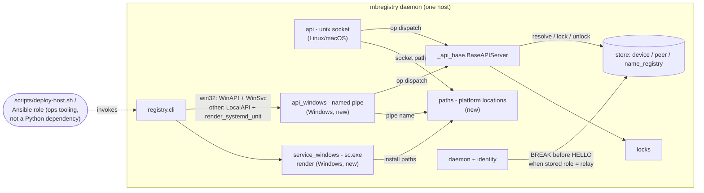

<!-- CLASI: Before changing code or making plans, review the SE process in CLAUDE.md -->

# Sprint 005: mbregistry Windows platform support and fleet migration

## Goals

Split out of sprint 004 for scope realism (see that sprint's planning
notes). Fix a real correctness defect in the daemon's shared re-probe
path first (a relay in the data plane can be misidentified). Bring
`mbregistry` up as a genuine second supported daemon platform on
Windows, verified with fakes and a real `windows-latest` CI job (no
Windows hardware exists for this project). Build repeatable, idempotent
fleet-deployment tooling inside `mbtools` and write the migration
runbook the stakeholder will use to retire the old `mbdeploy`/
`mbrelay.service` packages on the rest of the fleet, on their own
schedule — this sprint applies that tooling only to the five existing
hardware test hosts, not to `torture` or any other production host.
Add a README usage section so `mbtools` has user-facing docs beyond its
design documents.

## Problem

Sprints 001-004 were Linux-first (with macOS as a development
convenience). `mbregistry-windows-platform-support.md` (split from the
sprint 1 daemon issue) is still open: no Windows USB event source, no
Windows service (SCM) install, no named-pipe local query API. Separately,
a relay board left in the radio data plane can have its registry row
corrupted by an ordinary re-probe (`relay-in-data-plane-can-be
-misidentified-by-reprobe.md`, found during sprint 004's hardware
acceptance, ticket 011) — a real correctness bug in the daemon's shared
probe pipeline that every device goes through, and this sprint's first
priority to fix.

**Scope correction from the original roadmap entry (team-lead
direction):** this sprint does **not** touch the fleet beyond the five
existing hardware test hosts (`meili`, `loki`, `hodr`, `magni`,
`braeburn`), does not touch the production relay host `torture` or its
`mbrelay.service`, and does not modify `Busboombot/mbdeploy`,
`League-Robotics/microbit-radio-relay`, or `robot-console` — those are
other repositories and a production host outside this sprint's write
scope. The old `mbdeploy.service` was already retired on all four
Nolanet test nodes in sprint 001 (`docs/acceptance/001-hardware.md`); the
five test hosts are not carrying old packages that need retiring. What
this sprint actually owes the fleet-migration half of its name is:
repeatable, idempotent deployment tooling *inside* `mbtools` itself
(no dependency on the old `mbdeploy` repo's Ansible roles or golden
image), exercised against the five test hosts, plus a migration runbook
the stakeholder can execute against the real fleet — including `torture`
— on their own schedule, outside this sprint.

**Amendment (mid-sprint, ticket 011): `torture` is now an authorized
test host for one specific purpose.** The "does not touch `torture`"
boundary above was written when `torture` was still running the old
`mbrelay.service`. That has since changed, outside this sprint, by the
stakeholder's own action: `torture`'s legacy `mbrelay.service` has
already been replaced by `mbregistry`. That migration is what surfaced
`peer-sync-overwrites-ownership-of-locally-attached-devices.md`,
discovered during ticket 007's hardware work — `torture`'s relay pool
went to zero devices because a stale remote sync from `hodr` overwrote
ownership of `torture`'s own locally-attached relays. The stakeholder
has since designated `torture` an authorized test host for verifying
that fix (new ticket 011) and removed the relay named `getez` from it,
leaving 3 relays as the concrete verification devices for tickets
011/010. The rest of the original boundary still holds: this sprint
does not apply its five-test-host deployment tooling to `torture`, does
not execute the wider production fleet cutover (`docs/migration.md`'s
runbook remains the stakeholder's own action, on their own schedule),
and does not touch any other production host. `torture` is in scope
only for ticket 011's fix and ticket 010's re-verification of it.

**Hard constraint carried from planning: there is no Windows test
machine available to this project.** Windows work in this sprint must be
built and verified with fakes/mocks for the OS-specific seams (USB event
source, SCM registration, named pipe transport), the same way sprint
003's remote-stream code was unit-tested before hardware existed, and the
sprint's own hardware-acceptance ticket must explicitly flag the Windows
pieces as **not hardware-verified** rather than silently skipping them.
Real Windows verification is a follow-up outside this sprint's authority
to promise — though this sprint does add a `windows-latest` GitHub
Actions job to run the test suite under a real Windows OS, which is
genuine (non-hardware) verification of the Windows-specific code paths,
short of real USB/SCM hardware.

## Solution

- **Re-probe fix first** (`relay-in-data-plane-can-be-misidentified-by
  -reprobe.md`): the daemon's re-probe path sends a BREAK before `HELLO`
  whenever a device's *stored* role already indicates relay/bridge, so a
  reprobe can never observe radio-forwarded traffic instead of the
  board's own genuine command-plane banner. Ships with a fake-serial
  regression test reproducing the forwarded-announcement case, before any
  other change touches the shared probe pipeline.
- `mbregistry-windows-platform-support.md`: a named-pipe local query
  service as the Windows counterpart to the Unix-socket API in
  `registry.api`; Windows service (SCM) registration with
  restart-on-failure parity with the systemd unit `registry.cli` installs
  today; Windows file paths under `ProgramData` (the `/var/lib`
  equivalent); and USB attach/detach watching, which this sprint
  discovers does **not** need a new module — `registry.usbwatch`'s
  existing `PollingPortWatcher` already runs unmodified cross-platform
  (pyserial's `comports()` enumerates Windows COM ports the same way it
  does macOS's), the same reasoning its own docstring already gives for
  macOS. Every Windows-specific claim is verified with fakes/mocks only
  and explicitly marked not hardware-verified; a `windows-latest` GitHub
  Actions job runs the full test suite as real (non-hardware) Windows
  verification.
- Fleet migration, rescoped to this sprint's actual write authority:
  build idempotent deployment tooling *inside* `mbtools` (a hardened
  `scripts/deploy-host.sh` and/or Ansible role that installs from a built
  wheel, runs `install-service` including the udev rule, adds the
  operating user to the USB-access group, and enables/starts the
  service — safe to re-run), apply it only to the five existing hardware
  test hosts, and write `docs/migration.md`: the runbook the stakeholder
  will use to retire `mbdeploy serve`/`mbrelay.service` on the rest of
  the fleet (cut-over order, `torture` last, verifying robot-console
  against sprint 004's compatibility pool first, rollback, and the exact
  wiki/doc text to paste into both wikis) — on their own schedule,
  outside this sprint's write scope. This sprint does not apply its
  five-test-host deployment tooling to `torture`, and does not touch
  `Busboombot/mbdeploy`, `League-Robotics/microbit-radio-relay`,
  `robot-console`, the docs hub, or the Robot Garage wiki. Ticket 011 is
  the one authorized exception to "does not touch `torture`" — see the
  Problem section's amendment: `torture` already runs `mbregistry` (the
  stakeholder migrated it outside this sprint), and ticket 011 fixes and
  hardware-verifies a real ownership defect found there.
- Add a concise README usage section (install, the four commands, and
  the common flows: `list`, `deploy --repo`, `mbserial`, `mbrelay connect
  robot@host`, peering/`--peer`, ports) — no machine specifics, since
  the repo is public — and correct the README's stale "early planning"
  status text.
- As in sprint 004, hands-on verification against real hardware uses a
  spare board with no announcing firmware, per this project's standing
  rule about not disturbing a robot in active use.

## Success Criteria

- The re-probe fix is verified both by a fake-serial regression test and
  by a deliberately constructed real-hardware scenario (a relay left in
  the data plane while a reprobe fires) in this sprint's own hardware
  acceptance pass.
- `mbregistry` installs and runs as a Windows service, with USB
  attach/detach detected (verified with a fake/injectable event source —
  no Windows hardware available) and the local query API reachable over
  a named pipe; a `windows-latest` CI job runs the suite against real
  Windows.
- The new deployment tooling installs/updates `mbtools` idempotently on
  all five hardware test hosts without disturbing them, and
  `docs/migration.md` gives the stakeholder a complete, executable
  runbook for the rest of the fleet, including the exact wiki text to
  paste.
- The README has a usage section covering install and the four programs'
  common flows.
- The sprint's hardware-acceptance results explicitly list which claims
  are hardware-verified and which (all Windows-specific ones) are
  verified only against fakes/CI.

## Scope

### In Scope

- `relay-in-data-plane-can-be-misidentified-by-reprobe.md` (fixed first).
- `mbregistry-windows-platform-support.md`, verified with fakes plus a
  `windows-latest` CI job.
- Idempotent fleet-deployment tooling inside `mbtools`, applied only to
  the five hardware test hosts (`meili`, `loki`, `hodr`, `magni`,
  `braeburn`).
- `docs/migration.md`, the stakeholder-executed runbook for the rest of
  the fleet.
- A README usage section.
- Hardware acceptance on the five test hosts (`docs/acceptance/005
  -hardware.md`).

### Out of Scope

- Any further protocol or peering changes beyond ticket 011's ownership
  fix — this sprint otherwise consumes sprint 003's peering/remote-lock
  machinery and sprint 004's `mbrelay`/robot-console-compatibility work
  as-is. (Amendment: ticket 011, added mid-sprint for the newly linked
  `peer-sync-overwrites-ownership-of-locally-attached-devices.md` issue,
  is a deliberate, narrow exception — a correctness fix to
  `store._upsert_device`/`peering._apply_snapshot_device`/`_apply_event`
  and the daemon event publishers, not a new peering feature.)
- Real Windows hardware verification — no test machine is available;
  see "Problem" above.
- Touching `torture` (the production relay host) beyond ticket 011's fix
  and ticket 010's re-verification of it (see the Problem section's
  amendment), or touching any fleet host other than the five test hosts
  and `torture`.
- Modifying `Busboombot/mbdeploy`, `League-Robotics/microbit-radio-relay`,
  or `robot-console` — other repositories outside this project's write
  scope.
- Publishing to the docs hub or editing the Robot Garage wiki directly —
  `docs/migration.md` gives the stakeholder the exact text to paste
  themselves.
- Executing the actual production fleet cutover — this sprint produces
  the runbook and the tooling; running it against `torture` and the rest
  of the fleet is the stakeholder's own action, on their own schedule.

## Test Strategy

- **Re-probe fix**: a fake-serial regression test
  (`mbtools.testing.fakes.FakeSerial`) that scripts a device whose stored
  role is `RADIOBRIDGE` and whose port, on the next probe, yields a
  forwarded robot-dialect announcement before any `HELLO` is written —
  proving the fix sends a `BREAK` first. A second test proves an
  ordinary (non-relay) device's reprobe is unaffected (no spurious
  `BREAK`).
- **Windows platform code**: every OS-specific seam (named-pipe local
  API, SCM service registration) is built against fakes the same way
  `registry.api`'s `SO_PEERCRED`/`LOCAL_PEERPID` dispatch already is
  (`peer_pid_fn` injection) — unit-tested on macOS/Linux CI without any
  Windows-only third-party dependency. A new `windows-latest` GitHub
  Actions job runs the full suite under real Windows as genuine
  (non-hardware) verification; the sprint's hardware-acceptance document
  states plainly that this is not a substitute for real USB/SCM hardware
  verification, which remains unavailable to this project.
- **Fleet deployment tooling**: tested for idempotency directly against
  the five hardware test hosts (re-running produces no duplicate units,
  no service disruption on an already-healthy host — the same standard
  `registry.cli.cmd_install_service` already meets on Linux).
- **Full suite**: runs once at `close_sprint`, per this project's
  standing process rule; ticket-scoped runs during implementation.

## Architecture

**Sizing: Substantial.** This sprint introduces a new Windows-platform
subsystem inside `mbregistry` — three new modules (`registry.paths`,
`registry.api_windows`, `registry.service_windows`) plus an extension of
`registry.cli`'s dispatch — a new external integration (Windows's own
Service Control Manager, reached via `sc.exe`, and Win32 named-pipe I/O,
reached via `ctypes`), and a new operational-tooling surface (idempotent
fleet deployment scripts) with its own runbook. That is at least two of
the substantial-tier triggers (3+ modules touched, new external
integration) on the Windows side alone. The re-probe fix and the fleet
tooling/docs work are smaller, non-architectural extensions to existing
modules and are covered under "Impact on Existing Components" and
"Migration Concerns" rather than the diagrammed core, consistent with
how sprint 004 handled its own bugfix/process-quality tickets.

### Step 1-2: Problem and Responsibilities

Two responsibilities are genuinely new this sprint:

1. **Give `mbregistry` a Windows-native local query transport and a
   Windows-native way to run as a restart-on-failure service** — the two
   pieces of `mbregistry-windows-platform-support.md` that need new code
   (USB watching does not — see Design Rationale). This splits further
   into (1a) the named-pipe local API, which changes when the query
   protocol or the Windows pipe/PID mechanics change, and (1b) SCM
   service registration, which changes when Windows's own service model
   or this project's restart policy changes — different lifecycles,
   different modules.
2. **Resolve mbregistry's on-disk state locations per platform** — today
   `registry.store.DEFAULT_DB_PATH` and `registry.api.DEFAULT_SOCKET_PATH`
   are Linux-path literals; Windows needs `ProgramData`-rooted
   equivalents. This is a small, single-purpose responsibility (path
   resolution, nothing else) shared by both (1a)'s pipe-name/state
   location and (1b)'s install paths, and by `registry.store`/
   `registry.api` themselves once Windows is a real target — worth its
   own narrow module rather than duplicating a platform `if` in three
   places.

A third responsibility — **idempotent fleet deployment** — is new but is
deliberately *not* Python library code: it is operational tooling
(`scripts/deploy-host.sh` and/or an Ansible role) that shells out to
already-existing `mbtools` entry points (`uv build`, `mbregistry
install-service`), the same shape `scripts/deploy-test-host.sh` already
established in sprint 004. It gets its own component-diagram node as an
external actor, not a new dependency edge inside the Python package.

### Step 3: Modules

| Module | Purpose (one sentence) | Boundary | Serves |
|---|---|---|---|
| `registry.paths` (new) | Resolve where `mbregistry`'s on-disk/OS-namespace state lives, per platform | Pure functions (`default_db_path()`, `default_socket_path()`, `default_pipe_name()`); no I/O of its own, no knowledge of what's stored at those locations | UC (Windows service install, named-pipe API) |
| `registry.api_windows` (new) | Serve the local device-query API over a Windows named pipe | Owns Win32 named-pipe creation/accept/read/write via `ctypes` (`kernel32.dll`) and per-connection client-PID lookup (`GetNamedPipeClientProcessId`); reuses `registry._api_base.BaseAPIServer` for op dispatch exactly as `registry.api.RegistryAPIServer` does — no protocol logic of its own | mbregistry-windows-platform-support.md |
| `registry.service_windows` (new) | Render the Windows SCM commands that install `mbregistry` as a restart-on-failure service | Pure text-rendering functions (mirrors `registry.cli.render_systemd_unit`'s shape) plus `cmd_install_service`'s Windows branch, which prints (never runs) the `sc.exe create`/`sc.exe failure` commands — no direct SCM API calls, no pywin32 dependency | mbregistry-windows-platform-support.md |
| `registry.cli` (extended) | Dispatch `run`/`install-service` to the Windows-specific implementations on `sys.platform == "win32"`, unchanged on Linux/macOS | Adds a platform branch at the two existing entry points; no new commands | mbregistry-windows-platform-support.md |
| `registry.daemon` / `registry.identity` (extended) | Never let a re-probe observe anything but a relay's own genuine banner | `identity.probe()` gains an optional pre-`HELLO` reset; `daemon._maybe_probe` passes it whenever the *stored* role for that uid is relay/bridge | relay-in-data-plane-can-be-misidentified-by-reprobe.md |

`registry.usbwatch` is **not** in this table — see Design Rationale for
why Windows needs no new USB-watch module.

### Step 4: Diagrams

**Component diagram** — required: three new modules and new dependency
edges onto the existing shared dispatch/store layer.

`peering`/`remote_api`/`console_compat.*` are omitted — this sprint adds
no new peering surface and does not touch them (see Impact below).

**ERD** — not required: no data-model change this sprint (no new table,
no column change — the re-probe fix reads the existing `role` column it
already writes, and Windows paths are computed values, not stored
config).

**Dependency graph**: folded into the component diagram above. New edges
run from presentation/platform-adapter modules (`api_windows`,
`service_windows`, the CLI's platform branch) toward the existing
infrastructure layer (`_api_base`, `store`, `paths`), never the reverse —
no cycles, and the existing [Presentation] → [Domain] → [Infrastructure]
direction holds with `api_windows`/`service_windows` as new members of
the presentation/adapter tier, parallel to `api.py`, not replacing it.

### Step 5: What Changed / Why / Impact / Migration

**What Changed**
- New module `registry.paths`: `default_db_path()`, `default_socket_path()`,
  `default_pipe_name()` — Linux/macOS return today's literals unchanged
  (`/var/lib/mbregistry/devices.db`, `/run/mbregistry/api.sock`);
  Windows returns `ProgramData`-rooted equivalents (e.g.
  `%ProgramData%\mbregistry\devices.db`) and a fixed pipe name (e.g.
  `\\.\pipe\mbregistry`), flagged per the brief's own open decision #2 as
  an assumption for stakeholder confirmation, not a ratified path.
  `registry.store.DEFAULT_DB_PATH` and `registry.api.DEFAULT_SOCKET_PATH`
  are updated to call through this module rather than hold Linux-only
  literals, with no behavior change on the platforms already supported.
- New module `registry.api_windows`: `WindowsPipeAPIServer(BaseAPIServer)`
  — accept loop over a `ctypes`-created named pipe
  (`CreateNamedPipeW`/`ConnectNamedPipe`/`ReadFile`/`WriteFile`), and
  `_holder_for_connection` backed by `GetNamedPipeClientProcessId` (the
  named-pipe counterpart to `api.py`'s `SO_PEERCRED`/`LOCAL_PEERPID`
  dispatch) rather than a new third-party dependency — see Design
  Rationale. Every op (`list`/`find`/`lock`/`unlock`/`mark_flashed`) is
  inherited from `BaseAPIServer` unchanged, so this module carries no
  protocol logic of its own, the same division `api.py`/`remote_api.py`
  already established.
- New module `registry.service_windows`: `render_windows_service_install()`
  and `render_windows_service_failure_actions()` (or one combined
  render function) producing the `sc.exe create`/`sc.exe failure`
  command text — the Windows counterpart to `render_systemd_unit()`,
  same "render text, print, never execute" shape as
  `cmd_install_service`'s existing systemd/udev path.
- `registry.cli`: `cmd_run` and `cmd_install_service` gain a
  `sys.platform == "win32"` branch that swaps in `WindowsPipeAPIServer`/
  `registry.service_windows`'s renderer instead of
  `RegistryAPIServer`/`render_systemd_unit`; the Linux/macOS path is
  untouched.
- `registry.identity.probe()` gains an optional pre-`HELLO` reset
  (asserting a serial `BREAK`, mirroring `relay.protocol`'s own
  already-hardware-proven recovery mechanism, before the settle delay
  and `HELLO` write). `registry.daemon._maybe_probe` passes it whenever
  the uid's *pre-probe* stored role (`identity.is_relay(record.role)`)
  says relay/bridge — for both an ordinary reattach-triggered reprobe
  and a flash-triggered one, since a `BREAK` is a safe superset in both
  cases (it is exactly the reset a genuinely reattached relay needs, and
  harmless to a board that turns out, post-`BREAK`, to have actually been
  reflashed to a robot). The "never probe a locked device" half of the
  issue's recommended fix already exists (`daemon._maybe_probe`'s
  `self.locks.status(uid) is not None` check, sprint 001) — this sprint
  adds only the BREAK-before-HELLO half.
- New `scripts/deploy-host.sh` (and/or an Ansible role, implementer's
  choice per the ticket): builds a wheel, installs it, runs `mbregistry
  install-service` (systemd unit + udev rule), adds the operating user to
  the udev group, enables/starts the service — idempotent, safe to
  re-run, applied only to the five test hosts.
- New `docs/migration.md` and a new README usage section (docs, not
  code).

**Why**: close out the Windows leg of brief §9.7 without adding a new
third-party dependency footprint to every fleet node (Design Rationale),
fix a real shared-pipeline correctness bug before building more on top of
that pipeline, and give the stakeholder a repeatable, low-risk way to
finish the fleet cutover this project exists to enable — without this
sprint itself taking any action against a host or repository outside its
authority.

**Impact on Existing Components**
- `registry._api_base.BaseAPIServer`: no change — `api_windows` is a new
  consumer of an already-generalized mixin, exactly the extension point
  ticket 006 (sprint 001) built it for.
- `registry.locks`/`registry.store`: no schema or lock-kind change;
  `store.DEFAULT_DB_PATH` becomes a call-through to `paths.default_db_path()`
  (behavior-preserving on existing platforms).
- `registry.usbwatch`: unchanged — see Design Rationale.
- `registry.peering`/`remote_api`/`console_compat.*`: untouched; this
  sprint adds no new peering surface and Windows peering is out of scope
  (mDNS/ZeroMQ on Windows is not part of `mbregistry-windows-platform
  -support.md`'s own scope statement and is not claimed as working here).
- `pyproject.toml`: no new runtime dependency (Design Rationale) — only
  a new CI workflow file.

**Migration Concerns**
- **Windows paths are an assumption, not a decision.** Per the brief's
  own open decision #2, `registry.paths`'s Windows defaults must be
  flagged in the ticket and in `docs/migration.md` as needing
  stakeholder confirmation before any real Windows node is provisioned
  from them.
- **No Windows hardware exists to validate any of this against a real
  SCM, a real named pipe client, or a real Windows-attached micro:bit.**
  The `windows-latest` CI job proves the code runs correctly under real
  Windows and that the rendered `sc.exe` commands are syntactically
  sound (they can be executed in CI, which runs with administrator
  rights, as a real install/uninstall round-trip of a *test* service name
  — see the CI ticket) — it does not prove SCM restart-on-failure
  actually restarts a crashed `mbregistry`, or that a real USB
  attach/detach is seen, on real Windows hardware.
- **Deployment tooling only touches the five test hosts.** Re-running it
  against a host must not disrupt an already-healthy `mbregistry.service`
  or duplicate the udev rule/systemd unit — the same idempotency bar
  `install-service` already meets on Linux (sprint 004 ticket 008).
- **The re-probe fix touches the daemon's shared, heavily-tested
  attach/reprobe pipeline** (`docs/acceptance/004-hardware.md`'s own
  words) used identically for every device — hence "fix it first," with
  its own regression test, before any Windows work lands on top of the
  same files.
- **Production cutover is the stakeholder's own action, not this
  sprint's.** `docs/migration.md` documents cut-over order (relay host
  `torture` last, robot-console verified against sprint 004's
  compatibility pool first), rollback, and the exact wiki text — it does
  not get executed by any ticket in this sprint.

### Step 6: Design Rationale

**Decision 1 — Windows local API and service install use only Python's
standard library (`ctypes` + `subprocess`-renderable `sc.exe` text), not
`pywin32`.**
- *Context*: the issue's own scope statement leaves the mechanism open
  ("a Windows service wrapper"); `pywin32` is the conventional way to do
  both SCM registration and named-pipe I/O from Python on Windows.
- *Alternatives considered*: `pywin32` — rejected as the primary
  mechanism because it would be a new third-party dependency installed
  on every Windows fleet node (this project currently depends only on
  `pyserial`/`intelhex`/`pyocd`/`zeroconf`/`pyzmq`, each earning its
  place for something the standard library can't do; named-pipe I/O and
  `sc.exe` invocation are both reachable from `ctypes`/`subprocess`
  alone). `multiprocessing.connection`'s `AF_PIPE` family was also
  considered for the transport but rejected because it doesn't expose
  the connecting client's PID, which the lock-holder model requires.
- *Why this choice*: `ctypes.windll.kernel32` gives direct access to
  `CreateNamedPipeW`/`ConnectNamedPipe`/`ReadFile`/`WriteFile`/
  `GetNamedPipeClientProcessId` — five well-documented Win32 calls — with
  zero new dependencies; `sc.exe` ships with every Windows install, the
  same way `systemctl`/`udevadm` ship with every systemd Linux install
  this project already assumes.
- *Consequences*: `registry.api_windows`/`registry.service_windows` carry
  slightly more low-level `ctypes` code than a `pywin32`-based
  implementation would, in exchange for no new fleet-wide dependency.
  Revisit if a later sprint finds the `ctypes` surface too fragile to
  maintain.

**Decision 2 — No new USB-watch module for Windows; `PollingPortWatcher`
is reused unchanged.**
- *Context*: the issue's scope statement calls for "a real Windows
  attach/detach event source... behind the same interface" the Linux
  implementation uses.
- *Alternatives considered*: a `WMI`/`SetupAPI`-based real event source
  (true push notifications instead of polling) — deferred, not rejected;
  it is a valid future upgrade behind the same `PortWatcher` interface,
  but nothing in this sprint's scope needs it, since `usbwatch.py`'s own
  docstring already establishes that `PollingPortWatcher` has "no
  platform-specific code" and pyserial's `comports()` enumerates Windows
  COM ports through the OS's own SetupAPI/WMI backend without any
  Windows branch in this project's code.
- *Why this choice*: satisfies the issue's actual requirement (USB
  attach/detach is observed on Windows, behind the `PortWatcher`
  interface) with zero new code, consistent with the team-lead's own
  scoping note that "polling via comports works cross-platform."
- *Consequences*: Windows gets the same polling latency/behavior Linux
  and macOS already have, not push notifications; acceptable, since
  Linux doesn't have real event-based watching yet either (sprint 001's
  own deferred-upgrade note).

**Decision 3 — Windows service registration goes through the SCM
(`sc.exe`), not Task Scheduler.**
- *Context*: team-lead scoping asked for "a Windows service wrapper or
  Task Scheduler — pick the simplest robust option and justify."
- *Alternatives considered*: Task Scheduler, triggered "at startup" with
  a retry policy on task failure — rejected because its failure-recovery
  model is a bounded number of retries on the *task*, not systemd's
  `Restart=always`-equivalent continuous respawn, and a scheduled task
  doesn't appear in `services.msc`/`Get-Service`, which is where an
  operator used to systemd units would look for `mbregistry`'s status.
- *Why this choice*: `sc.exe create` plus `sc.exe failure ... actions=
  restart/60000/restart/60000/restart/60000` gives a direct SCM
  equivalent of the systemd unit's `Restart=on-failure` — same
  observability surface (`Get-Service mbregistry`), same "the OS
  restarts it if it dies" guarantee the brief asks for.
- *Consequences*: `cmd_install_service`'s Windows branch prints `sc.exe`
  commands rather than running them, mirroring the existing "print,
  don't execute" Linux/systemd precedent — safe to exercise in a test or
  in CI without side effects unless the operator (or the CI job,
  deliberately, against a throwaway service name) chooses to run them.

**Decision 4 — Fleet deployment tooling lives inside `mbtools`, not the
old `mbdeploy` repo, and is applied only to the five test hosts.**
- *Context*: the original roadmap entry for this sprint assumed touching
  `Busboombot/mbdeploy`'s own Ansible roles and golden Pi Zero image;
  team-lead scoping overrides that.
- *Alternatives considered*: updating the old repo's tooling directly —
  rejected, out of this sprint's write scope (a different repository);
  doing nothing and leaving migration entirely manual — rejected, the
  brief's own migration concern (open decision #8) asks for a repeatable
  procedure, not just a one-off manual cutover.
- *Why this choice*: `mbtools` already has a working precedent
  (`scripts/deploy-test-host.sh`) for building-and-installing onto a test
  host over SSH; extending that same shape to also run `install-service`
  idempotently keeps all deployment logic in the repo that owns the
  software being deployed, and keeps this sprint's blast radius to hosts
  it's authorized to touch.
- *Consequences*: the actual retirement of `mbdeploy serve`/
  `mbrelay.service` on the rest of the fleet (including `torture`) is
  documented (`docs/migration.md`) but not executed by this sprint — a
  deliberate scope boundary, not an oversight.

### Step 7: Open Questions

- The brief's open decision #2 (exact Windows path layout under
  `ProgramData`) and open decision #7 (is macOS a supported daemon
  platform, or dev-only?) are still open; this sprint's `registry.paths`
  module picks a concrete, documented Windows default but does not
  claim it is stakeholder-ratified.
- Whether a future sprint should replace `PollingPortWatcher` with a real
  push-based event source (`udev`/netlink on Linux, `WM_DEVICECHANGE`/WMI
  on Windows) is unaddressed by this sprint (Decision 2) — flagged for a
  future issue if polling latency ever proves too slow in practice.
- Whether the CI ticket's real `sc.exe create`/`delete` round-trip
  (against a throwaway service name, to prove the rendered commands are
  actually valid) is worth the added CI complexity, versus a
  syntax-only check, is an implementer judgment call for that ticket —
  either satisfies this sprint's "real, non-hardware Windows
  verification" goal.
- **Named-pipe access control is unresolved.** The Unix-socket API's
  effective access control today is the filesystem permissions on
  `/run/mbregistry/api.sock` (root-owned, since `mbregistry.service` has
  no `User=`); a Win32 named pipe created with `CreateNamedPipeW`'s
  default security attributes is reachable by any local user unless an
  explicit DACL is set. This sprint's `registry.api_windows` ticket must
  either set an equivalent restrictive DACL or explicitly document the
  gap as an assumption for stakeholder confirmation (parallel to the
  brief's own open decision #2/#3) — it must not silently ship a wider
  local trust boundary on Windows than exists on Linux/macOS today.

## Use Cases

### SUC-001: A relay left in the data plane survives a routine re-probe unmodified

A relay board (`role` already `RADIOBRIDGE`/contains `RELAY`) is
transparently forwarding radio traffic when the daemon's poll loop
decides it's eligible for re-probe (a USB reattach flap, or a
flash-pending reprobe). Today, `identity.probe()` accepts whatever line
arrives in its read window — including a fragment of the *robot's* own
forwarded announcement — and overwrites the relay's registry row with
the robot's identity. After this sprint: the daemon sends a `BREAK`
before `HELLO` whenever the uid's stored role is relay/bridge, forcing
the board back into its own command plane before trusting anything it
says, so the registry row is never corrupted by forwarded data-plane
traffic. Traces to `relay-in-data-plane-can-be-misidentified-by
-reprobe.md`.

### SUC-002: `mbregistry` runs as a Windows service with a working local query API

An operator installs `mbregistry` on a Windows host: `mbregistry
install-service` prints the `sc.exe` commands that register it as a
restart-on-failure service under the SCM; once running (verified only
against fakes/CI in this sprint, not real Windows hardware), USB
attach/detach is observed via the existing cross-platform
`PollingPortWatcher`, and a local client (a future Windows build of
`mbdeploy`/`mbserial`) reaches the device-query API over a named pipe
the same way today's Linux/macOS clients reach it over a Unix socket —
same ops, same JSON wire shape, different transport. Every claim in this
use case is explicitly marked not-hardware-verified in this sprint's
acceptance results. Traces to `mbregistry-windows-platform-support.md`.

### SUC-003: An operator deploys or updates `mbtools` on a fleet host idempotently

An operator runs this sprint's new deployment tooling against one of the
five hardware test hosts. It builds a wheel, installs it into the host's
venv, runs `install-service` (systemd unit + udev rule), ensures the
operating user is in the USB-access group, and enables/starts the
service. Running it again against the same, already-healthy host makes
no further change and does not disrupt the running service — the same
idempotency bar `install-service` alone already meets. The tooling is
never applied to any host outside the five test hosts in this sprint.

### SUC-004: A stakeholder executes the migration runbook against the production fleet

Following `docs/migration.md`, the stakeholder retires `mbdeploy serve`
and `mbrelay.service` on a remaining production node, in the documented
order (relay host `torture` last, after confirming robot-console still
works against sprint 004's compatibility pool on an already-migrated
host), with a documented rollback if something goes wrong, and pastes
the runbook's given text into both wikis. This use case is executed by
the stakeholder, not by any ticket in this sprint.

### SUC-005: A new user gets all four programs running from the README alone

A user with no prior context reads the README's new usage section and
successfully installs `mbtools`, and runs each of the four programs'
common flows: `mbregistry list`, `mbdeploy deploy <name> --repo
OWNER/REPO`, `mbserial <name>`, and `mbrelay connect
<robot>[@host]` — including how `--peer`/`@host` reach a remote host's
registry — without needing any machine-specific detail (the repo is
public).

### SUC-006: Hardware acceptance validates the sprint on the five test hosts

On the five hardware test hosts: the re-probe fix is validated against a
deliberately constructed relay-in-data-plane-during-reprobe scenario
(not just the fake-serial unit test); the deployment tooling's
idempotency is confirmed on all five; every command (`mbregistry list`,
`mbdeploy deploy`, `mbserial`, `mbrelay connect`, `mbrelay names`) is
smoke-tested; and `braeburn`'s mDNS discovery is checked after a longer
uptime window if feasible in the session, with the observed uptime
recorded either way. Results, including an explicit hardware-verified
vs. fakes/CI-only breakdown for every Windows claim, are written to
`docs/acceptance/005-hardware.md`.

## GitHub Issues

(GitHub issues linked to this sprint's tickets. Format: `owner/repo#N`.)

## Definition of Ready

Before tickets can be created, all of the following must be true:

- [ ] Sprint planning document is complete (sprint.md, including its
      Architecture and Use Cases sections)
- [ ] Architecture review passed (or skipped, for changes with no
      architectural impact)
- [ ] Stakeholder has approved the sprint plan

## Tickets

| # | Title | Depends On |
|---|-------|------------|
| 001 | Fix: relay in data plane misidentified by re-probe | — |
| 002 | `registry.paths`: cross-platform state-location resolution | — |
| 003 | Windows named-pipe local query API (`registry.api_windows`) | 002 |
| 004 | Windows service install via SCM (`registry.service_windows`) | 002 |
| 005 | Wire Windows platform support into `mbregistry run`/`install-service` | 003, 004 |
| 006 | CI: `windows-latest` test job | 005 |
| 007 | Idempotent fleet deployment tooling for the five test hosts | — |
| 008 | Migration runbook (`docs/migration.md`) | 007 |
| 009 | README usage section | — |
| 010 | Hardware acceptance: five test hosts (`docs/acceptance/005-hardware.md`) | 001, 007, 008, 011 |
| 011 | Fix: local ownership wins over stale peer sync | — |

Tickets execute serially in the order listed. Ticket 001 (the re-probe
fix) is deliberately first, ahead of any Windows work, per team-lead
scoping — it is the daemon's shared, heavily-tested probe pipeline that
every later ticket in this sprint builds alongside, not on top of.
Ticket 011 was added after `peer-sync-overwrites-ownership-of-locally
-attached-devices.md` (found during ticket 007's own hardware work, on
`torture`) was linked to this sprint as an urgent correctness fix; it
has no dependency on 008/009 and, per the listed execution order, is
picked up next, with 010 now also depending on it so the sprint's final
hardware-acceptance pass re-verifies the fix on `torture`'s real relay
pool.
