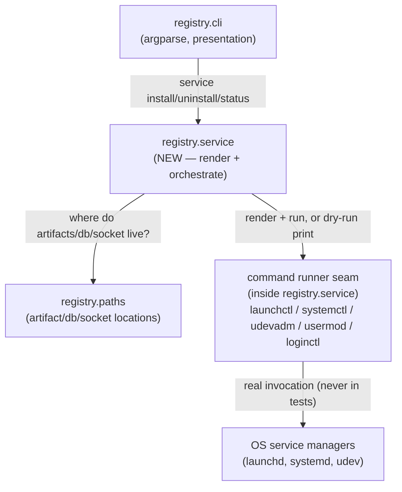

<!-- CLASI: Before changing code or making plans, review the SE process in CLAUDE.md -->

# Sprint 006: mbregistry service install/uninstall (user/system, macOS + Linux)

## Goals

Replace `mbregistry install-service` (Linux-only, systemd unit + udev rule,
write-and-print-instructions) with a `mbregistry service` command group that
actually installs, starts, and cleanly removes the `mbregistry` daemon, at
either **user** or **system** scope, on **macOS and Linux**. Resolve the
open "is macOS a supported daemon platform?" decision as **yes** (both
LaunchAgent/user and LaunchDaemon/system), consistent with the per-platform
defaults already implemented in `src/mbtools/registry/paths.py`.

## Problem

Two related gaps, both surfaced during sprint 005 hardware acceptance:

1. `install-service` only ever wrote a systemd unit and udev rule and
   printed (never ran) the follow-up commands — it never actually started
   the service, has no concept of user vs. system scope, and does nothing
   at all on macOS. There is also no `uninstall` or `status` counterpart,
   so removing or inspecting an install is manual, undocumented shell work.
2. macOS has no `/run`, so a bare `mbregistry run` there has no sensible
   default socket path — every client command on a Mac needs an explicit
   `--socket`/`$MBREGISTRY_SOCKET`. `paths.py` already returns
   platform-correct macOS defaults (see Architecture below), but nothing
   installs or starts a macOS daemon at those paths — the launchd
   equivalent of the systemd unit was only ever hand-documented in
   `docs/service.md` §7, never implemented or tested.

## Solution

A new `mbregistry service` subcommand group:

```
mbregistry service install   (--user | --system) [--dry-run]
mbregistry service uninstall (--user | --system) [--purge]
mbregistry service status
```

`--user`/`--system` is required and mutually exclusive for
`install`/`uninstall` — there is no default scope. `install` writes the
service-manager file(s) *and* loads/starts the service (a behavior change
from `install-service`); `--dry-run` prints what would be written/run
without touching anything. `uninstall` stops and unloads the service and
removes its files; it keeps `devices.db` unless `--purge` is given, and is
a safe no-op (exit 0, with a note about the other scope if one exists) when
nothing is installed at the requested scope. `status` reports both scopes'
install/running state and paths.

Per-platform mechanics:

| | `--user` | `--system` (needs root/sudo) |
|---|---|---|
| macOS | LaunchAgent, `launchctl bootstrap gui/$UID` | LaunchDaemon, `launchctl bootstrap system` |
| Linux | systemd user unit, `systemctl --user enable --now`, `loginctl enable-linger` | systemd system unit + udev rule, `daemon-reload`, `enable --now`, operator auto-added to `plugdev` |

Windows is explicitly out of scope: `mbregistry service ...` prints "not
supported on Windows" and exits nonzero on every subcommand; the existing
`service_windows.py`/`run --windows-service` code is untouched.

`install-service` is replaced by the new `service install` command. It is
kept for one release as a **hidden, deprecated alias** that prints a
deprecation notice to stderr and maps to `service install --system
--dry-run` (matching its old "write files, print commands, start nothing"
behavior exactly), per the issue's own Migration guidance — not removed
outright, so a script that still invokes it does not suddenly start and
enable a real service it never asked to run.

## Success Criteria

- `mbregistry service install --user` and `--system` both actually start
  the daemon (not just write files) on a spare macOS and a spare Linux
  host, and it survives a reboot / relogin as appropriate to scope.
- `mbregistry service uninstall` cleanly removes what `install` created,
  keeps `devices.db` by default, purges it with `--purge`, and is a safe,
  0-exit no-op when nothing is installed at the requested scope.
- `mbregistry service status` correctly reports both scopes on a host with
  either, both, or neither installed.
- `mbregistry service ...` on Windows fails clearly and nonzero, on every
  subcommand, with no attempt to touch systemd/launchd code paths.
- No automated test invokes a real `launchctl`/`systemctl`/`usermod` —
  every one goes through a mocked command runner.
- `docs/service.md` and `README.md` describe only the new commands; §6/§7's
  hand-written unit/plist instructions become "run `mbregistry service
  install`".

## Scope

### In Scope

- `mbregistry service install|uninstall|status`, both scopes, macOS +
  Linux.
- macOS launchd plist rendering (LaunchAgent + LaunchDaemon variants) and
  `launchctl` orchestration (`bootstrap`/`bootout`/`enable`/`disable`/
  `kickstart`/`print`).
- Linux systemd unit rendering extended to a user-scope variant (alongside
  the existing system-scope one) and `systemctl --user`/`loginctl
  enable-linger` orchestration; the existing udev-rule rendering and
  `plugdev` preflight/auto-add logic.
- A command-runner abstraction so every external command
  (`launchctl`/`systemctl`/`udevadm`/`usermod`/`loginctl`) is a single,
  mockable seam, plus `--dry-run` support built on the same seam.
- `docs/service.md` and `README.md` updates.
- Deprecated `install-service` hidden alias.
- Confirming/finishing the macOS default socket/db paths in `paths.py`
  (per the linked issue) — see Architecture; this sprint verifies and
  documents that work rather than redoing it, since `paths.py` already
  implements the darwin branches.

### Out of Scope

- Windows service install/uninstall/status (explicit error only).
- Any change to `service_windows.py`, `run --windows-service`, or the
  Windows SCM path.
- Removing the operator from `plugdev` on uninstall.
- Any data-model or wire-protocol change — `devices.db`'s schema and the
  local/remote API are untouched.
- Automating the "log in again" step after a fresh `plugdev` membership
  grant (still manual, as today).

## Test Strategy

Unit tests render plist/unit/udev content (golden-file style, matching the
existing `render_systemd_unit`/`render_udev_rule` test pattern) and drive
`install`/`uninstall`/`status` through a mocked command runner — no real
`launchctl`/`systemctl`/`usermod`/`loginctl` call in the automated suite,
on any platform (a Linux CI leg must be able to exercise the macOS launchd
render/orchestration path and vice versa, entirely through the mock).
`--dry-run` is tested as "renders and prints, writes/runs nothing" against
a `tmp_path`. Hardware/host acceptance (installing for real on a spare
Mac and a spare Linux node, per CLAUDE.md's "pick a spare board" rule,
applied here to a spare *host*) is manual, tracked the same way sprint
005's hardware acceptance was, and is not part of the automated suite.

## Architecture

**Substantial** — although the change is contained to roughly three
modules, it introduces a **new cross-module dependency**: `registry.cli`
(presentation) will depend on a new `registry.service` module (business
logic/orchestration), which in turn depends on `registry.paths`
(infrastructure/location knowledge) and a new command-execution seam. Per
the sizing rubric, a new cross-module dependency alone is sufficient to
rule out the "compact" tier regardless of module count, so this sprint
uses the full methodology below, including a component diagram — the
diagram earns its place because real new composition is happening (a new
module being wired between two existing ones), unlike sprint 020's
no-new-composition case. There is no data-model change and no new
external integration, so this is a lighter-weight "substantial" than
sprint 018's (which introduced two whole subsystems).

### Step 1: Understand the problem

Covered above (Problem/Solution). The core shift is from "write files and
print instructions" (today's `install-service`) to "actually install,
start, stop, and report status," at a scope the operator chooses, on two
platforms that need genuinely different mechanics (launchd vs. systemd)
behind one CLI surface.

### Step 2: Responsibilities

1. **Knowing where service artifacts live** — which plist/unit path, log
   path, for which platform and scope. This is a location-knowledge
   responsibility, the same kind `registry.paths` already owns for the
   database and socket.
2. **Rendering service-manager file content** — the plist/unit/udev-rule
   text itself, parameterized by scope. Pure text generation, no I/O
   beyond returning a string (matching `render_systemd_unit`/
   `render_udev_rule`'s existing shape).
3. **Executing external commands** — actually invoking
   `launchctl`/`systemctl`/`udevadm`/`usermod`/`loginctl`, or, under
   `--dry-run`, printing what would run instead. This must be a single,
   narrow, mockable seam — every other responsibility here calls through
   it rather than shelling out itself.
4. **Orchestrating install/uninstall/status per platform+scope** — the
   sequence of "render, write, preflight-check, run commands" that turns
   1-3 into one coherent operation, and decides what to do when something
   is missing (e.g. Linux `--user` refusing to install without `plugdev`).
5. **CLI surface** — parsing `service install|uninstall|status` and their
   flags, dispatching to responsibility 4, and printing user-facing
   output (including the Windows "not supported" error and the
   deprecated `install-service` alias).

Responsibility 1 changes an existing module (`registry.paths`); 2-4 are
one new module (`registry.service` — cohesive under "install/uninstall/
report the mbregistry service," even though it renders two different
platforms' file formats, because all of it is the single concern of
service lifecycle management, not two); 5 changes an existing module
(`registry.cli`).

### Step 3: Modules

- **`registry.paths`** (existing, extended). Purpose: know where
  `mbregistry`'s on-disk/OS-namespace state lives, including — new this
  sprint — where its *service-manager artifacts* (plist/unit/log paths)
  live, per platform and scope. Boundary: no I/O beyond existence checks
  (unchanged), no knowledge of *how* a service is installed, only *where*
  its files go. Serves SUC-001, SUC-002. This module's existing
  `system_socket_path`/`user_socket_path`/`system_db_path`/
  `user_db_path` already return correct macOS values (confirmed by
  reading the current source — the darwin branches were added ahead of
  this sprint), which is what answers the linked
  `macos-default-socket-path-needs-a-user-writable-location.md` issue's
  "decision needed": **yes, macOS is a supported daemon platform**, and
  no path-default rework is needed here — only the plist/launchd
  *install* mechanism this sprint adds.
- **`registry.service`** (new). Purpose: install, uninstall, and report
  the status of the `mbregistry` service, on whichever platform/scope is
  asked for. Boundary: owns all plist/unit/udev-rule rendering, the
  command-runner seam, and the per-platform/scope orchestration; knows
  nothing about argparse or CLI flag parsing. Serves SUC-001, SUC-002,
  SUC-003, SUC-004.
- **`registry.cli`** (existing, modified). Purpose (unchanged, extended):
  the `mbregistry` command-line entry point. New this sprint: the
  `service install|uninstall|status` subparsers, the Windows "not
  supported" short-circuit, and the deprecated `install-service` alias.
  Boundary: argument parsing and user-facing text only — the actual
  install/uninstall/status logic lives in `registry.service`, not here
  (this is the dependency-direction fix noted in Design Rationale below).
  Serves SUC-001 through SUC-005.
- **`registry.service_windows`** (existing, untouched). Not part of this
  sprint's new dependency graph — `registry.cli`'s Windows branch for
  `service ...` is a two-line "print not-supported, exit nonzero," never
  calling into this module or `registry.service`.

### Step 4: Diagrams

Component diagram — required here because a new module is being
composed between two existing ones (new cross-module dependency, Step
2's trigger):



No entity-relationship diagram (no data-model change) and no separate
dependency-graph diagram (the component diagram above already shows the
one new edge; there is nothing else to add — `registry.paths` gains no
new outgoing dependency, and `registry.cli`'s existing dependencies on
`registry.client`/`registry.daemon`/etc. are unaffected).

### Step 5: What Changed / Why / Impact / Migration

**What Changed**

- `registry.paths`: add service-artifact location helpers (plist path,
  unit path, log path, per platform and scope) alongside the existing
  db/socket helpers. No change to existing function signatures or
  returned values for db/socket paths.
- `registry.service` (new module): plist rendering (LaunchAgent +
  LaunchDaemon variants), a user-scope systemd unit renderer alongside
  the existing system-scope one (moved here from `registry.cli`), the
  existing udev-rule renderer (also moved here), a command-runner
  abstraction, and install/uninstall/status orchestration for both
  platforms and both scopes.
- `registry.cli`: new `service install|uninstall|status` subcommands;
  Windows short-circuit for all three; `install-service` becomes a
  hidden, deprecated alias for `service install --system --dry-run`. The
  systemd-unit/udev-rule rendering functions this module used to define
  directly move to `registry.service`; `registry.cli` calls them instead
  of owning them.

**Why**

`install-service` never matched what its name promised (it didn't
install anything running) and had no macOS or user-scope story at all,
which is exactly the gap sprint 005's hardware acceptance and the linked
issues surfaced. Splitting rendering/orchestration out of `registry.cli`
into `registry.service` also fixes a small dependency-direction
mismatch: business logic (deciding *what* commands to run and *what*
file content to write) was living in the presentation module; moving it
gives `registry.cli` the same thin-dispatcher shape every other
subcommand in that module already has (`cmd_list`/`cmd_run` are already
thin callers into `registry.client`/`registry.daemon`, respectively).

**Impact on Existing Components**

- `registry.cli`'s public re-exports (`render_systemd_unit`,
  `render_udev_rule`, `DEFAULT_UNIT_PATH`, `DEFAULT_UDEV_RULE_PATH` in its
  `__all__`) move to `registry.service`. `tests/registry/cli/
  test_cli_install_service.py` currently imports these directly from
  `mbtools.registry.cli` — those tests are being substantially rewritten
  anyway (the command they test is being replaced), so ticket 004 updates
  or relocates them rather than adding a compatibility re-export; there
  is no other in-repo caller.
- No change to `registry.daemon`, `registry.api`, `registry.store`,
  `registry.client`, or the wire protocol. `mbregistry run`'s own
  behavior (which paths it binds when started directly, without a
  service manager) is unchanged.
- No change to `registry.service_windows`; Windows keeps its existing
  `install-service` SCM path unless a user explicitly invokes `service
  ...`, which now errors instead of silently doing nothing useful.

**Migration Concerns**

- A host with a previous `install-service`-written systemd unit/udev rule
  is upgraded in place: re-running the new `service install --system`
  overwrites both files with equivalent (system-scope) content and this
  time also enables/starts the service — an explicit, documented
  behavior change from "write only" to "write and start," called out in
  `docs/service.md`'s upgrade section.
- The hidden `install-service` alias exists for exactly one release and
  is documented as deprecated in both `--help` output and
  `docs/service.md`; it is safe to remove afterward since it does not
  itself start anything (mapping to `--dry-run`).
- `devices.db` is never touched by install/uninstall except under
  `uninstall --purge`, so no migration of existing device history is
  needed.

### Design Rationale

**Decision: extract a new `registry.service` module rather than growing
`registry.cli` in place.**
*Context*: `registry.cli` already owns systemd-unit and udev-rule
rendering inline, and this sprint roughly triples that surface (two
platforms, two scopes, uninstall, status, a command-runner seam).
*Alternatives considered*: (a) keep growing `cli.py` in place — rejected,
`cli.py` is already the largest module in the package (55KB) and this
would move it further from the thin-dispatcher shape its other
subcommands have; (b) split by platform instead of by concern (e.g.
`service_macos.py` + `service_linux.py`, mirroring `service_windows.py`)
— rejected for this sprint's size: the shared concerns (command-runner
seam, scope-preflight shape, status reporting shape) outweigh the
platform-specific rendering differences, and a single module keeps the
new cross-module dependency to exactly one edge (`cli` → `service`)
instead of three. A future sprint can still split `registry.service` by
platform internally without changing its external boundary if it grows
much further — noted as an open question below, not decided now.
*Why this choice*: keeps the new dependency graph simple (Step 4's
diagram, one new edge) and gives `registry.cli` the same shape as every
other subcommand.
*Consequences*: `registry.service` is a wider module than most others in
this package (it legitimately does two platforms' worth of rendering),
but it passes the cohesion test — "install/uninstall/report this
service" is one sentence, no "and" — because platform dispatch is an
implementation detail inside one responsibility, not two responsibilities
glued together.

**Decision: a single injectable command-runner seam, not per-tool mocks.**
*Context*: the automated suite must never invoke real
`launchctl`/`systemctl`/`udevadm`/`usermod`/`loginctl` (Test Strategy),
and `--dry-run` needs to produce the same "here's what would run" text a
mock assertion checks.
*Alternatives considered*: mocking `subprocess.run` directly at the test
boundary — rejected, it couples every test to `subprocess`'s calling
convention and gives `--dry-run` no natural implementation (it would need
its own separate code path, risking drift from what real execution does).
*Why this choice*: matches the codebase's existing injectable-seam
convention (`serial_factory`/`flash_runner` in `assemble_daemon_and_api`,
`win32=` in `service_windows.run_as_windows_service`) — one seam, real
implementation by default, fake in tests, and `--dry-run` is just "the
same seam, told to print instead of execute" rather than a parallel code
path.
*Consequences*: every orchestration function in `registry.service` takes
(or defaults) a runner parameter, adding a little repetition, but every
test gets the same simple mocking story and `--dry-run` can never
silently diverge from what real execution does.

**Decision: Linux `--user` install refuses (rather than proceeds) when
`plugdev`/the udev rule are missing.**
*Context*: issue text specifies this explicitly — a lingering user
service has no logind seat, so `uaccess` grants nothing, and `plugdev`
membership needs root.
*Alternatives considered*: install anyway and let USB access fail at
first use — rejected per the issue's own explicit direction; a daemon
that starts but can't open its boards is a worse failure mode than
refusing at install time with the exact fix printed.
*Why this choice*: fail fast, at install time, with the exact `sudo`
commands to run, matching the issue's stated behavior.
*Consequences*: `service install --user` on a freshly-provisioned Linux
host with no prior `--system` install needs one round of root-run
commands before it can succeed — documented in the CLI's own error output
and in `docs/service.md`.

### Migration Concerns

See Step 5 above.

## Use Cases

Sprint-level use cases refining UC-015 ("Service install and restart")
with the scope/platform detail that use case left open.

### SUC-001: Install `mbregistry` as a user-scope service
Parent: UC-015

- **Actor**: An operator (human or Ansible) running `mbregistry service
  install --user` on their own workstation or a shared host, without
  root.
- **Preconditions**: `mbtools` is installed for this user; on Linux, if
  this is the host's only install, `plugdev` membership and the udev rule
  already exist (system-scope prerequisite — see error flow).
- **Main Flow**:
  1. Operator runs `mbregistry service install --user`.
  2. On macOS: a LaunchAgent plist is written to
     `~/Library/LaunchAgents/`, pointed at the venv's interpreter and
     `mbregistry run`, using the per-user db/socket paths `paths.py`
     already defines; `launchctl bootstrap gui/$UID` loads and starts it.
  3. On Linux: a systemd user unit is written to
     `~/.config/systemd/user/`; `systemctl --user enable --now` starts
     it; `loginctl enable-linger` is run so it keeps running after
     logout.
  4. The command prints the paths written and confirms the service is
     running.
- **Postconditions**: The daemon is running under this user's account,
  using per-user paths, and restarts at login (macOS) or persists via
  linger (Linux) without a further login.
- **Acceptance Criteria**:
  - [ ] macOS: plist exists at the documented path; `launchctl print
        gui/$UID/org.jointheleague.mbregistry` shows it running.
  - [ ] Linux: unit exists at the documented path; `systemctl --user
        is-active mbregistry` reports active; `loginctl show-user`
        reports linger enabled.
  - [ ] `--dry-run` performs no writes and runs no commands, but prints
        what would happen.
  - [ ] Re-running `install --user` is idempotent (rewrites files,
        reloads, does not error on "already exists").

### SUC-002: Install `mbregistry` as a system-scope service
Parent: UC-015

- **Actor**: An operator with root/sudo, running `mbregistry service
  install --system`.
- **Preconditions**: `mbtools` is installed at a fixed interpreter path
  (e.g. `/opt/mbtools`); operator has root.
- **Main Flow**:
  1. Operator runs `sudo mbregistry service install --system`.
  2. On macOS: a LaunchDaemon plist is written to
     `/Library/LaunchDaemons/`; `launchctl bootstrap system` loads and
     starts it, using the system-scope db/socket paths.
  3. On Linux: the systemd system unit and the non-root-USB-access udev
     rule are written (same content shape as today's `install-service`);
     `daemon-reload`, `enable --now`, `udevadm control --reload-rules` +
     `trigger` all run; the operating user (`$SUDO_USER`) is
     automatically added to `plugdev` via `usermod` — no longer just
     printed, per the stakeholder decision.
  4. The command prints what it did, including the "log in again" note
     for the new `plugdev` membership.
- **Postconditions**: The daemon runs as root/LocalSystem-equivalent,
  starts at boot, and (Linux) the invoking operator has USB access after
  their next login.
- **Acceptance Criteria**:
  - [ ] macOS: LaunchDaemon plist exists; `launchctl print
        system/org.jointheleague.mbregistry` shows it running.
  - [ ] Linux: unit + udev rule exist with the same content shape as
        today's `install-service`; service is enabled and active;
        `usermod -aG plugdev <operator>` was actually run (verified via
        the mocked command runner in tests), not just printed.
  - [ ] `--dry-run` writes/runs nothing.
  - [ ] Idempotent re-run, matching SUC-001's own criterion.

### SUC-003: Uninstall a service, keeping or purging state
Parent: UC-015

- **Actor**: An operator running `mbregistry service uninstall --user`
  or `--system`, optionally with `--purge`.
- **Preconditions**: None — safe to run whether or not anything is
  installed at the requested scope.
- **Main Flow**:
  1. Operator runs `mbregistry service uninstall --system` (or
     `--user`).
  2. The service is stopped and unloaded (`launchctl bootout` /
     `systemctl disable --now`), its plist/unit file removed, and (Linux
     system scope) the udev rule removed and `daemon-reload` run.
  3. `devices.db` and the socket/log files are left in place unless
     `--purge` was given, in which case the whole state directory is
     removed too.
  4. The command prints what it removed.
- **Alternate Flow — nothing installed at this scope**:
  1. The command detects no plist/unit exists at the requested scope.
  2. It prints a message and exits 0. If an install exists at the
     *other* scope, the message names it ("not installed for user; a
     system install exists — use --system").
- **Postconditions**: No service running/loaded at the requested scope;
  `devices.db` present unless `--purge`.
- **Acceptance Criteria**:
  - [ ] Uninstall of an existing install stops it and removes its
        files; `devices.db` still exists afterward.
  - [ ] `--purge` also removes the state directory.
  - [ ] Uninstall when nothing is installed at that scope: exit 0, clear
        message, no error.
  - [ ] Uninstall when the *other* scope has an install: message names
        it.
  - [ ] The operator is never removed from `plugdev` by uninstall.

### SUC-004: Query service status
Parent: UC-015

- **Actor**: An operator or script running `mbregistry service status`.
- **Preconditions**: None.
- **Main Flow**:
  1. Operator runs `mbregistry service status`.
  2. For each of `--user` and `--system` scope, the command reports
     whether the service files exist, whether the service is
     loaded/running, and the db/socket paths in use.
  3. Exit code reflects overall health (0 if consistent/queryable, even
     if nothing is installed — this is a report, not a health gate).
- **Postconditions**: No state change; read-only.
- **Acceptance Criteria**:
  - [ ] Reports correctly when neither scope is installed.
  - [ ] Reports correctly when one or both scopes are installed and
        running.
  - [ ] Reports correctly when files exist but the service is not
        currently running (stopped, not uninstalled).

### SUC-005: `service` command group is refused on Windows
Parent: UC-015

- **Actor**: An operator running any `mbregistry service ...` subcommand
  on Windows.
- **Preconditions**: `sys.platform == "win32"`.
- **Main Flow**:
  1. Operator runs `mbregistry service install --user` (or any
     subcommand) on Windows.
  2. The command prints a clear "not supported on Windows" message and
     exits nonzero, without touching `service_windows.py` or any
     systemd/launchd code path.
  3. The existing `mbregistry install-service` (Windows SCM
     `sc.exe`-rendering path) is unaffected and still works as before.
- **Postconditions**: No files written, no commands run.
- **Acceptance Criteria**:
  - [ ] `service install|uninstall|status` all exit nonzero on Windows
        with the same clear message.
  - [ ] `install-service` on Windows is unchanged (still renders
        `sc.exe` commands).

## GitHub Issues

(No GitHub issues linked yet — this sprint tracks the two CLASI issues
listed in frontmatter.)

## Definition of Ready

- [x] Sprint planning document is complete (sprint.md, including its
      Architecture and Use Cases sections)
- [x] Architecture review passed (or skipped, for changes with no
      architectural impact)
- [x] Stakeholder has approved the sprint plan

## Tickets

| # | Title | Depends On |
|---|-------|------------|
| 001 | Service artifact paths + command-runner foundation | — |
| 002 | macOS launchd install/uninstall/status (user + system) | 001 |
| 003 | Linux systemd user/system install/uninstall/status + plugdev/udev | 001 |
| 004 | CLI wiring, Windows guard, install-service deprecation, docs | 002, 003 |

Tickets execute serially in the order listed.
